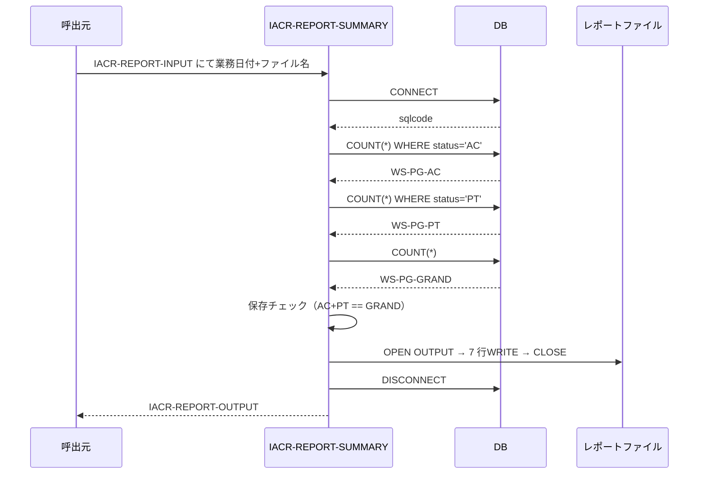
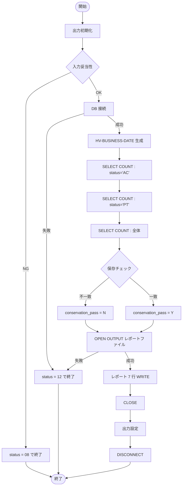

# 基本設計書 — IACR-REPORT-SUMMARY

> **サブシステム:** 13-interestaccrual
> **プログラム ID:** `IACR-REPORT-SUMMARY`
> **種別:** バッチ
> **更新日:** 2026-07-06

---

## 1. プログラム概要

| 項目 | 値 |
|------|-----|
| プログラム ID | `IACR-REPORT-SUMMARY` |
| ソースファイル | `src/iacr-report-summary.sqb` |
| 所属サブシステム | 13-interestaccrual |
| 種別 | バッチ |
| 概要 | 指定業務日のinterest_accruals テーブルから status='AC' / status='PT' / 全体の 3 つの件数を取得し、AC+PT=全体 の保存チェックを通したうえで、日次サマリレポートファイルを出力する。 |

---

## 2. 機能概要

### 2.1 このプログラムが「すること」
DB の interest_accruals テーブルを業務日付で絞り、status='AC' / 'PT' / 全体の 3 回の COUNT(*) を取得する。
AC+PT と全体件数の保存（conservation）が一致するかを検証し、結果を平面レポートへ書き出す。
呼出元にステータスとカウントを IACR-REPORT-OUTPUT で返す。

### 2.2 呼出元と呼出し先
- **呼出元:** 業務スケジューラ / テストドライバ `IACR-TEST`。
- **呼出先:** なし（DB とのみ対話。AUD-WRITE 等の呼出しは行わない）。

### 2.3 シーケンス図

---

## 3. 処理フロー

### 3.1 全体フロー（flowchart）

---

## 4. 入出力仕様

### 4.1 入力

| 項目 | 型 | 必須 | 説明 |
|------|-----|:----:|------|
| IACR-RPT-BUSINESS-DATE | PIC 9(8) | ✅ | 集計対象業務日（YYYYMMDD）。0 は不可。 |
| IACR-RPT-SUMMARY-FILENAME | PIC X(80) | ✅ | サマリファイルパス（保存チェック対象外だが入力必須）。 |
| IACR-RPT-REPORT-FILENAME | PIC X(80) | ✅ | 出力レポートファイルパス。未指定は不可。 |

### 4.2 出力

| 項目 | 型 | 説明 |
|------|-----|------|
| IACR-RPT-STATUS | PIC X(2) | 処理結果コード（下記参照） |
| IACR-RPT-PRODUCTS-REPORTED | PIC 9(2) | レポート対象商品数（固定 3） |
| IACR-RPT-TOTAL-ACCRUALS | PIC 9(7) | 利息件数合計 |
| IACR-RPT-TOTAL-ACCRUED-JPY | PIC S9(15) COMP-3 | 利息金額合計（常時 0。将来拡張用） |
| IACR-RPT-AC-COUNT | PIC 9(7) | status='AC' 件数 |
| IACR-RPT-PT-COUNT | PIC 9(7) | status='PT' 件数 |
| IACR-RPT-GRAND-TOTAL | PIC 9(7) | 全体件数 |
| IACR-RPT-CONSERVATION-PASS | PIC X(1) | AC+PT=全体 の保存チェック結果（Y/N） |
| IACR-RPT-DURATION-SEC | PIC 9(5) | 処理時間（秒。常時 0。将来拡張用） |

### 4.3 返却コード（概要）

| コード | 意味 |
|--------|------|
| 00 | 正常 |
| 04 | CONSERVATION-WARN（AC+PT と GRAND が不一致。処理は継続） |
| 08 | INVALID-INPUT（日付 / いずれかのファイル名が未設定） |
| 12 | IO-FAIL（DB 接続 or レポートファイル OPEN 失敗） |
| 16 | FATAL（未使用予約。将来拡張用） |

---

## 5. 正常系テストケース

| # | テスト名 | 入力 | 期待出力 | 確認ポイント |
|---|---------|------|---------|------------|
| 1 | 正常集計（AC=3） | business_date=20260612 | status=00, AC=3, conservation=Y | IACR-RUN-DAILY 実行後の側で 3 件が AC としてカウントされること |
| 2 | 保存チェック合格 | AC+PT と GRAND が同値 | conservation_pass=Y | 正常データで保存チェックが Y になること |
| 3 | レポートファイル出力 | 書き込み権限ありディレクトリ | 7 行の平面ファイル生成 | レポートファイルが生成され、ヘッダ＋ 6 データ行の書式になっていること |

---

## 6. 異常系テストケース

| # | テスト名 | 入力 | 期待される異常 | 確認ポイント |
|---|---------|------|--------------|------------|
| 1 | B-DATE=0 | business_date=0 | status=08 | 日付未設定を即座に検知して終了すること |
| 2 | レポートファイル名未入力 | report_filename=SPACE | status=08 | 出力ファイル名が空白なら DB 接続前にリジェクトされること |
| 3 | DB 接続障害 | DB 停止状態 | status=12 | CONNECT 失敗時にステータスだけでなくファイル I/O も実行しないこと |
| 4 | レポート書き込み不可 | READ-ONLY ディレクトリ | status=12 | OPEN OUTPUT の FILE STATUS 異常を IO-FAIL で伝達すること |
| 5 | 保存チェック不一致 | AC+PT != GRAND のデータ | status=04, conservation=N | 保存違反を CONSERVATION-WARN(04) として検知し、処理は完了すること |

---

## 参考
- ソース: [iacr-report-summary.sqb](../src/iacr-report-summary.sqb)
- 公開 IF: [iacr-api.cpy](../copy/api/iacr-api.cpy)
- ファイルレイアウト: [fd-iacr-summary.cpy](../copy/private/fd-iacr-summary.cpy)
- その他: [Makefile](../Makefile)
- 連携: [IACR-RUN-DAILY](iacr-run-daily.md) / [01-calendar](../../01-calendar/design/cal-next-bd.md)（業務日付判定）
