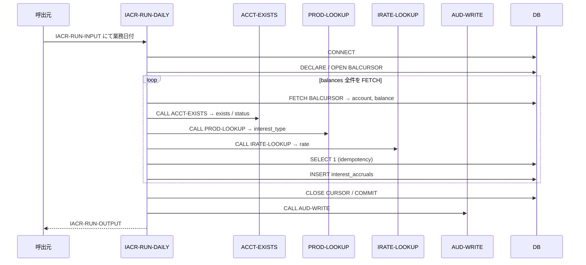
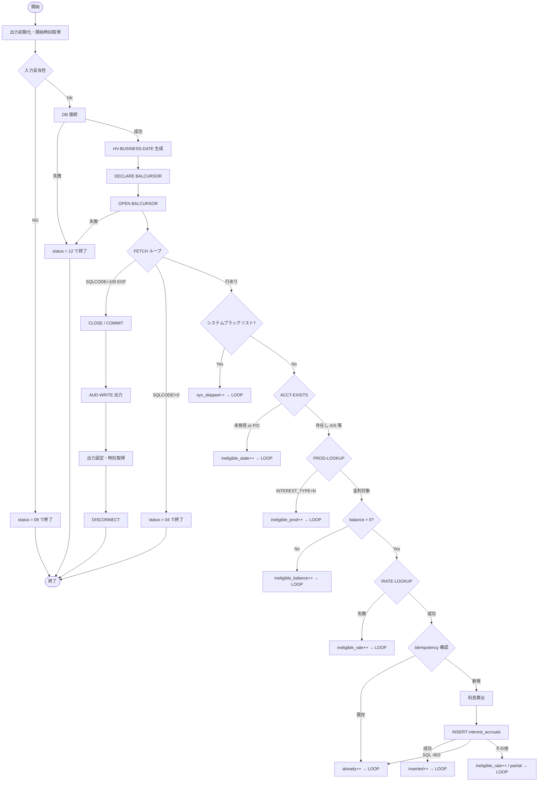

# 基本設計書 — IACR-RUN-DAILY

> **サブシステム:** 13-interestaccrual
> **プログラム ID:** `IACR-RUN-DAILY`
> **種別:** バッチ
> **更新日:** 2026-07-06

---

## 1. プログラム概要

| 項目 | 値 |
|------|-----|
| プログラム ID | `IACR-RUN-DAILY` |
| ソースファイル | `src/iacr-run-daily.sqb` |
| 所属サブシステム | 13-interestaccrual |
| 種別 | バッチ |
| 概要 | balances テーブルをカーソルで全件走査し、各口座について ACCT-EXISTS / PROD-LOOKUP / IRATE-LOOKUP を呼出して適格性を判定のうえ、日次利息を算出して interest_accruals テーブルに INSERT する。 |

---

## 2. 機能概要

### 2.1 このプログラムが「すること」
日次バッチとして balances テーブルを FETCH ループで走査し、各口座の存在・状態・商品・金利を外部モジュールに照会して利息適格性を判定し、適格口座のみ利息を算出して interest_accruals に INSERT する。
処理後は AUD-WRITE で監査サマリを出力し、処理件数を IACR-RUN-OUTPUT に返す。

### 2.2 呼出元と呼出し先
- **呼出元:** 業務スケジューラ / テストドライバ `IACR-TEST`。
- **呼出先:** `ACCT-EXISTS`（口座存在・状態）、`PROD-LOOKUP`（商品マスタ）、`IRATE-LOOKUP`（金利）、`AUD-WRITE`（監査ログ）。

### 2.3 シーケンス図

---

## 3. 処理フロー

### 3.1 全体フロー（flowchart）

---

## 4. 入出力仕様

### 4.1 入力

| 項目 | 型 | 必須 | 説明 |
|------|-----|:----:|------|
| IACR-RUN-BATCH-ID | PIC X(14) | ✅ | バッチ管理用 ID。監査ログに載る。 |
| IACR-RUN-BUSINESS-DATE | PIC 9(8) | ✅ | 業務日付（YYYYMMDD）。0 は不可。 |
| IACR-RUN-SUMMARY-FILENAME | PIC X(80) |  | サマリファイルパス（将来拡張用）。 |
| IACR-RUN-CHECKPOINT-FILENAME | PIC X(80) |  | チェックポイントファイルパス（将来拡張用）。 |

### 4.2 出力

| 項目 | 型 | 説明 |
|------|-----|------|
| IACR-RUN-STATUS | PIC X(2) | 処理結果コード（下記参照） |
| IACR-OUT-ACCOUNTS-SCANNED | PIC 9(7) | スキャンした口座数 |
| IACR-OUT-ACCRUALS-INSERTED | PIC 9(7) | 新規 INSERT された利息数 |
| IACR-OUT-INELIGIBLE-STATE | PIC 9(7) | 口座状態によりスキップされた数 |
| IACR-OUT-INELIGIBLE-PROD | PIC 9(7) | 商品属性によりスキップされた数 |
| IACR-OUT-INELIGIBLE-BALANCE | PIC 9(7) | 残高不足によりスキップされた数 |
| IACR-OUT-INELIGIBLE-RATE | PIC 9(7) | 金利取得失敗によりスキップされた数 |
| IACR-OUT-ALREADY-ACCRUED | PIC 9(7) | 既に利息済み（idempotent）だった数 |
| IACR-OUT-SYSTEM-SKIPPED | PIC 9(7) | システム口座ブラックリストによりスキップされた数 |
| IACR-OUT-DURATION-SEC | PIC 9(5) | 処理時間（秒） |

### 4.3 返却コード（概要）

| コード | 意味 |
|--------|------|
| 00 | 正常 |
| 04 | PARTIAL（FETCH ループ途中で SQL エラー） |
| 08 | INVALID-INPUT（BATCH-ID または BUSINESS-DATE 未設定） |
| 12 | IO-FAIL（DB 接続 or カーソル OPEN 失敗） |
| 16 | FATAL（未使用予約。将来拡張用） |

---

## 5. 正常系テストケース

| # | テスト名 | 入力 | 期待出力 | 確認ポイント |
|---|---------|------|---------|------------|
| 1 | 通常実行で 3 件利息生成 | business_date=20260612 | status=00, inserted=3, ineligible_state=2, ineligible_prod=1, ineligible_balance=1, sys_skipped=4 | ホワイトリスト 4 口座がスキップされ、P/C 状態 2 口座・INTEREST=N 1 口座・残高 0 1 口座がフィルタされること |
| 2 | 再実行で idempotent | 同一 business_date を再投入 | inserted=0, already=3 | 同一 business_date+account の重複 INSERT が防止されること |
| 3 | 空 balances でも再投入可能 | クリーン状態から再実行 | status=00, inserted>=3 | テストデータ再投入後に期待件数が得られること |

---

## 6. 異常系テストケース

| # | テスト名 | 入力 | 期待される異常 | 確認ポイント |
|---|---------|------|--------------|------------|
| 1 | BATCH-ID 未入力 | batch_id=SPACE, business_date=20260612 | status=08 | 入力バリデーションが DB 接続前に効くこと |
| 2 | BUSINESS-DATE=0 | batch_id=BATCH-001, business_date=0 | status=08 | 日付 0 が拒否されること |
| 3 | DB 接続障害 | DB 停止状態 | status=12 | CONNECT 失敗時に即座に IO-FAIL で返ること |
| 4 | カーソル OPEN 失敗 | テーブル不在等 | status=12 | OPEN 失敗時に即座に IO-FAIL で返ること |
| 5 | INSERT 重複（-803） | 手動で競合行を INSERT | already++ としてカウント | SQL -803 を PARTIAL に昇格させず idempotent として扱うこと |

---

## 参考
- ソース: [iacr-run-daily.sqb](../src/iacr-run-daily.sqb)
- 公開 IF: [iacr-api.cpy](../copy/api/iacr-api.cpy)
- その他: [Makefile](../Makefile)
- 外部 IF: [ACCT-EXISTS](../../08-account/design/acct-exists.md) / [PROD-LOOKUP](../../05-product/design/prod-lookup.md) / [IRATE-LOOKUP](../../06-interestrate/design/irate-lookup.md)
