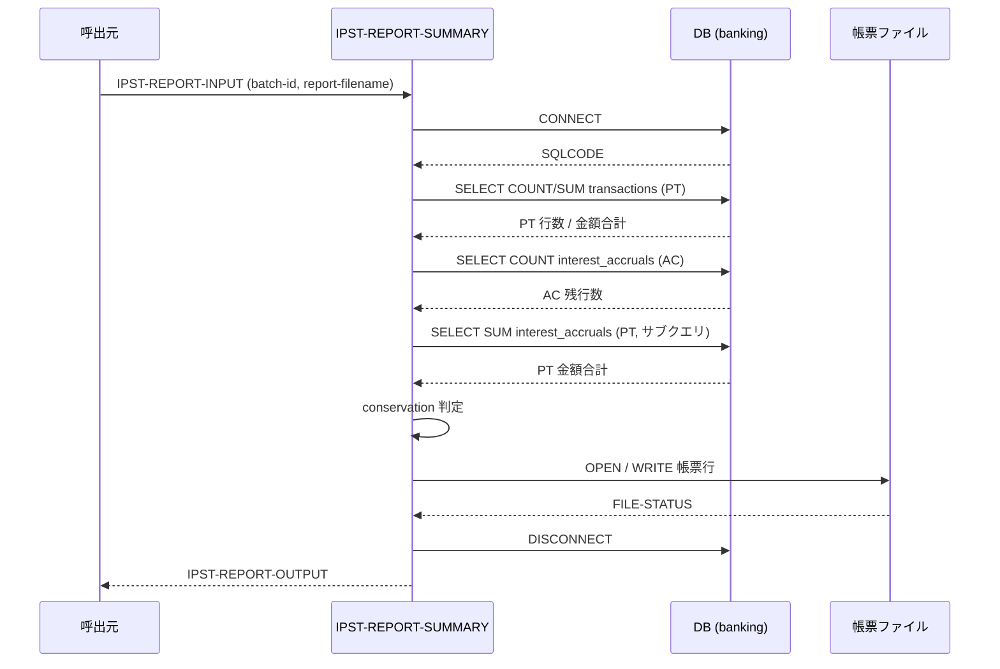
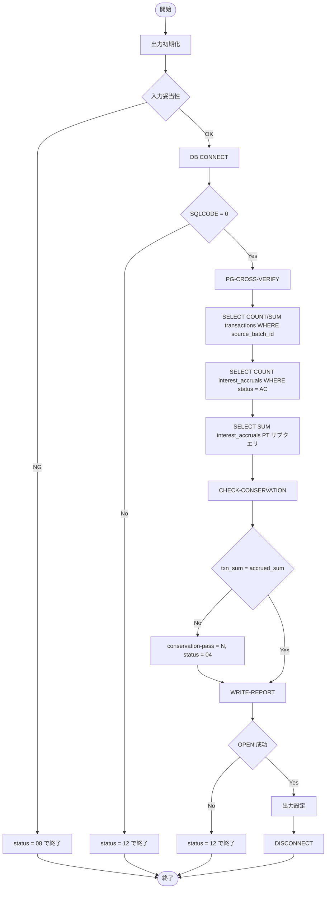

# 基本設計書 — IPST-REPORT-SUMMARY

> **サブシステム:** 14-interestpost
> **プログラム ID:** `IPST-REPORT-SUMMARY`
> **種別:** バッチ
> **更新日:** 2026-07-06

---

## 1. プログラム概要

| 項目 | 値 |
|------|-----|
| プログラム ID | `IPST-REPORT-SUMMARY` |
| ソースファイル | `src/ipst-report-summary.sqb` |
| 所属サブシステム | 14-interestpost |
| 種別 | バッチ |
| 概要 | IPST-RUN-MONTHEND で処理された月次利息仕訳のサマリ帳票を生成する。transactions と interest_accruals をクロス照合し、仕訳合計と AC 残高の保存量 (conservation) を検証したうえで帳票ファイルを出力する。 |

---

## 2. 機能概要

### 2.1 このプログラムが「すること」
指定バッチ ID に紐づく transactions の PT 行数・金額合計と、interest_accruals の PT 行金額合計をそれぞれ DB 集計で取得し、両者が一致するか (conservation) を検証する。結果を所定フォーマットのテキスト帳票ファイルへ書き出し、呼び出し元へサマリ数値を返却する。

### 2.2 呼出元と呼出し先
- **呼出元:** 月次バッチスケジューラ (想定)。テストドライバ `IPST-TEST` が `CALL "IPST-REPORT-SUMMARY"` で呼出す。通常は IPST-RUN-MONTHEND の後続処理として実行される。
- **呼出先:** なし (外部プログラム呼出なし)。DB 接続のみ。

### 2.3 シーケンス図

---

## 3. 処理フロー

### 3.1 全体フロー（flowchart）

---

## 4. 入出力仕様

### 4.1 入力

| 項目 | 型 | 必須 | 説明 |
|------|-----|:----:|------|
| IPST-RPT-BUSINESS-DATE | PIC 9(8) | — | 営業日 (YYYYMMDD)。帳票ヘッダ記載用。 |
| IPST-RPT-BATCH-ID | PIC X(14) | ✅ | 照合対象バッチ ID。transactions.source_batch_id に使用。 |
| IPST-RPT-SUMMARY-FILENAME | PIC X(80) | — | サマリファイルパス (将来拡張用) |
| IPST-RPT-REPORT-FILENAME | PIC X(80) | ✅ | 出力帳票ファイルパス |

### 4.2 出力

| 項目 | 型 | 説明 |
|------|-----|------|
| IPST-RPT-STATUS | PIC X(2) | 処理結果コード (下記返却コード参照) |
| IPST-RPT-PRODUCTS-REPORTED | PIC 9(2) | 帳票に記載した製品数 (固定 = 1) |
| IPST-RPT-TOTAL-POSTED | PIC 9(7) | PT 取引件数 |
| IPST-RPT-TOTAL-POSTED-JPY | PIC S9(15) COMP-3 | PT 取引金額合計 |
| IPST-RPT-PT-ROW-COUNT | PIC 9(7) | PT 行数 (TOTAL-POSTED と同値) |
| IPST-RPT-AC-REMAINING | PIC 9(7) | AC 残行数 |
| IPST-RPT-ACCRUED-SUM | PIC S9(15) COMP-3 | PT に移行した AC 金額合計 |
| IPST-RPT-CONSERVATION-PASS | PIC X(1) | 保存量検証結果 ("Y" / "N") |
| IPST-RPT-DURATION-SEC | PIC 9(5) | 処理時間 (秒) |

### 4.3 返却コード（概要）

| コード | 意味 |
|--------|------|
| 00 | 正常 (conservation = Y) |
| 04 | CONSERVATION-WARN (conservation = N, 処理は完了) |
| 08 | INVALID-INPUT (バッチ ID 空 / 帳票ファイル名空) |
| 12 | IO-FAIL (DB 接続失敗 / 帳票 OPEN 失敗) |
| 16 | FATAL (未使用予約) |

---

## 5. 正常系テストケース

| # | テスト名 | 入力 | 期待出力 | 確認ポイント |
|---|---------|------|---------|------------|
| 1 | 帳票正常出力 | batch=MTH20260630-01, date=20260630 | status=00, PT=2, cons=Y | 2 件 PT 行がカウントされ、conservation が Y になること |
| 2 | 保存量パス | batch=MTH20260630-01 | cons=Y, txn_sum = accrued_sum | transactions 合計と interest_accruals PT 合計が一致すること |
| 3 | 帳票ファイル生成 | report-filename 指定 | status=00 | 指定パスに LINE SEQUENTIAL ファイルが出力されること |

---

## 6. 異常系テストケース

| # | テスト名 | 入力 | 期待される異常 | 確認ポイント |
|---|---------|------|--------------|------------|
| 1 | バッチ ID 空 | batch="" | status = 08 | 入力バリデーションが最優先されること |
| 2 | 帳票ファイル名空 | report-filename="" | status = 08 | ファイル名未指定が検知されること |
| 3 | DB 接続障害 | (DB 停止状態) | status = 12 | CONNECT 失敗時に即座に IO-FAIL で終了すること |
| 4 | 帳票 OPEN 失敗 | (書込権限なしパス) | status = 12 | FILE-STATUS != 00 で IO-FAIL 設定し終了すること |
| 5 | 保存量不一致 | (PT 行削除等の不整合データ) | status = 04, cons=N | conservation 判定が N になり CONSERVATION-WARN が返ること |

---

## 参考
- ソース: [ipst-report-summary.sqb](../src/ipst-report-summary.sqb)
- 公開 IF: [ipst-api.cpy](../copy/api/ipst-api.cpy)
- その他: [Makefile](../Makefile)
- 関連サブシステム: [14-interestpost/ipst-run-monthend-bd](ipst-run-monthend-bd.md) (本プログラムの前提処理)
- 関連サブシステム: [13-interestaccrual](../../13-interestaccrual/design/) (AC 行生成元)
