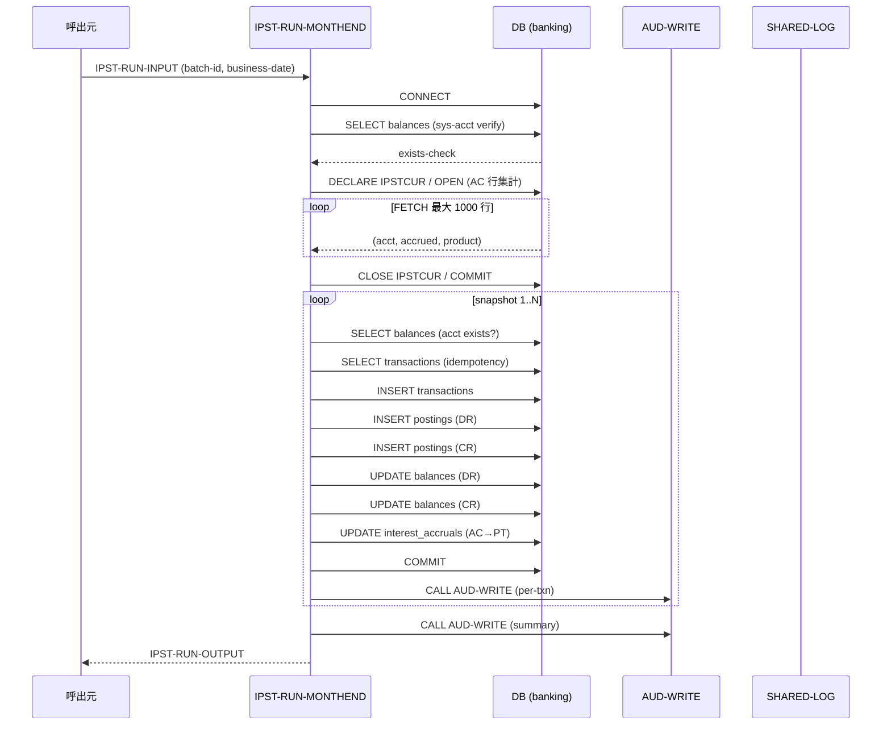
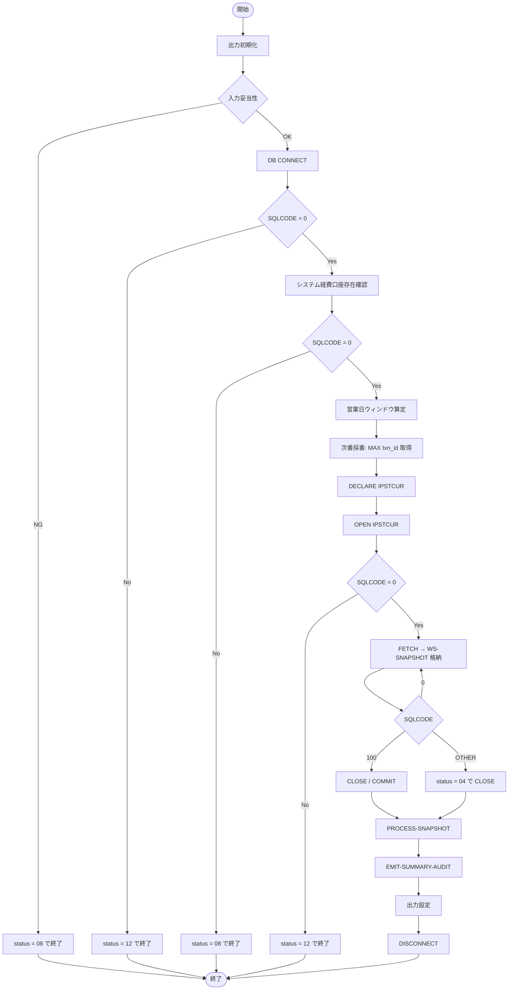

# 基本設計書 — IPST-RUN-MONTHEND

> **サブシステム:** 14-interestpost
> **プログラム ID:** `IPST-RUN-MONTHEND`
> **種別:** バッチ
> **更新日:** 2026-07-06

---

## 1. プログラム概要

| 項目 | 値 |
|------|-----|
| プログラム ID | `IPST-RUN-MONTHEND` |
| ソースファイル | `src/ipst-run-monthend.sqb` |
| 所属サブシステム | 14-interestpost |
| 種別 | バッチ |
| 概要 | 月次利息仕訳を一括生成する。`interest_accruals` から営業日範囲内の AC 行をアカウント集計し、product_code="001" かつ残高が有効な口座に対して double-entry 仕訳 (transactions + postings) を挿入し、該当 AC 行を PT に更新する。 |

---

## 2. 機能概要

### 2.1 このプログラムが「すること」
月次締め日に、当月末営業日を基準日として interest_accruals テーブル上の AC 状態の未仕訳データをアカウント単位で集計し、1 口座あたり 1 件の INTEREST トランザクション (DR/CR ペアの postings) を生成する。同時に balances を更新し、処理済み AC 行を PT に移行する。

### 2.2 呼出元と呼出し先
- **呼出元:** 月次バッチスケジューラ (想定)。テストドライバ `IPST-TEST` が `CALL "IPST-RUN-MONTHEND"` で呼出す。
- **呼出先:**
  - `AUD-WRITE` (shared/util/aud-write) — 監査ログ出力
  - `SHARED-LOG` (shared/util/shared-log) — エラーログ出力
  - `DEH-VALIDATE` (copy/private/double-entry-helper.cpy) — 仕訳入力値検証

### 2.3 シーケンス図



---

## 3. 処理フロー

### 3.1 全体フロー（flowchart）



### 3.2 スナップショット処理フロー（flowchart）

```mermaid
flowchart TD
    S_START[PROCESS-SNAPSHOT 入口] --> IDX_INIT[WS-IDX = 1]
    IDX_INIT --> IDX_CHK{WS-IDX > SNAP-COUNT}
    IDX_CHK -->|Yes| S_END[戻る]
    IDX_CHK -->|No| LOAD[スナップショット行読出]
    LOAD --> PROD_CHK{product = "001"}
    PROD_CHK -->|No| SKIP_PROD[CTR-PROD++]
    PROD_CHK -->|Yes| ACCT_CHK[口座存在確認 SELECT]
    ACCT_CHK -->|NOT FOUND| SKIP_CLOSED[CTR-CLOSED++]
    ACCT_CHK -->|OK| DUP_CHK[重複確認 SELECT]
    DUP_CHK -->|FOUND| SKIP_ALREADY[CTR-ALREADY++]
    DUP_CHK -->|NOT FOUND| DEH_VAL[DEH-VALIDATE]
    DEH_VAL -->|RC != 0| SKIP_HELPER[CTR-HELPER++, SHARED-LOG]
    DEH_VAL -->|RC = 0| POST[POST-PAIR-PARA]
    POST --> COMMIT[COMMIT, CTR-POSTED++, TOTAL-JPY 加算]
    COMMIT --> PER_AUD[EMIT-PER-TXN-AUDIT]
    PER_AUD --> NEXT[WS-IDX++]
    SKIP_PROD --> NEXT
    SKIP_CLOSED --> NEXT
    SKIP_ALREADY --> NEXT
    SKIP_HELPER --> NEXT
    NEXT --> IDX_CHK
    S_END --> S_RETURN([戻る])
```

---

## 4. 入出力仕様

### 4.1 入力

| 項目 | 型 | 必須 | 説明 |
|------|-----|:----:|------|
| IPST-RUN-BATCH-ID | PIC X(14) | ✅ | バッチ一意識別子。transactions.source_batch_id に保存される。 |
| IPST-RUN-BUSINESS-DATE | PIC 9(8) | ✅ | 営業日 (YYYYMMDD)。月次ウィンドウ算定に使用。 |
| IPST-RUN-SUMMARY-FILENAME | PIC X(80) | — | サマリファイルパス (将来拡張用) |
| IPST-RUN-CHECKPOINT-FILENAME | PIC X(80) | ✅ | チェックポイントファイルパス |

### 4.2 出力

| 項目 | 型 | 説明 |
|------|-----|------|
| IPST-RUN-STATUS | PIC X(2) | 処理結果コード (下記返却コード参照) |
| IPST-OUT-ACCOUNTS-AGGREGATED | PIC 9(7) | カーソルで集計された総アカウント数 |
| IPST-OUT-ACCOUNTS-POSTED | PIC 9(7) | 実際に仕訳されたアカウント数 |
| IPST-OUT-SKIPPED-CLOSED | PIC 9(7) | 口座なしによりスキップされた件数 |
| IPST-OUT-SKIPPED-PRODUCT | PIC 9(7) | product != "001" によりスキップされた件数 |
| IPST-OUT-SKIPPED-ALREADY | PIC 9(7) | 重複によりスキップされた件数 (冪等) |
| IPST-OUT-SKIPPED-HELPER | PIC 9(7) | DEH 検証失敗によりスキップされた件数 |
| IPST-OUT-AC-ROWS-CONSUMED | PIC 9(8) | PT に移行した AC 行数 |
| IPST-OUT-TOTAL-POSTED-JPY | PIC S9(15) COMP-3 | 仕訳合計金額 (JPY) |
| IPST-OUT-DURATION-SEC | PIC 9(5) | 処理時間 (秒) |

### 4.3 返却コード（概要）

| コード | 意味 |
|--------|------|
| 00 | 正常 |
| 04 | PARTIAL (FETCH 中エラー等、一部処理) |
| 08 | INVALID-INPUT (バッチ ID 空 / 日付 0 / システム口座不在) |
| 12 | IO-FAIL (DB 接続失敗 / カーソル OPEN 失敗) |
| 16 | FATAL (UPDATE balances で更新行数 != 1) |

---

## 5. 正常系テストケース

| # | テスト名 | 入力 | 期待出力 | 確認ポイント |
|---|---------|------|---------|------------|
| 1 | 正常 2 口座仕訳 | batch=MTH20260630-01, date=20260630 | status=00, posted=2, prod=1, consumed=6 | 001 商品 2 口座のみ仕訳、003 商品 1 口座スキップ、AC 行 6 件 PT 化 |
| 2 | 冪等再投入 | 同一バッチで 2 回目実行 | posted=0, prod=1 | 重複確認により 2 回目はスキップされること |
| 3 | 商品フィルタ | date=20260630 | skipped-product=1 | product_code != "001" の口座がカウントされること |
| 4 | DEH 検証・システム口座・監査 | date=20260630 | helper=0, status=00, posted>=1 | 経費口座存在、DEH 通過、監査が per-txn + summary で発行されること |
| 5 | AC→PT 原子性・残高更新 | date=20260630 | consumed=6, total-jpy>0 | AC 6 行が PT 化、balances に DR/CR 金額が反映されること |

---

## 6. 異常系テストケース

| # | テスト名 | 入力 | 期待される異常 | 確認ポイント |
|---|---------|------|--------------|------------|
| 1 | バッチ ID 空 | batch="" | status = 08 | 入力バリデーションが最優先されること |
| 2 | 日付 0 | date=0 | status = 08 | 日付未指定が検知されること |
| 3 | DB 接続障害 | (DB 停止状態) | status = 12 | CONNECT 失敗時に即座に IO-FAIL で終了すること |
| 4 | カーソル OPEN 失敗 | (テーブル不在等) | status = 12 | OPEN 失敗時に後続処理を行わないこと |
| 5 | FETCH 中エラー | (実行中テーブルロック) | status = 04 | SQLCODE != 0/100 で PARTIAL 設定し CLOSE 後処理継続すること |
| 6 | 残高更新行数異常 | (トリガで更新行数 != 1) | status = 16 | SQLERRD(3) != 1 で FATAL 設定し ROLLBACK すること |
| 7 | 口座なしスキップ | (該当口座が存在しないデータ) | skipped-closed > 0 | balances 未存在時はカウントしてスキップし処理継続すること |

---

## 参考
- ソース: [ipst-run-monthend.sqb](../src/ipst-run-monthend.sqb)
- 公開 IF: [ipst-api.cpy](../copy/api/ipst-api.cpy)
- その他: [Makefile](../Makefile)
- 関連サブシステム: [13-interestaccrual](../../13-interestaccrual/design/) (AC 行生成元)
- 共有ユーティリティ: [shared/util/aud-write](../../../shared/util/aud-write/) (AUD-WRITE)
- 共有ユーティリティ: [shared/util/shared-log](../../../shared/util/shared-log/) (SHARED-LOG)
