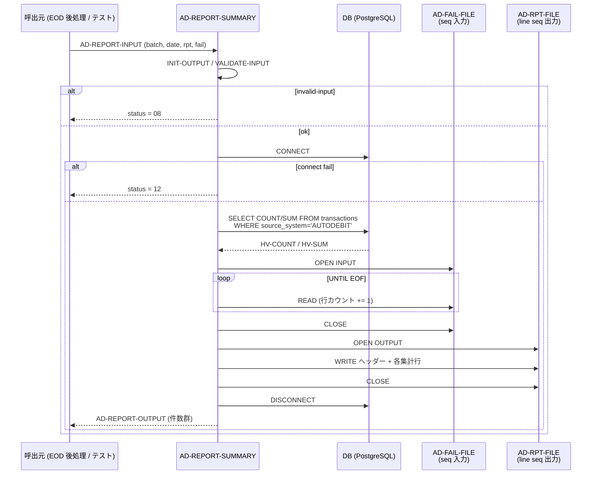
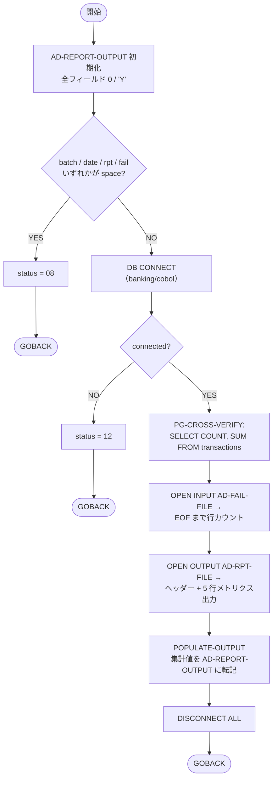

# 基本設計書 — AD-REPORT-SUMMARY

> **サブシステム:** 15-autodebit
> **プログラム ID:** `AD-REPORT-SUMMARY`
> **種別:** バッチ（埋込み SQL / .sqb → ocesql → .cob.gen → .so）
> **更新日:** 2026-07-06

---

## 1. プログラム概述

| 項目 | 値 |
|------|-----|
| プログラム ID | `AD-REPORT-SUMMARY` |
| ソースファイル | `src/ad-report-summary.sqb` → `ad-report-summary.cob.gen` |
| 所属サブシステム | 15-autodebit |
| 種別 | バッチ（ocesql 経由の埋込み SQL モジュール） |
| 概要 | AD-RUN-DAILY が出力した失敗ファイルと、PG 側 `transactions` テーブルに残る AUTODEBIT 系レコードを突合し、PG カウントとファイル失敗件数が一致するかを「保存性（conservation）確認」付きでテキストレポートにまとめる。 |

---

## 2. 機能概要

### 2.1 このプログラムが「すること」
バッチ ID に対して業務日付を入力とし、(1) DB に接続して `transactions` から当該バッチの AUTODEBIT レコードの `COUNT(*)` と `SUM(amount_jpy)` を集計し、(2) `AD-FAILED-FILE`（AD-RUN-DAILY が書き出したシーケンシャルファイル）を読み取って失敗件数をカウントし、(3) レポートファイルに集計行を書き出して戻り値として各種件数を返す。処理の冒頭で入力バリデーションを行い、不備時は即座に 08 で終了する。

### 2.2 呼出元と呼出し先
- **呼出元:** EOD バッチ後処理（AD-RUN-DAILY の後段）。ユニットテストでは `AD-TEST` が `CALL "AD-REPORT-SUMMARY"` で呼び出す。
- **呼出先:**
  - RDBMS（PostgreSQL）— `CONNECT` / `SELECT COUNT/SUM` / `DISCONNECT`
  - `AUD-WRITE`（`COPY "aud-write-api.cpy"` をインクルード。監査ログ書き込み I/F を共有）。
  - 直接の外部 CALL はなし。I/O は AD-FAIL-FILE（入力）と AD-RPT-FILE（出力）の 2 ファイルのみ。
- 関連: レポートの「保存性」観点で [CAL-NEXT-BD](../../01-calendar/design/cal-next-bd.md) の日付加算ルールを参照する設計（次回プラン日との突合）がある。

### 2.3 シーケンスiagram

---

## 3. 処理フロー

### 3.1 全体フロー（flowchart）

---

## 4. 入出力仕様

### 4.1 入力

| 項目 | 型 | 必須 | 説明 |
|------|-----|:----:|------|
| AD-RPT-BUSINESS-DATE | PIC 9(8) | ✅ | 業務日（YYYYMMDD）。PG 突合の基準日。 |
| AD-RPT-BATCH-ID | PIC X(14) | ✅ | AD-RUN-DAILY と同一のバッチ ID。PG 突合用。 |
| AD-RPT-SUMMARY-FILENAME | PIC X(80) | — | 使わず（将来拡張用）。 |
| AD-RPT-REPORT-FILENAME | PIC X(80) | ✅ | レポート（ラインシーケンシャル）出力先。 |
| AD-RPT-FAILED-FILENAME | PIC X(80) | ✅ | AD-RUN-DAILY が書き出した失敗ファイル入力先。 |

### 4.2 出力

| 項目 | 型 | 説明 |
|------|-----|------|
| AD-RPT-STATUS | PIC X(2) | 00 / 04 / 08 / 12 / 16 |
| AD-RPT-TOTAL-INSTRUCTIONS | PIC 9(7) | PG から取得した実行件数 |
| AD-RPT-TOTAL-OK-JPY | PIC S9(15) COMP-3 | PG から取得した成功額 |
| AD-RPT-TOTAL-FAILED-COUNT | PIC 9(7) | ファイル行数と同値 |
| AD-RPT-SUSPENDED-COUNT | PIC 9(7) | 0 固定（本プログラム非更新） |
| AD-RPT-PG-PT-COUNT | PIC 9(7) | PG 取込件数 |
| AD-RPT-FILE-FAILED-COUNT | PIC 9(7) | ファイル入力行数 |
| AD-RPT-CONSERVATION-PASS | PIC X(1) | 'Y' で初期化。将来 PG count==file count の整合チェック時に 'N' |
| AD-RPT-DURATION-SEC | PIC 9(5) | 0 固定（未計測） |

### 4.3 返却コード（概要）

| コード | 意味 |
|--------|------|
| 00 | 正常 |
| 04 | CONSERVATION-WARN（PG とファイル件数不一致。将来拡張） |
| 08 | INVALID-INPUT（REPORT / FAILED ファイルパスいずれか空白） |
| 12 | IO-FAIL（DB CONNECT 失敗 or レポート OPEN 失敗） |
| 16 | FATAL（未使用） |

---

## 5. 正常系テストケース

| # | テスト名 | 入力 | 期待出力 | 確認ポイント |
|---|---------|------|---------|------------|
| 1 | 単一バッチサマリ | batch=EOD20260613-01、failed に n 件 | status=00, pg-pt-count==n, file-failed-count==n | PG 集計とファイルカウントが一致 |
| 2 | 失敗なしバッチ | failed が空ファイル | status=00, file-failed-count=0, pg-pt-count=0 | 双方 0 で保存性 'Y' |
| 3 | 実データ突合 | TC01 で POST 済みバッチ | pg-pt-count=1, total-jpy==100 | コピーブック AD-FAILED-REC の各列が正しく READ される |
| 4 | conservation フラグ | ランタイム状態で正常終了 | conservation-pass='Y' | AD-RUN-DAILY の冪等性を横断確認する観点 |

---

## 6. 異常系テストケース

| # | テスト名 | 入力 | 期待される異常 | 確認ポイント |
|---|---------|------|--------------|------------|
| 1 | バッチ ID 空白 | batch=space | status=08 | VALIDATE で即時検知 |
| 2 | DB 接続不可 | banking が落ちている | status=12 | CONNECT の SQLCODE != 0 で分岐 |
| 3 | レポートファイル OPEN 失敗 | 権限なしパスを指定 | status=12、io-fail 返却 | WRITE-REPORT の OPEN OUTPUT 直後判定 |
| 4 | FAILED-FILE 不在 | 未作成パス | file-failed-count=0、件数不一致になり得る | READ-LOOP が AT END で即 EXIT PERFORM し、後段でレポートは出力される |

---

## 参考
- ソース: [ad-report-summary.sqb](../src/ad-report-summary.sqb) / [ad-report-summary.cob.gen](../src/ad-report-summary.cob.gen)
- 公開 IF: [ad-api.cpy](../copy/api/ad-api.cpy) / [ad-failed-rec.cpy](../copy/private/ad-failed-rec.cpy)
- 依存コピーブック: `aud-write-api.cpy`（I/F 共有）
- テスト: [ad-test.cob (TC11/TC12)](../tests/unit/ad-test.cob) / [ad-reset-pg.sh](../tests/unit/ad-reset-pg.sh)
- 外部連携: [CAL-NEXT-BD](../../01-calendar/design/cal-next-bd.md)（次回プラン日加算ロジック参照）
- その他: [Makefile](../Makefile)
