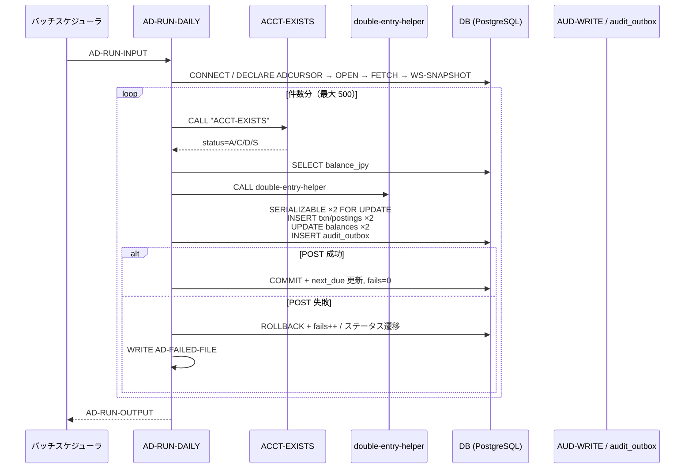
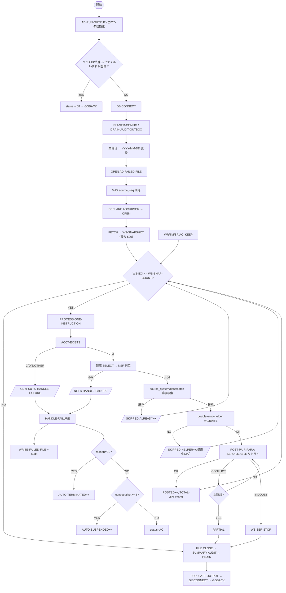

# 基本設計書 — AD-RUN-DAILY

> **サブシステム:** 15-autodebit
> **プログラム ID:** `AD-RUN-DAILY`
> **種別:** バッチ（埋込み SQL / .sqb → ocesql → .cob.gen → .so）
> **更新日:** 2026-07-06

---

## 1. プログラム概要

| 項目 | 値 |
|------|-----|
| プログラム ID | `AD-RUN-DAILY` |
| ソースファイル | `src/ad-run-daily.sqb` → `ad-run-daily.cob.gen` |
| 所属サブシステム | 15-autodebit |
| 種別 | バッチ（ocesql 経由の埋込み SQL モジュール、`.so`） |
| 概要 | 当日が期日となったアクティブな自動引き落とし指令を DB カーソルで取得し、1 件ずつ口座・残高検証の上で借方 / 貸方の 2 行をトランザクションとして POST する。POST 成功時は指令ステータスを AC に戻し、未達時は失敗回数をインクリメントして SP / TM へ遷移させる。 |

---

## 2. 機能概要

### 2.1 このプログラムが「すること」
バッチ ID / 業務日 / ファイルパスをパラメータで受け取り、`autodebit_schedules` から `ステータス = 'AC' かつ next_due_date <= 業務日` の指令をカーソル取得する。最大 500 件をメモリ・スナップショットに退避し、1 件ずつ `ACCT-EXISTS` → 残高取得 → `double-entry-helper` による仕訳チェック → SERIZALIZABLE ・リトライつき `POST-PAIR` を実行し、結果に応じて `autodebit_schedules` を更新する。失敗指令は `AD-FAILED-FILE` 書き出しと `audit_outbox` / `AUD-WRITE` で記録する。

### 2.2 呼出元と呼出し先
- **呼出元:** 日次バッチスケジューラ（EOD バッチ）。ユニットテストでは `AD-TEST` が `CALL "AD-RUN-DAILY"` で呼び出す。
- **呼出先:**
  - `ACCT-EXISTS`（口座存在・状態検証）
  - `double-entry-helper`（仕訳カテゴリ・金額・借贷の整合性検証）
  - `AUD-WRITE`（監査ログ書き込み）
  - `SHARED-LOG`（構造化ログ）
  - `ser-retry-procs`（SERIALIZABLE 競合のバックオフ＆リトライ）
  - `aud-drain-procs`（`audit_outbox` のリトライ送出）
  - （`COPY "cal-api.cpy"` 経由で次回プラン日計算に [CAL-NEXT-BD](../../01-calendar/design/cal-next-bd.md) を採用。現在は自前計算 M/D/W と並行）

### 2.3 シーケンス図

---

## 3. 処理フロー

### 3.1 全体フロー（flowchart / SQL カーソル・ループ明示）

---

## 4. 入出力仕様

### 4.1 入力

| 項目 | 型 | 必須 | 説明 |
|------|-----|:----:|------|
| AD-RUN-BATCH-ID | PIC X(14) | ✅ | バッチ一識別子。`source_batch_id` に記録される。 |
| AD-RUN-BUSINESS-DATE | PIC 9(8) | ✅ | 業務日（YYYYMMDD）。期日比較・仕訳日の基準。 |
| AD-RUN-FAILED-FILENAME | PIC X(80) | ✅ | 失敗レコードの出力先（シーケンシャル）。 |
| AD-RUN-CHECKPOINT-FILENAME | PIC X(80) | — | チェックポイントファイル（将来拡張用）。 |
| AD-RUN-SUMMARY-FILENAME | PIC X(80) | — | サマリファイル（将来拡張用）。 |

### 4.2 出力

| 項目 | 型 | 説明 |
|------|-----|------|
| AD-RUN-STATUS | PIC X(2) | 返却コード（00/04/08/12/16） |
| AD-OUT-INSTRUCTIONS-DUE | PIC 9(7) | カーソルで取得した対象件数 |
| AD-OUT-INSTRUCTIONS-POSTED | PIC 9(7) | POST 成功件数 |
| AD-OUT-FAILED-NF / -CL / -SU | PIC 9(7) | 失敗内訳：残高不足 / 口座異常 / 休止 |
| AD-OUT-SKIPPED-ALREADY | PIC 9(7) | 冪等スキップ（同一 batch+desc 既存） |
| AD-OUT-SKIPPED-HELPER | PIC 9(7) | double-entry-helper 検証拒否件数 |
| AD-OUT-AUTO-SUSPENDED | PIC 9(7) | SP 遷移件数（連続 3 回失敗） |
| AD-OUT-AUTO-TERMINATED | PIC 9(7) | TM 遷移件数（口座クローズ等） |
| AD-OUT-TOTAL-DEBITED-JPY | PIC S9(15) COMP-3 | 借方合計（円） |

### 4.3 返却コード（概要）

| コード | 意味 |
|--------|------|
| 00 | 正常（全指令処理） |
| 04 | PARTIAL（FETCH・POST 途中で障害。リトライ上限/INDOUBT） |
| 08 | INVALID-INPUT（入力不足） |
| 12 | IO-FAIL（DB 接続 or ファイル OPEN 失敗） |
| 16 | FATAL（現実装では未発行。将来用） |

---

## 5. 正常系テストケース

| # | テスト名 | 入力 | 期待出力 | 確認ポイント |
|---|---------|------|---------|------------|
| 1 | 単一指令POST成功 | AC2001、残高≥金額 | status=00, posted=1, total-jpy==amount, 次回期日 M+1 | balances 減算、autodebit_schedules.next_due 更新 |
| 2 | 同一支払人複数指令 | AD-DUP-001 + AD-DUP-002 | posted=2 | 同一バッチ内で別指令 ID 扱い |
| 3 | 二重実行で冪等スキップ | 同 batch/id を連続 CALL | 2 回目 posted=0、skipped-already=n | description + batch_id ユニーク条件 |
| 4 | リトライ後成功 | SER_FAULT_CONFLICT_N=2, SER_MAX_RETRIES=5 | retries>=2, posted=1 | SERIALIZABLE 競合 → バックオフ → 成功 |
| 5 | 頻度 W 更新 | frequency=W | next_due が業務日 +7 日 | cal-api.cpy 相当の頻度ロジック |

---

## 6. 異常系テストケース

| # | テスト名 | 入力 | 期待される異常 | 確認ポイント |
|---|---------|------|--------------|------------|
| 1 | 入力未指定 | batch-id=space | status=08 | VALIDATE で即時検知 |
| 2 | DB 接続不可 | banking がダウン | status=12 | CONNECT の SQLCODE != 0 で判定 |
| 3 | 口座未発見 | acct が存在しない | cl+1 | ACCT-EXISTS=NOT-FOUND で CL カウント |
| 4 | 口座休止 | acct status=D | su+1 | ACCOUNT_DORMANT 理由で skips 判定 |
| 5 | リトライ上限超過 | SER_MAX_RETRIES=3 を超える競合 | partial、auto-sp>=1 | SER-RETRY で上限超過 → AD-RUN-PARTIAL |
| 6 | FAILED-FILE I/O 例外 | 書込権限なしパス | DECLARATIVES で WS-FILE-IO-ERROR=Y | `ad-test.cob` TC12 相当 |
| 7 | SERIALIZABLE INDOUBT | トランザクションが疑問列に | WS-SER-STOP=Y、バッチ中断 | INDOUBT でループ全体を打ち切り |

---

## 参考
- ソース: [ad-run-daily.sqb](../src/ad-run-daily.sqb) / [ad-run-daily.cob.gen](../src/ad-run-daily.cob.gen)
- 公開 IF: [ad-api.cpy](../copy/api/ad-api.cpy) / [ad-failed-rec.cpy](../copy/private/ad-failed-rec.cpy)
- 依存コピーブック: `acct-api.cpy` / `cal-api.cpy` / `double-entry-helper.cpy` / `aud-write-api.cpy` / `shared-log-api.cpy` / `ser-retry-state|procs.cpy` / `aud-drain-state|procs.cpy`
- テスト: [ad-test.cob](../tests/unit/ad-test.cob) / [ad-setup-pg.sh](../tests/unit/ad-setup-pg.sh) / [ad-reset-pg.sh](../tests/unit/ad-reset-pg.sh) / [ad-retry-test.sh](../tests/unit/ad-retry-test.sh) / [ad-dup-seed.sh](../tests/unit/ad-dup-seed.sh) / [ad-dup-redue.sh](../tests/unit/ad-dup-redue.sh)
- 外部連携: [CAL-NEXT-BD](../../01-calendar/design/cal-next-bd.md)（次回プラン日計算の参照） / [ACCT-EXISTS](../../08-account/design/acct-exists.md)（口座検証）
- その他: [Makefile](../Makefile)
