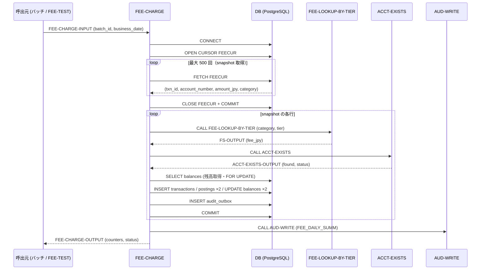
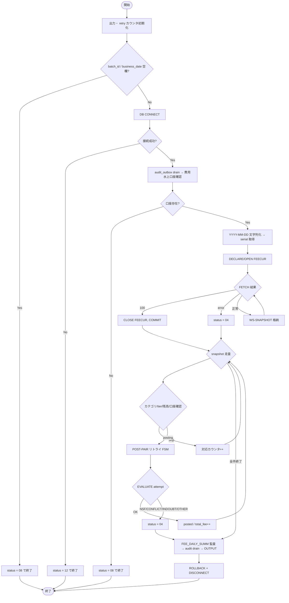

# 基本設計書 — FEE-CHARGE

> **サブシステム:** 16-fee
> **プログラム ID:** `FEE-CHARGE`
> **種別:** バッチ
> **更新日:** 2026-07-06

---

## 1. プログラム概要

| 項目 | 値 |
|------|-----|
| プログラム ID | `FEE-CHARGE` |
| ソースファイル | `src/fee-charge.sqb` |
| 所属サブシステム | 16-fee |
| 種別 | バッチ |
| 概要 | 営業日に BATCH ソースで発生したカテゴリ 30/40 の取引を走査し、口座単位で手数料を算出して仕訳（借方：顧客口座／贷方：手数料収益）を起票する。FEE-LOOKUP-BY-TIER で手数料を取得し、ACCT-EXISTS で口座状態を確認した上で、悲観ロックとリトライ FSM を用いて posting / balances を更新する。 |

---

## 2. 機能概要

### 2.1 このプログラムが「すること」
ビジネス日付＋バッチ ID でtransactions テーブルの fx済み category 30/40 対象を FETCH カーソルで最大 500 件までスキャンし、snapshot に保持する。snapshot の各行について手数料判定→口座存在判定→残高チェック→二重仕訳ヘルパーの検証→FOR UPDATE による悲観ロック→transactions 挿入→postings 2 行挿入→balances 2 行更新→audit_outbox 書き込みを Serializable トランザクション内で実行する。カテゴリ 30 や tier 1 の非課金明細、無効・閉鎖口座、残高不足、重複明細はスキップしてそれぞれのカウンタを積算し、上位のバッチスケジューラへ集計値として返す。

### 2.2 呼出元と呼出し先
- **呼出元:** バッチスケジューラ（cron / 運用スクリプト）。ユニットテストドライバ `FEE-TEST` から `CALL "FEE-CHARGE"` で呼出される。
- **呼出先:** `FEE-LOOKUP-BY-TIER`（07-feeschedule の .so モジュール。手数料マスタルックアップ）、`ACCT-EXISTS`（08-account の .so モジュール。口座存在／ステータス確認）、`AUD-WRITE`（共有ユーティリティ。要約監査書き込み）、`double-entry-helper.cpy`（共用コピブック。DEH による仕訳妥当性検証）。

### 2.3 シーケンス図

---

## 3. 処理フロー

### 3.1 全体フロー（flowchart）

---

## 4. 入出力仕様

### 4.1 入力

| 項目 | 型 | 必須 | 説明 |
|------|-----|:----:|------|
| FEE-CHARGE-BATCH-ID | PIC X(14) | ✅ | 稼働バッチ ID。`FEE` 関連の source_batch_id 重複判定に使用。 |
| FEE-CHARGE-BUSINESS-DATE | PIC 9(8) | ✅ | ビジネス日付（YYYYMMDD）。スナップショット取引フィルタ・手数料算出基準日に使用。 |
| FEE-CHARGE-SUMMARY-FILENAME | PIC X(80) | — | 要約書からのファイルパス。将来拡張用。 |

### 4.2 出力

| 項目 | 型 | 説明 |
|------|-----|------|
| FEE-CHARGE-STATUS | PIC X(2) | 処理結果コード（下記返却コード参照） |
| FEE-OUT-TXNS-SCANNED | PIC 9(7) | スキャン対象明細数 |
| FEE-OUT-CHARGES-POSTED | PIC 9(7) | 実際に手数料仕訳を起票した件数 |
| FEE-OUT-SKIPPED-NO-FEE | PIC 9(7) | スキップ件数（課金対象外＝category30／tier1 等） |
| FEE-OUT-SKIPPED-CLOSED | PIC 9(7) | スキップ件数（無効／閉鎖口座） |
| FEE-OUT-SKIPPED-NSF | PIC 9(7) | スキップ件数（残高不足） |
| FEE-OUT-SKIPPED-ALREADY | PIC 9(7) | スキップ件数（重複仕訳） |
| FEE-OUT-SKIPPED-HELPER | PIC 9(7) | スキップ件数（仕訳ヘルパー却下） |
| FEE-OUT-TOTAL-FEE-JPY | PIC S9(15) COMP-3 | 当日課金合計額 |
| FEE-OUT-DURATION-SEC | PIC 9(5) | 処理時間（秒）。更新されていれば。 |

### 4.3 返却コード（概要）

| コード | 意味 |
|--------|------|
| 00 | 正常 |
| 04 | PARTIAL（一部的スキップまたは INDOUBT による途中打ち切り） |
| 08 | INVALID-INPUT（batch_id または business_date 未設定） |
| 12 | IO-FAIL（DB 接続不能） |
| 16 | FATAL（深刻な内部エラー。現状では未使用予備） |

---

## 5. 正常系テストケース

| # | テスト名 | 入力 | 期待出力 | 確認ポイント |
|---|---------|------|---------|------------|
| 1 | カテゴリ 40 tier2＋tier3 の 2 件課金 | batch_id=TEST / date=20260613（seed 6 行） | posted=2, total_fee=1320 | 最低 2 件の手数料で ¥440 + ¥880 が記録されること |
| 2 | カテゴリ 30 は非課金 | 同上 | no-fee>=1 | category 30 明細はカウントされるだけで仕訳は起票されない |
| 3 | Tier 1 は手数料 0 扱い | 同上 | no-fee に tier1 分を含む | 少額 tier は FEE-LOOKUP-BY-TIER が 0 を返しスキップされること |
| 4 | リトライ FSM でコンフリクト突破 | SER_FAULT_CONFLICT_N=2 / MAX=5 | posted>=1 | 競合発生でもリトライで仕訳が成功し retries_total>0 |
| 5 | Re-run による冪等確認 | 同一 batch を連続 2 回 | run2 posted=0, already=2 | 同一 description の重複判定が 2 回目をスキップ |
| 6 | 費用水上口座残高の整合 | 同上 | fee_rev_bal=1320 | balances の手数料収益口座 c=1320 に積算されていること |

---

## 6. 異常系テストケース

| # | テスト名 | 入力 | 期待される異常 | 確認ポイント |
|---|---------|------|--------------|------------|
| 1 | batch_id 未指定 | batch_id=SPACES | status = 08 | VALIDATE-INPUT で即座に無効判定 |
| 2 | DB 接続不能 | 接続先不正 | status = 12 | CONNECT 失敗時のハンドリング |
| 3 | スナップショット取得エラー | FEECUR FETCH 失敗 | status = 04 | PARTIAL に転化し、snapshot のみ確定後に集計を返す |
| 4 | リトライ上限超過 | SER_FAULT_CONFLICT_N=10 / MAX=2 | 当該取引 PARTIAL、status = 04 | retries_total>0、posted 減少、上限超えて中断 |
| 5 | 無効閉鎖口座スキップ | status P/C の acct | closed>=1 | ACCT-EXISTS 返却値によりステータスチェックが機能 |

---

## 参考
- ソース: [fee-charge.sqb](../src/fee-charge.sqb)
- 生成後ソース: [fee-charge.cob.gen](../src/fee-charge.cob.gen)
- 公開 IF: [fee-api.cpy](../copy/api/fee-api.cpy)
- テスト: [fee-test.cob](../tests/unit/fee-test.cob) · [fee-retry-test.sh](../tests/unit/fee-retry-test.sh)
- 関連設計（呼出先）: [FEE-LOOKUP-BY-TIER](../../07-feeschedule/design/fee-lookup-by-tier.md) · [ACCT-EXISTS](../../08-account/design/acct-exists.md)
- 共有コピブック: `double-entry-helper.cpy` / `aud-write-api.cpy` / `shared-log-api.cpy`
- その他: [Makefile](../Makefile)
