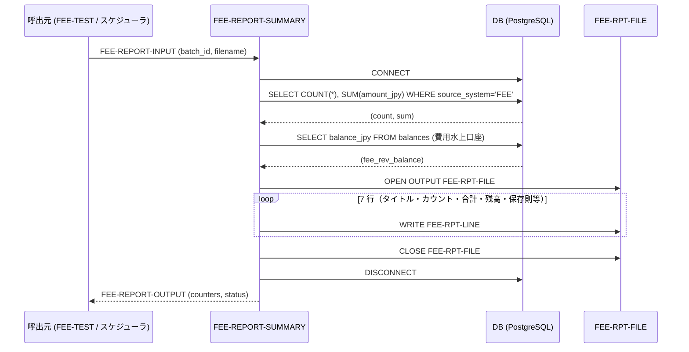

# 基本設計書 — FEE-REPORT-SUMMARY

> **サブシステム:** 16-fee
> **プログラム ID:** `FEE-REPORT-SUMMARY`
> **種別:** バッチ
> **更新日:** 2026-07-06

---

## 1. プログラム概要

| 項目 | 値 |
|------|-----|
| プログラム ID | `FEE-REPORT-SUMMARY` |
| ソースファイル | `src/fee-report-summary.sqb` |
| 所属サブシステム | 16-fee |
| 種別 | バッチ |
| 概要 | ビジネス日付＋バッチ ID で集計した手数料未掵約額と費用水上口座（`0010010000004`）現在高を交差検証し、日次要約レポート（120 カラム固定長 LINE SEQUENTIAL）を出力する。保存則チェック・PT カウント・JPY 合計・費用水上残高を同一レポートに出力し、FEE-CHARGE が生成した仕訳の正味整合を外部から証明可能にする。 |

---

## 2. 機能概要

### 2.1 このプログラムが「すること」
`FEE-CHARGE` が起票した `source_system='FEE'` の取引を COUNT / SUM で集計し、費用水上口座の balance_jpy を取得する 2 つの SQL を同じトランザクション文脈で実行する。取得値をレポートヘッダ行（タイトル、バッチ ID、ピストン合計、取引合計、費用水上残高、"PASSED"/フラグ）としてカンマ / ラベル形式でシリアライズし、FEE-RPT-FILE に 7 行出力する。出力先ファイルは呼び出し側が `FEE-RPT-REPORT-FILENAME` で与える。

### 2.2 呼出元と呼出し先
- **呼出元:** バッチスケジューラ（`FEE-CHARGE` 続きで呼出されることを想定）。ユニットテストドライバ `FEE-TEST` から `CALL "FEE-REPORT-SUMMARY"` で呼出される。
- **呼出先:** なし（外部 `.so` モジュール呼出なし。SQL のみで完結）。

### 2.3 シーケンス図



---

## 3. 処理フロー

### 3.1 全体フロー（flowchart）

```mermaid
flowchart TD
    START([開始]) --> INIT[出力カウンタ・保存則フラグ初期化]
    INIT --> VALIDATE{batch_id / report_filename 空欄?}
    VALIDATE -->|Yes| ERR_INV[status = 08 で終了]
    VALIDATE -->|No| DB_CONN[DB CONNECT]
    DB_CONN --> CONN_OK{接続成功?}
    CONN_OK -->|No| ERR_IO[status = 12 で終了]
    CONN_OK -->|Yes| PG_VERIFY[PG-CROSS-VERIFY]
    PG_VERIFY --> Q1[SELECT COUNT/SUM FROM transactions]
    PG_VERIFY --> Q2[SELECT balance_jpy FROM balances]
    Q2 --> RPT_OPEN[OPEN OUTPUT FEE-RPT-FILE]
    RPT_OPEN --> FS_OK{ファイルステータス 00?}
    FS_OK -->|No| ERR_IO2[status = 12 で終了]
    FS_OK -->|Yes| W1[WRITE ヘッダ行]
    W1 --> W2[WRITE "Batch ID:" 行]
    W2 --> W3[WRITE "PT count:" 行]
    W3 --> W4[WRITE "Txn JPY sum:" 行]
    W4 --> W5[WRITE "Fee rev balance:" 行]
    W5 --> W6[WRITE "Conservation:" 行]
    W6 --> RPT_CLOSE[CLOSE FEE-RPT-FILE]
    RPT_CLOSE --> POP_OUT[counters → OUTPUT 構造体]
    POP_OUT --> CLEANUP[DISCONNECT ALL]
    CLEANUP --> END([終了])
    ERR_INV --> END
    ERR_IO --> END
    ERR_IO2 --> END
```

---

## 4. 入出力仕様

### 4.1 入力

| 項目 | 型 | 必須 | 説明 |
|------|-----|:----:|------|
| FEE-RPT-BUSINESS-DATE | PIC 9(8) | — | レポート日付（YYYYMDD）。現在 SQL フィルタには不使用だが将来ファイル名やログ識別に使用 |
| FEE-RPT-BATCH-ID | PIC X(14) | ✅ | 集計対象バッチ。`source_system='FEE' AND source_batch_id=:batch_id` に使用 |
| FEE-RPT-SUMMARY-FILENAME | PIC X(80) | — | FEE-CHARGE が出力する要約ファイル名。現在未使用（将来統合用） |
| FEE-RPT-REPORT-FILENAME | PIC X(80) | ✅ | 出力ファイルパス。LINE SEQUENTIAL で書き出し |

### 4.2 出力

| 項目 | 型 | 説明 |
|------|-----|------|
| FEE-RPT-STATUS | PIC X(2) | 処理結果コード（下記返却コード参照） |
| FEE-RPT-TOTAL-CHARGES | PIC 9(7) | 手数料取引カウント（PT count） |
| FEE-RPT-TOTAL-FEE-JPY | PIC S9(15) COMP-3 | 手数料合計額 |
| FEE-RPT-FEE-REVENUE-BAL | PIC S9(15) COMP-3 | 費用水上口座現在高 |
| FEE-RPT-CONSERVATION-PASS | PIC X(1) | 保存則チェック結果。初期値 "Y"（警告 "Ｎ"） |
| FEE-RPT-DURATION-SEC | PIC 9(5) | 処理時間（秒） |

ファイル出力構成（7 行 × PIC X(120) LINE SEQUENTIAL）：

```
=== FEE Daily Charge Report ===
Batch ID:        {batch_id}
PT count:        {count}
Txn JPY sum:     {sum}
Fee rev balance: {balance}
Conservation:    {Y/N}
```

### 4.3 返却コード（概要）

| コード | 意味 |
|--------|------|
| 00 | 正常 |
| 04 | CONSERVATION-WARN（保存則不一致の疑い。現在は固定 "Y"） |
| 08 | INVALID-INPUT（batch_id / report_filename 未指定） |
| 12 | IO-FAIL（DB 接続不可／ファイルオープン不可） |
| 16 | FATAL（深刻な内部エラー。現状では未使用予備） |

---

## 5. 正常系テストケース

| # | テスト名 | 入力 | 期待出力 | 確認ポイント |
|---|---------|------|---------|------------|
| 1 | 費用水上・PT 件数整合確認 | 同一バッチの FEE-CHARGE 直後呼び出し | charges=2, sum=1320 | FEE-CHARGE が起票した 2 件と同値を取得 |
| 2 | 費用水上残高との一致確認 | 同上 | fee_rev_balance=1320 | 手数料収益口座カラムと sum が一致 |
| 3 | 保存則パス | 正常 seed | conservation_pass="Y" | 保存則フラグは初期 "Y" のまま維持 |
| 4 | レポートファイル生成 | report_filename 指定 | 7 行のファイルが指定パスに存在 | LINE SEQUENTIAL サイズ 120 で書かれていること |
| 5 | ステータス 00 帰還 | 正常実行 | status=00 | IO-FAIL 等の異常がなければ |

---

## 6. 異常系テストケース

| # | テスト名 | 入力 | 期待される異常 | 確認ポイント |
|---|---------|------|--------------|------------|
| 1 | batch_id 未指定 | batch_id=SPACES | status = 08 | VALIDATE-INPUT で即座に無効判定 |
| 2 | report_filename 未指定 | report_filename=SPACES | status = 08 | ファイルパスはレポート書き出しに必須 |
| 3 | DB 接続不能 | 接続先不正 | status = 12 | CONNECT 失敗時に IO-FAIL で帰還 |
| 4 | レポートファイル書込不可 | 権限なし／フルディスク | status = 12 | OPEN OUTPUT のファイルステータス不正で検知 |
| 5 | カーソル取得エラー（transactions 無し） | 未知 batch_id | charges=0, sum=0 | SQL エラーではなくゼロ件返却として処理が継続 |

---

## 参考
- ソース: [fee-report-summary.sqb](../src/fee-report-summary.sqb)
- 生成後ソース: [fee-report-summary.cob.gen](../src/fee-report-summary.cob.gen)
- 公開 IF: [fee-api.cpy](../copy/api/fee-api.cpy)
- テスト: [fee-test.cob](../tests/unit/fee-test.cob)
- 関連設計（呼出元詳細）: [FEE-CHARGE](fee-charge.md)
- その他: [Makefile](../Makefile)