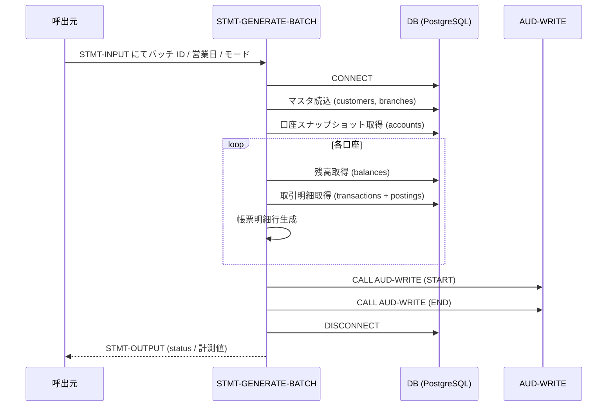
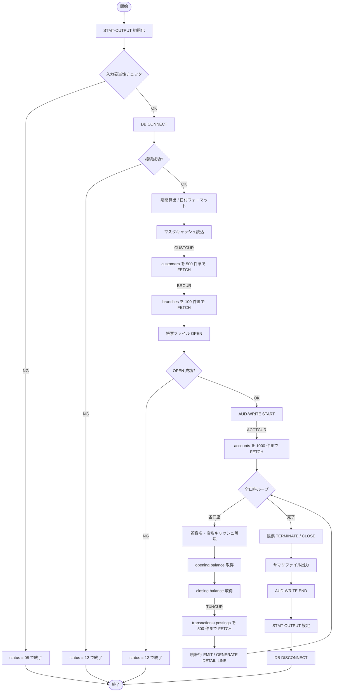

# 基本設計書 — STMT-GENERATE-BATCH

> **サブシステム:** 17-statement
> **プログラム ID:** `STMT-GENERATE-BATCH`
> **種別:** バッチ
> **更新日:** 2026-07-06

---

## 1. プログラム概要

| 項目 | 値 |
|------|-----|
| プログラム ID | `STMT-GENERATE-BATCH` |
| ソースファイル | `src/stmt-generate-batch.sqb` |
| 所属サブシステム | 17-statement |
| 種別 | バッチ |
| 概要 | 営業日時点の口座スナップショットを取得し、期間内取引明細と残高を集計して帳票（STATEMENT-REPORT）を出力する。顧客名・店名はマスタキャッシュで解決し、監査ログを AUD-WRITE に記録する。 |

---

## 2. 機能概要

### 2.1 このプログラムが「すること」
バッチ ID・営業日・出力モード（日次／月次）を入力として受け取り、DB から口座・取引・残高を読み出して帳票ファイルとサマリファイルを出力する。
処理件数・明細行数などの計測値を STMT-OUTPUT に返却し、AUD-WRITE で開始／終了の監査ログを残す。

### 2.2 呼出元と呼出し先
- **呼出元:** テストドライバ `STMT-TEST`。ジョブスケジューラ等からの `CALL "STMT-GENERATE-BATCH"` 呼出しを想定。
- **呼出先:** `AUD-WRITE`（[shared/util/aud-write](../../shared/util/aud-write/design/aud-write-bd.md)）。監査ログの書き出しを委譲する。

### 2.3 シーケンス図

---

## 3. 処理フロー

### 3.1 全体フロー（flowchart）

---

## 4. 入出力仕様

### 4.1 入力

| 項目 | 型 | 必須 | 説明 |
|------|-----|:----:|------|
| STMT-BATCH-ID | PIC X(14) | ✅ | バッチ実行情報を識別する ID |
| STMT-BUSINESS-DATE | PIC 9(8) | ✅ | 営業日（YYYYMMDD） |
| STMT-MODE | PIC X(1) | ✅ | "D"=日次 / "M"=月次 |
| STMT-OUTPUT-FILENAME | PIC X(80) | ✅ | 帳票ファイルパス |
| STMT-SUMMARY-FILENAME | PIC X(80) |  | サマリファイルパス（省略時は出力しない） |
| STMT-SKIP-INACTIVE | PIC X(1) |  | "Y"=取引なし口座をスキップ、"N"=取引なし明細を出力 |

### 4.2 出力

| 項目 | 型 | 説明 |
|------|-----|------|
| STMT-STATUS | PIC X(2) | 処理結果コード（下記返却コード参照） |
| STMT-OUT-ACCOUNTS-PROCESSED | PIC 9(7) | 明細を出力した口座数 |
| STMT-OUT-ACCOUNTS-EMPTY | PIC 9(7) | 取引なしで空明細を出力した口座数 |
| STMT-OUT-ACCOUNTS-SKIPPED | PIC 9(7) | 取引なしでスキップした口座数 |
| STMT-OUT-LINES-WRITTEN | PIC 9(10) | 出力明細行数 |
| STMT-OUT-PAGES-WRITTEN | PIC 9(7) | 出力ページ数 |
| STMT-OUT-BYTES-WRITTEN | PIC 9(12) | 出力バイト数 |
| STMT-OUT-DURATION-SEC | PIC 9(5) | 処理時間（秒） |

### 4.3 返却コード（概要）

| コード | 意味 |
|--------|------|
| 00 | 正常 |
| 04 | PARTIAL（一部失敗） |
| 08 | INVALID-INPUT（入力不正） |
| 12 | IO-FAIL（DB 接続／ファイル OPEN 失敗） |
| 16 | FATAL（重大エラー） |

---

## 5. 正常系テストケース

| # | テスト名 | 入力 | 期待出力 | 確認ポイント |
|---|---------|------|---------|------------|
| 1 | 日次モード正常系 | business=20260613, mode=D | status=00, accts>=5 | 5 件以上の口座が処理されること |
| 2 | 帳票ファイル出力 | mode=D | .rpt ファイルが存在し、"PRACTICE BANK STATEMENT" を含む | ページ見出しが出力されること |
| 3 | 明細行出力 | mode=D | lines-written >= 10 | 取引明細が 10 行以上出力されること |
| 4 | 開始残高出力 | mode=D | .rpt に "Opening Balance" を含む | 開始残高行が出力されること |
| 5 | 終了残高出力 | mode=D | .rpt に "Closing Balance" を含む | 終了残高行が出力されること |
| 6 | 空口座明細出力 | mode=D, skip=N | 口座 0010010099405 が .rpt に出現 | 取引なし口座のプレースホルダ行が出力されること |
| 7 | 月次モード正常系 | business=20260613, mode=M | status=00 | 月次モードで正常終了すること |
| 8 | 冪等性（再実行） | 同一パラメータを 2 回実行 | 2 回目の .rpt が 1 回目と同一 | 再実行でバイト同一の帳票が得られること |
| 9 | サマリファイル出力 | summary-filename 指定 | summary ファイルが存在し、バッチ ID / 件数を含む | サマリが出力されること |
| 10 | 監査ログ発行 | mode=D | audit_log に 17-statement のレコードが 2 件以上 | START / END の監査ログが出力されること |

---

## 6. 異常系テストケース

| # | テスト名 | 入力 | 期待される異常 | 確認ポイント |
|---|---------|------|--------------|------------|
| 1 | 不正モード | mode="X" | status = 08 | D/M 以外が拒否されること |
| 2 | 必須入力未設定 | batch-id または business-date 未設定 | status = 08 | 入力チェックが優先されること |
| 3 | DB 接続失敗 | DB 停止状態 | status = 12 | 接続不能時に IO-FAIL が返ること |
| 4 | 帳票 OPEN 失敗 | 出力先ディレクトリ不在 | status = 12 | ファイル OPEN 失敗時に後続処理が実行されないこと |

---

## 参考
- ソース: [stmt-generate-batch.sqb](../src/stmt-generate-batch.sqb)
- 公開 IF: [stmt-api.cpy](../copy/api/stmt-api.cpy)
- その他: [Makefile](../Makefile)
