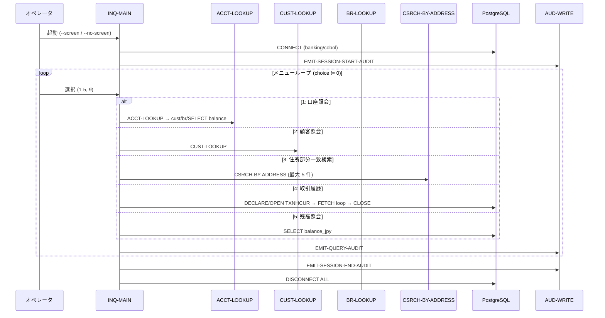
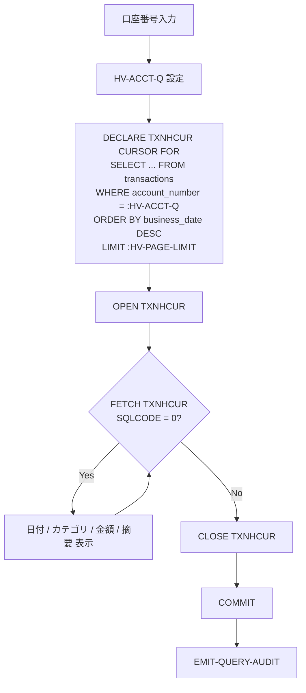

# 基本設計書 — INQ-MAIN

> **サブシステム:** 18-inquiry
> **プログラム ID:** `INQ-MAIN`
> **種別:** オンライン
> **更新日:** 2026-07-06

---

## 1. プログラム概要

| 項目 | 値 |
|------|-----|
| プログラム ID | `INQ-MAIN` |
| ソースファイル | `src/inq-main.sqb` |
| 所属サブシステム | 18-inquiry |
| 種別 | オンライン |
| 概要 | 銀行員向け CUI 照会ツール。メニュー駆動で (1) 口座照会 (2) 顧客照会 (3) 住所部分一致検索 (4) 取引履歴 (5) 残高照会 を提供し、各操作およびセッション開始／終了時に AUD-WRITE で監査ログを書き込む。 |

---

## 2. 機能概要

### 2.1 このプログラムが「すること」
PostgreSQL データベースおよび外部ルックアップモジュール (ACCT-LOOKUP / CUST-LOOKUP / BR-LOOKUP / CSRCH-BY-ADDRESS) を呼び出し、対話セッション中にオペレータが選択した照会処理を実行する。
各照会が 1 クエリとしてカウントされ、セッションの開始と終了が監査テーブルに記録される。

### 2.2 呼出元と呼出し先
- **呼出元:** 端末オペレータ (bash / 画面モード)。`bin/inq [--screen|--no-screen]` として起動。
- **呼出先:**
  - `ACCT-LOOKUP` — 口座番号から口座情報を取得
  - `CUST-LOOKUP` — 顧客 ID から顧客情報を取得
  - `BR-LOOKUP` — 支店コードから支店名を取得
  - `CSRCH-BY-ADDRESS` — 住所部分一致のページング検索
  - `AUD-WRITE` — 監査ログ書き込み

### 2.3 シーケンス図



---

## 3. 処理フロー

### 3.1 全体フロー（flowchart）

```mermaid
flowchart TD
    START([起動]) --> PARSE[引数解析 --screen/--no-screen]
    PARSE --> CONNECT[PG CONNECT]
    CONNECT --> CONN_OK{接続成功?}
    CONN_OK -->|No| FATAL[status = 16 で終了]
    CONN_OK -->|Yes| AUD_START[EMIT-SESSION-START-AUDIT]
    AUD_START --> LOOP{@menu-choice = 0?}
    LOOP -->|No| SHOW[メニュー表示]
    SHOW --> READ[選択読み取り]
    READ --> DISPATCH[EVALUATE menu-choice]
    DISPATCH -->|"1"| ACCT[INQ-ACCT-MODE]
    DISPATCH -->|"2"| CUST[INQ-CUST-MODE]
    DISPATCH -->|"3"| CSRCH[INQ-CSRCH-MODE]
    DISPATCH -->|"4"| TXN[INQ-TXN-HIST-MODE]
    DISPATCH -->|"5"| BAL[INQ-BAL-MODE]
    DISPATCH -->|"9"| HELP[INQ-DISPLAY-HELP]
    DISPATCH -->|"0"| EXIT_LOOP[ループ脱出]
    DISPATCH -->|OTHER| INVALID[エラーメッセージ設定]
    ACCT --> AUD_Q[EMIT-QUERY-AUDIT]
    CUST --> AUD_Q
    CSRCH --> AUD_Q
    TXN --> AUD_Q
    BAL --> AUD_Q
    AUD_Q --> LOOP
    INVALID --> LOOP
    HELP --> LOOP
    EXIT_LOOP --> AUD_END[EMIT-SESSION-END-AUDIT]
    AUD_END --> CLEANUP[DISCONNECT ALL]
    CLEANUP --> END([終了])
    FATAL --> END
```

### 3.2 取引履歴モードの SQL カーソルフロー



---

## 4. 入出力仕様

### 4.1 入力

| 項目 | 型 | 必須 | 説明 |
|------|-----|:----:|------|
| 起動引数 `--screen` / `--no-screen` | PIC X(50) | — | 画面モード (SCREEN SECTION 使用) と非画面モードを切替。デフォルトは非画面モード |
| メニュー選択 | PIC X(2) | ✅ | "1"〜"5", "9"=Help, "0"=Exit |
| 口座番号 (モード 1/4/5) | PIC X(13) | ✅ | 13 桁の口座番号。SPACES は拒否 |
| 顧客 ID (モード 2) | PIC 9(10) | ✅ | 10 桁の顧客番号 (NUMVAL 変換) |
| 住所部分文字列 (モード 3) | PIC X(50) | — | 部分一致検索キーワード |

### 4.2 出力

| 項目 | 型 | 説明 |
|------|-----|------|
| メニュー・結果表示 | 端末 DISPLAY | 画面モード時は SCREEN SECTION、非画面モード時は行単位の DISPLAY |
| 監査ログ | audit_log テーブル | AUD-WRITE 経由で INQ_SESSION_START / INQ_QUERY_EXECUTED / INQ_SESSION_END を書き込み |
| 返却コード (STOP RUN) | PIC 9(2) | 接続失敗時 = 12、それ以外 = 0 |

### 4.3 返却コード（概要）

| コード | 意味 |
|--------|------|
| 00 | 正常終了 |
| 08 | 無効な入力 (メニュー選択外) — 画面内エラー表示のみで終了しない |
| 12 | PG 接続失敗 (IO-FAIL) — STOP RETURNING 12 |
| 16 | FATAL (予期しない障害) |

---

## 5. 正常系テストケース

| # | テスト名 | 入力 | 期待出力 | 確認ポイント |
|---|---------|------|---------|------------|
| 1 | メニュー表示 | `0` | "PRACTICE BANK INQUIRY TOOL" | メニュー見出しが表示されること |
| 2 | 口座照会 (T1) | `1` → `0010010099501` → `0` | 0010010099501 と "Customer.*INQ" | ACCT → CUST → BR → balances の連鎖が完了すること |
| 3 | 残高照会 (T2 = 75,000) | `5` → `0010010099502` → `0` | "Balance:" と "75,000" | balances テーブルから編集表示すること |
| 4 | 取引履歴 | `4` → `0010010099501` → `0` | "TXN HISTORY" | カーソル OPEN → FETCH ループ → CLOSE が動くこと |
| 5 | 監査書き込み (START/END) | `0` | audit_log に行が 2 件追加 | AUD-WRITE がセッション開始／終了を記録すること |

---

## 6. 異常系テストケース

| # | テスト名 | 入力 | 期待される異常 | 確認ポイント |
|---|---------|------|--------------|------------|
| 1 | 口座未検出 | `1` → `0010010099999` → `0` | "Account not found" | ACCT-LOOKUP が NOT-OK を返した分岐 |
| 2 | 無効メニュー選択 | `X` → `0` | "Invalid menu selection" | EVALUATE OTHER の分岐 |
| 3 | 口座番号未入力 | `1` → (空) → `0` | "Account number required" | 入力チェックで即 EXIT |
| 4 | PG 接続障害 | DB 停止状態で起動 | STOP RETURNING 12 | WS-CONNECTED にならず終了 |
| 5 | 外部モジュール不在 | ACCT-LOOKUP 削除でモード 1 | "ACCT-LOOKUP not callable" | ON EXCEPTION が拾うこと |

---

## 参考
- ソース: [inq-main.sqb](../src/inq-main.sqb)
- 公開 IF: [inq-api.cpy](../copy/api/inq-api.cpy)
- その他: [Makefile](../Makefile)
