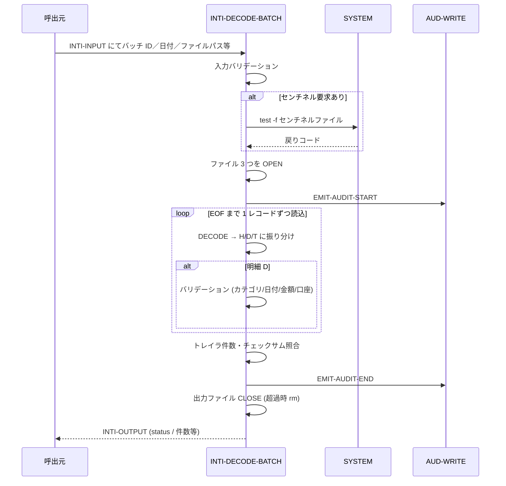
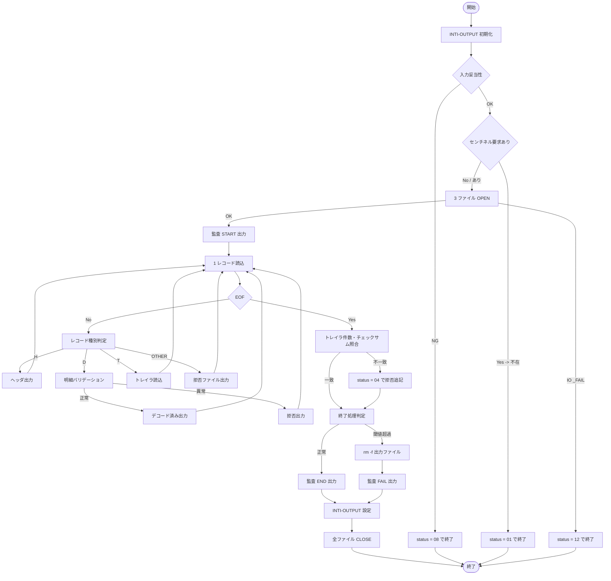

# 基本設計書 — INTI-DECODE-BATCH

> **サブシステム:** 19-integrationin
> **プログラム ID:** `INTI-DECODE-BATCH`
> **種別:** バッチ
> **更新日:** 2026-07-06

---

## 1. プログラム概要

| 項目 | 値 |
|------|-----|
| プログラム ID | `INTI-DECODE-BATCH` |
| ソースファイル | `src/inti-decode-batch.cob` |
| 所属サブシステム | 19-integrationin |
| 種別 | バッチ |
| 概要 | EBCDIC 固定長ファイルを入力として読み込み、レコードタイプ (H/D/T) ごとにバリデーション＋デコードを実施し、トランザクション明細ファイルを生成する。不良レファイルは拒否ファイルに出力し、トレイラのレコード数／チェックサムを整合検証する。 |

---

## 2. 機能概要

### 2.1 このプログラムが「すること」
EBCDIC 固定長ファイルを 1 レコード (800 バイト) ずつ読み込み、ヘッダ (H) → 明細 (D) → トレイラ (T) の順序をバリデーションしながらデコード済みファイル (600 バイト固定長) へ書き出す。
明細レコードはカテゴリ変換・日付変換 (YY→YYYY) ・金額・口座フォーマットを検証し、条件を満たさないレコードは拒否ファイルに出力する。
処理末尾でトレイラレコード数と実デコード件数の照合、およびチェックサム (各バイト ORD 累積 mod 65536) を行い、閾値超過時は出力ファイルを削除して異常終了する。

### 2.2 呼出元と呼出し先
- **呼出元:** テストドライバ `INTI-DRIVER`。外部バッチスケジューラからの `CALL "INTI-DECODE-BATCH"` を想定。
- **呼出先:** `SYSTEM` (shell コマンド呼出 — センチネル確認／出力ファイル削除)。`AUD-WRITE` (監査ログ出力)。

### 2.3 シーケンス図

---

## 3. 処理フロー

### 3.1 全体フロー（flowchart）

---

## 4. 入出力仕様

### 4.1 入力

| 項目 | 型 | 必須 | 説明 |
|------|-----|:----:|------|
| INTI-BATCH-ID | PIC X(14) | ✅ | バッチ識別子。監査ログおよびデコード済みファイルヘッダに格納される。 |
| INTI-BUSINESS-DATE | PIC 9(8) | ❌ | 営業日 (YYYYMMDD)。0 の場合はバリデーションエラー (08)。 |
| INTI-INPUT-FILENAME | PIC X(120) | ✅ | 入力 EBCDIC ファイルの絶対パス。 |
| INTI-OUTPUT-FILENAME | PIC X(120) | ✅ | デコード済み出力ファイルの絶対パス。 |
| INTI-REJECT-FILENAME | PIC X(120) | ❌ | 拒否レコード出力ファイルの絶対パス。 |
| INTI-SENTINEL-FILENAME | PIC X(120) | ❌ | 投入トリガファイル。指定され AND センチネル要求ありのときのみ投入前提チェックを行う。 |
| INTI-REJECT-THRESHOLD-PCT | PIC 9(3) | ❌ | 拒否率閾値 (%)。超過時は出力ファイル削除して 04 で終了。 |
| INTI-REQUIRE-SENTINEL | PIC X(1) | ❌ | "Y" 時のみセンチナル確認を行う。 |

### 4.2 出力

| 項目 | 型 | 説明 |
|------|-----|------|
| INTI-STATUS | PIC X(2) | 処理結果コード (下記返却コード参照) |
| INTI-OUT-RECORDS-READ | PIC 9(10) | 読み込んだ総レコード件数 |
| INTI-OUT-DETAILS-DECODED | PIC 9(10) | 正常にデコードされた明細件数 |
| INTI-OUT-DETAILS-REJECTED | PIC 9(10) | 拒否されたレコード件数 |
| INTI-OUT-REJECT-PCT | PIC 9(3) | 拒否率 (%) |
| INTI-OUT-CHECKSUM-MATCH | PIC X(1) | トレイラ件数・チェックサム一致フラグ ("Y" / "N") |
| INTI-OUT-DURATION-SEC | PIC 9(5) | 処理時間 (秒)。将来拡張用フィールド (現状は未設定) |

ファイル出力:
- **デコード済入力ファイル:** 600 バイト固定長。ヘッダ 1 + 明細 N + トランザクション 1 レコードから構成。
- **拒否ファイル:** リテラル "reason | raw-data(80) | expanded-reason" の可変長行を追記する。

### 4.3 返却コード（概要）

| コード | 意味 |
|--------|------|
| 00 | 正常 — デコード済みファイルは正常に出力された |
| 01 | NO-INPUT-READY — センチネルファイル未存在のため処理をスキップ |
| 04 | PARTIAL — トレイラ不一致、拒否率超過、先頭にヘッダなしなどで一部不正 |
| 08 | INVALID-INPUT — 必須入力 (BATCH-ID / BUSINESS-DATE / ファイルパス) 不足 |
| 12 | IO-FAIL — ファイル OPEN 失敗 |
| 16 | FATAL — その他の予期せぬ異常 (ドライバのデフォルト分岐) |

レコードレベルの拒否理由コード: E101 (missing header), E102 (dup/missing trailer), E103 (trailer count mismatch), E105 (invalid category), E106 (invalid acct format), E108 (zero amount), E110 (invalid date), E111 (non-printable UTF-8), E199 (other).

---

## 5. 正常系テストケース

| # | テスト名 | 入力 | 期待出力 | 確認ポイント |
|---|---------|------|---------|------------|
| 1 | 5 明細すべて正常 (happy path) | H + D × 5 + T (スレッショルド内) | rc=0, status=00, read=7, decoded=5, rejected=0 | 600 バイト × 7 レコード (= 4200 バイト) の出力ファイルが生成されること |
| 2 | カテゴリ変換確認 (10/20/30/40) | category = 10 / 20 / 30 / 40 の明細 | いずれも decoded++ | EVALUATE 全分岐をカバーし、invalid (例 99) は E105 で拒否されること |
| 3 | 日付スラッシュ (YY < 50 → 20YY, YY >= 50 → 19YY) | YY = 26 と YY = 99 の明細 | ともにデコード | 2000 / 1900 の切替判定と YYYY 計算が正しく出力されること |
| 4 | チェックサム・トレイラ件数一致 | レコード数がトレイラ T-RECORD-COUNT と等しい | checksum-match = "Y", status = 00 | ACCUMULATE-CHECKSUM mod 65536 とトレイラ T-CHECKSUM が一致して終了すること |

---

## 6. 異常系テストケース

| # | テスト名 | 入力 | 期待される異常 | 確認ポイント |
|---|---------|------|--------------|------------|
| 1 | 無効カテゴリ (100% 拒否) | category = 99 の明細 1 件 | rc=4, status=04, rejected=1 | 拒否レート 100% > 閾値 (20) で出力ファイルが削除されること |
| 2 | 金額ゼロ | amount = 0 の明細 | rc=4, status=04, reason=E108 | VALIDATE-AMOUNT が E108 を設定し拒否ファイルへ追記されること |
| 3 | トレイラ件数不一致 | H.expected != T.actual (g=5/actual=99) | rc=4, status=04, reason=E103 | VERIFY-TRAILER で PARTIAL がセットされること |
| 4 | ヘッダなしの明細始端 | H を飛ばして D から始まるファイル | rc=4, status=04, reason=E101 | 先頭が D の場合のみ E101、トランザクションも拒否として扱われる |
| 5 | 閾値超過時に出力ファイル削除 | 4 中 3 件拒否 (75% > 20%) | rc=4 かつ出力ファイルが存在しない | FINALIZE-OUTPUT 内 `rm -f` が呼ばれ、ファイルが削除されること |
| 6 | センチネル不在 | INTI-REQUIRE-SENTINEL="Y" かつセンチネルなし | rc=1, status=01 | CHECK-SENTINEL で NO-INPUT-READY がセットされ途中終了すること |
| 7 | 監査ログへの書き出し | 正常終了後に audit_log テーブルを照会 | 監査行が 2 行 (START/END) 追加されること | EMIT-AUDIT-START/END が AUD-WRITE を呼び、PostgreSQL に行が INSERT されること |

---

## 参考
- ソース: [inti-decode-batch.cob](../src/inti-decode-batch.cob)
- 公開 IF: [inti-api.cpy](../copy/api/inti-api.cpy)
- ドライバ: [inti-driver.cob](../tests/unit/inti-driver.cob)
- テスト: [inti-test.sh](../tests/unit/inti-test.sh)
- 設定: [Makefile](../Makefile)
