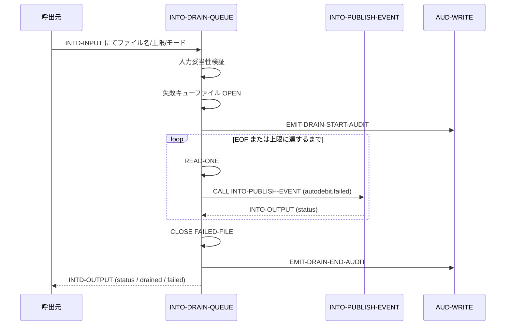
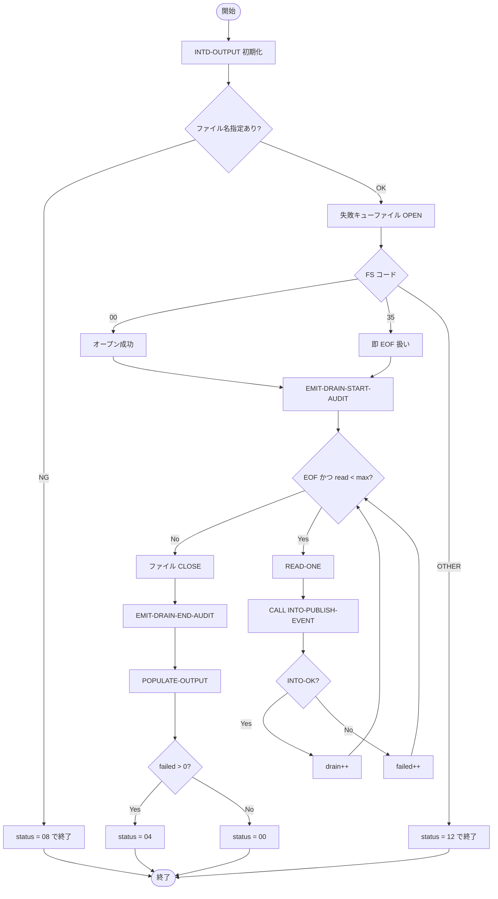

# 基本設計書 — INTO-DRAIN-QUEUE

> **サブシステム:** 20-integrationout
> **プログラム ID:** `INTO-DRAIN-QUEUE`
> **種別:** バッチ
> **更新日:** 2026-07-06

---

## 1. プログラム概要

| 項目 | 値 |
|------|-----|
| プログラム ID | `INTO-DRAIN-QUEUE` |
| ソースファイル | `src/into-drain-queue.cob` |
| 所属サブシステム | 20-integrationout |
| 種別 | バッチ |
| 概要 | autodebit 失敗レコードファイルを 1 レコードずつ読み込み、各レコードを `INTO-PUBLISH-EVENT` に渡して MQ イベントとして排出する。最大レコード数に達するかファイル末尾まで処理し、drain 件数・失敗件数を出力する。 |

---

## 2. 機能概要

### 2.1 このプログラムが「すること」
autodebit 失敗キューファイル（固定長 200 バイト逐次ファイル）を入力として読み取り、各レコードを `autodebit.failed` イベントに変換して `INTO-PUBLISH-EVENT` に委譲する。
処理件数が上限に達するかファイル EOF に達した時点で終了し、正常時は 00、一部失敗時は 04 を返す。

### 2.2 呼出元と呼出し先
- **呼出元:** テストドライバ `INTO-DRIVER`（`INTO_OP=D` モード）。他バッチからの `CALL "INTO-DRAIN-QUEUE"` を想定。
- **呼出先:** `INTO-PUBLISH-EVENT`（同一サブシステム内の .so モジュール）。1 レコードごとにイベント発行を委譲する。`AUD-WRITE`（監査ログ）を呼出す。

### 2.3 シーケンス図

---

## 3. 処理フロー

### 3.1 全体フロー（flowchart）

---

## 4. 入出力仕様

### 4.1 入力

| 項目 | 型 | 必須 | 説明 |
|------|-----|:----:|------|
| INTD-SOURCE-FILENAME | PIC X(120) | ✅ | 失敗キューファイルの絶対パス。未指定は status=08 |
| INTD-MAX-RECORDS | PIC 9(7) | ✅ | 1 回の drain で読み取る最大レコード数。0 指定時は 10000 にデフォルト |
| INTD-MODE | PIC X(1) | ✅ | `R`=実 MQ、`M`=モック。`INTO-PUBLISH-EVENT` へスルーされる |

### 4.2 出力

| 項目 | 型 | 説明 |
|------|-----|------|
| INTD-STATUS | PIC X(2) | 処理結果コード（下記返却コード参照） |
| INTD-OUT-DRAINED-COUNT | PIC 9(7) | 正常にイベント発行できたレコード数 |
| INTD-OUT-FAILED-COUNT | PIC 9(7) | 失敗したレコード数 |
| INTD-OUT-DURATION-MS | PIC 9(7) | 予約項目（現在未設定） |

### 4.3 返却コード（概要）

| コード | 意味 |
|--------|------|
| 00 | 正常（全レコード drain 成功） |
| 04 | 一部失敗（drain 成功レコードと失敗レコードが混在） |
| 08 | INVALID-INPUT（ファイル名未指定） |
| 12 | IO-FAIL（ファイル OPEN 失敗） |

---

## 5. 正常系テストケース

| # | テスト名 | 入力 | 期待出力 | 確認ポイント |
|---|---------|------|---------|------------|
| 1 | 空ファイル（存在しないファイル） | 存在しないパス | status=00, drained=0, failed=0 | FS=35 を EOF 扱いし正常終了すること |
| 2 | 5 レコードの drain | 5 件の autodebit 失敗レコード | status=00, drained=5 | 全レコードが `autodebit.failed` としてモック出力されること |
| 3 | 上限レコード数の超過抑制 | max=3 / ファイル 5 レコード | drained=3 | 上限到達でループを抜けること |

---

## 6. 異常系テストケース

| # | テスト名 | 入力 | 期待される異常 | 確認ポイント |
|---|---------|------|--------------|------------|
| 1 | ファイル名未指定 | INTD-SOURCE-FILENAME = スペース | status = 08 | 入力検証で即座に返ること |
| 2 | ファイル OPEN 失敗 | 権限不正ファイル等 | status = 12 | FS=00/35 以外を IO-FAIL とすること |
| 3 | 一部レコードの publish 失敗 | 例外発生レコード混在 | status = 04, failed > 0 | 部分失敗が 04 で伝播すること |

---

## 参考
- ソース: [into-drain-queue.cob](../src/into-drain-queue.cob)
- 公開 IF: [into-api.cpy](../copy/api/into-api.cpy)
- その他: [Makefile](../Makefile)
