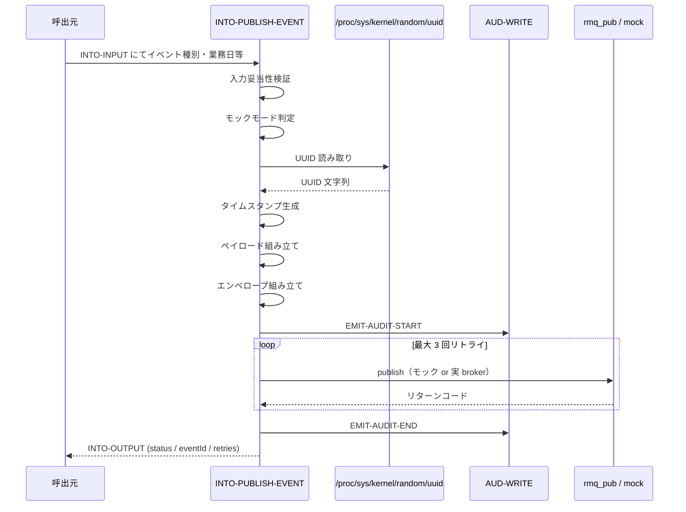
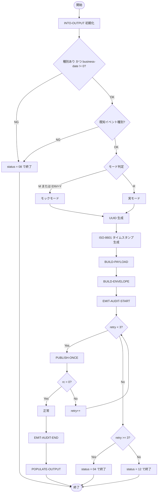

# 基本設計書 — INTO-PUBLISH-EVENT

> **サブシステム:** 20-integrationout
> **プログラム ID:** `INTO-PUBLISH-EVENT`
> **種別:** バッチ
> **更新日:** 2026-07-06

---

## 1. プログラム概要

| 項目 | 値 |
|------|-----|
| プログラム ID | `INTO-PUBLISH-EVENT` |
| ソースファイル | `src/into-publish-event.cob` |
| 所属サブシステム | 20-integrationout |
| 種別 | バッチ |
| 概要 | イベント種別に応じた JSON ペイロードを生成し、envelope を組み立てて MQ ブローカーへ publish する。最大 3 回のリトライを行い、成否に応じた監査ログを出力する。 |

---

## 2. 機能概要

### 2.1 このプログラムが「すること」
イベント種別（txn.posted / interest.posted / autodebit.failed / batch.completed / statement.generated）に応じた JSON ペイロードを生成し、version/eventId/eventType/businessDate/publishedAt/source を持つ envelope を組み立て、MQ ブローカーへ publish する。
publish 失敗時は最大 3 回リトライし、結果を監査ログへ記録する。

### 2.2 呼出元と呼出し先
- **呼出元:** `INTO-DRAIN-QUEUE`（同一サブシステム）。テストドライバ `INTO-DRIVER`。他バッチからの `CALL "INTO-PUBLISH-EVENT"` を想定。
- **呼出先:** `rmq_pub`（共有ユーティリティ、C 言語モジュール）。RabbitMQ への実際のパブリッシュを委譲する。`AUD-WRITE`（監査ログ）を呼出す。

### 2.3 シーケンス図

---

## 3. 処理フロー

### 3.1 全体フロー（flowchart）

---

## 4. 入出力仕様

### 4.1 入力

| 項目 | 型 | 必須 | 説明 |
|------|-----|:----:|------|
| INTO-EVENT-TYPE | PIC X(20) | ✅ | イベント種別。未指定は status=08 |
| INTO-BUSINESS-DATE | PIC 9(8) | ✅ | 業務日（YYYYMMDD）。0 は無効 |
| INTO-BATCH-ID | PIC X(14) |  | バッチ ID（batch / statement 系で使用） |
| INTO-TXN-ID | PIC X(18) |  | トランザクション ID（txn 系で使用） |
| INTO-ACCOUNT | PIC X(13) |  | 口座番号 |
| INTO-AMOUNT-JPY | PIC S9(15) COMP-3 |  | 日本円金額 |
| INTO-CATEGORY | PIC X(2) |  | カテゴリ |
| INTO-REASON | PIC X(10) |  | 失敗理由コード（autodebit.failed で使用） |
| INTO-COUNT | PIC 9(10) |  | レコード件数（batch / statement 系で使用） |
| INTO-MODE | PIC X(1) |  | `R`=実 MQ、`M`=モック。未指定時は環境変数 `INTO_MOCK_BROKER` を参照 |

### 4.2 出力

| 項目 | 型 | 説明 |
|------|-----|------|
| INTO-STATUS | PIC X(2) | 処理結果コード（下記返却コード参照） |
| INTO-EVENT-ID | PIC X(36) | 生成された UUID v4 |
| INTO-DURATION-MS | PIC 9(7) | 予約項目（現在未設定） |
| INTO-RETRY-COUNT | PIC 9(1) | 実際のリトライ回数 |

### 4.3 返却コード（概要）

| コード | 意味 |
|--------|------|
| 00 | 正常（publish 成功） |
| 04 | RETRY-EXHAUSTED（最大リトライ回数超過） |
| 08 | INVALID-INPUT（イベント種別未指定 / 未知の種別） |
| 12 | BROKER-FAIL（publish 失敗、リトライ上限未達は起きない。実質 04 に集約） |
| 16 | FATAL（予約） |

---

## 5. 正常系テストケース

| # | テスト名 | 入力 | 期待出力 | 確認ポイント |
|---|---------|------|---------|------------|
| 1 | txn.posted のモック発行 | event=txn.posted, mode=M | status=00, eventId=UUID | モックファイルに envelope が出力されること |
| 2 | 5 種別すべての payload 生成 | 各イベント種別 | status=00 | 種別ごとに payload フィールドが異なること |
| 3 | envelope 7 項目の存在 | event=txn.posted | version/eventId/eventType/businessDate/publishedAt/source/payload | 必須 7 項目がすべて含まれること |
| 4 | UUID v4 形式 | 任意のイベント | eventId が UUID v4 形式 | `/proc/sys/kernel/random/uuid` から取得した形式 |
| 5 | ISO-8601 タイムスタンプ | 任意のイベント | publishedAt が `YYYY-MM-DDThh:mm:ssZ` | UTC 形式であること |
| 6 | 監査ログの出力 | event=txn.posted | audit_log に行が追加されること | `20-integrationout` サブシステムの監査が記録されること |

---

## 6. 異常系テストケース

| # | テスト名 | 入力 | 期待される異常 | 確認ポイント |
|---|---------|------|--------------|------------|
| 1 | 未知のイベント種別 | event=invalid.type | status = 08 | 種別バリデーションで拒否されること |
| 2 | イベント種別未指定 | event=スペース | status = 08 | 必須チェックで即座に返ること |
| 3 | リトライ上限超過 | broker 常時失敗 | status = 04 | 3 回リトライ後に 04 を返すこと |
| 4 | 実ブローカー接続失敗 | mode=R, broker 停止 | status = 04 | `ON EXCEPTION` で rc=-1 となりリトライ消費すること |

---

## 参考
- ソース: [into-publish-event.cob](../src/into-publish-event.cob)
- 公開 IF: [into-api.cpy](../copy/api/into-api.cpy)
- その他: [Makefile](../Makefile)
