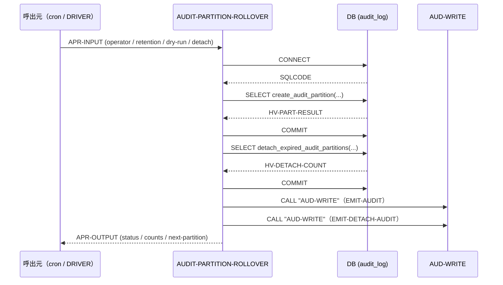
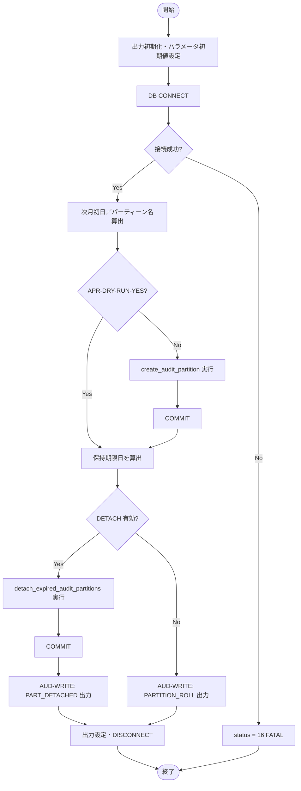

# 基本設計書 — AUDIT-PARTITION-ROLLOVER

> **サブシステム:** 21-audit
> **プログラム ID:** `AUDIT-PARTITION-ROLLOVER`
> **種別:** バッチ
> **更新日:** 2026-07-06

---

## 1. プログラム概要

| 項目 | 値 |
|------|-----|
| プログラム ID | `AUDIT-PARTITION-ROLLOVER` |
| ソースファイル | `src/audit-partition-rollover.sqb` |
| 所属サブシステム | 21-audit |
| 種別 | バッチ |
| 概要 | audit_log テーブルのパーティション管理を行う。次月のパーティションを事前作成し、保持期間を超過した古いパーティションを DETACH する。dry-run 時は作成／DETACH をスキップする。 |

---

## 2. 機能概要

### 2.1 このプログラムが「すること」
現在日付に基づき翌月の audit_log パーティションを作成し、保持期限を経過したパーティションを DETACH する。
実行結果（作成数／DETACH 数／次パーティション名）を AUD-WRITE にて自監査ログとして出力する。

### 2.2 呼出元と呼出し先
- **呼出元:** テストドライバ `AUDIT-DRIVER`（`AUDIT_MODE=R`）。cron 等による定期バッチ起動を想定。
- **呼出先:** `AUD-WRITE`（shared util）。自システム内監査ログ EMIT。

### 2.3 シーケンス図

---

## 3. 処理フロー

### 3.1 全体フロー（flowchart）

---

## 4. 入出力仕様

### 4.1 入力

| 項目 | 型 | 必須 | 説明 |
|------|-----|:----:|------|
| APR-OPERATOR-USER | PIC X(30) |  | 操作者 ID。空白時は "SYSTEM" |
| APR-RETENTION-DAYS | PIC 9(5) |  | 保持日数。0 指定時はデフォルト 30 日 |
| APR-DRY-RUN | PIC X(1) | ✅ | "Y" 時はパーティション作成／DETACH をスキップするフラグ |
| APR-ENABLE-DETACH | PIC X(1) | ✅ | "Y" 時に古いパーティションの DETACH を実行 |

### 4.2 出力

| 項目 | 型 | 説明 |
|------|-----|------|
| APR-STATUS | PIC X(2) | 処理結果コード（下記返却コード参照） |
| APR-OUT-CREATED-COUNT | PIC 9(3) | 作成したパーティション数 |
| APR-OUT-DETACHED-COUNT | PIC 9(3) | DETACH したパーティション数 |
| APR-OUT-NEXT-PARTITION | PIC X(20) | 作成対象の次パーティション名（例: `audit_log_202608`） |

### 4.3 返却コード（概要）

| コード | 意味 |
|--------|------|
| 00 | 正常（作成／DETACH いずれか実行、または dry-round のみ） |
| 16 | FATAL（DB 接続失敗、もしくは SQL エラー時の ROLLBACK） |

---

## 5. 正常系テストケース

| # | テスト名 | 入力 | 期待出力 | 確認ポイント |
|---|---------|------|---------|------------|
| 1 | dry-run 時は作成されない | DRY=Y, DETACH=N | status=00, created=0 | create_audit_partition が発行されないこと |
| 2 | 実効実行で次月パーティションができる | DRY=N, DETACH=N | status=00, created=1 | 次月初日に `audit_log_YYYYMM` が存在すること |
| 3 | 再実行時は冪等（2 回目は作成スキップ） | DRY=N, 2 回連続 | status=00, created=0 | 2 回目の作成が 0 になること |
| 4 | DETACH 有効で古いパーティションが外れる | DRY=N, DETACH=Y, RETENTION=30 | detached >= 1 | horizin 以前のパーティション数が減少すること |

---

## 6. 異常系テストケース

| # | テスト名 | 入力 | 期待される異常 | 確認ポイント |
|---|---------|------|--------------|------------|
| 1 | DB 接続不能 | DB 停止状態 | status=16 |即座に FATAL で終了し、ロールバックされないこと |
| 2 | create_audit_partition 失敗 | エラー誘発 | status=16 | ROLLBACK 後 GOBACK すること |
| 3 | COMMIT 失敗（SQLCODE not in (0,100)） | DB 異常 | status=16 | パーティション状態が破損しないこと |

---

## 参考
- ソース: [audit-partition-rollover.sqb](../src/audit-partition-rollover.sqb)
- 公開 IF: [audit-api.cpy](../copy/api/audit-api.cpy)
- ヘルパ: [detach-helper.sh](../src/detach-helper.sh)
- その他: [Makefile](../Makefile)
