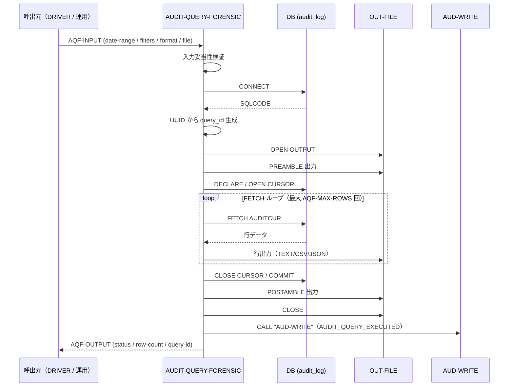
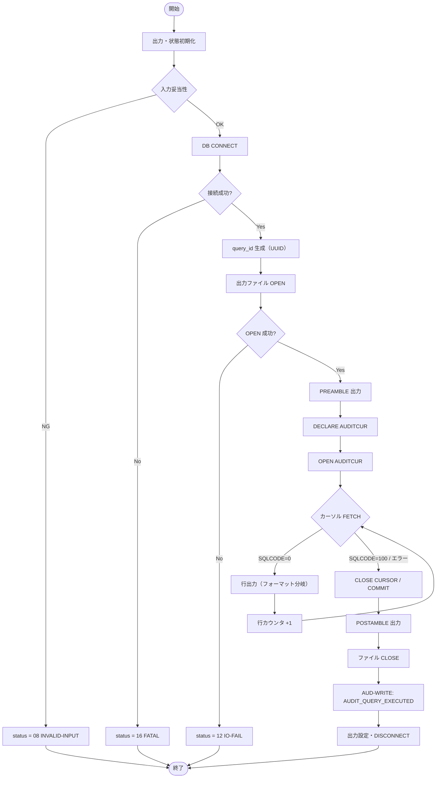

# 基本設計書 — AUDIT-QUERY-FORENSIC

> **サブシステム:** 21-audit
> **プログラム ID:** `AUDIT-QUERY-FORENSIC`
> **種別:** バッチ
> **更新日:** 2026-07-06

---

## 1. プログラム概要

| 項目 | 値 |
|------|-----|
| プログラム ID | `AUDIT-QUERY-FORENSIC` |
| ソースファイル | `src/audit-query-forensic.sqb` |
| 所属サブシステム | 21-audit |
| 種別 | バッチ |
| 概要 | 監査証跡テーブル（audit_log）を日付範囲・サブシステム・アクション・重大度・口座番号で検索し、TEXT/CSV/JSON 形式のファイルに出力する。検索結果の件数とクエリ ID を自監査ログとして残す。 |

---

## 2. 機能概要

### 2.1 このプログラムが「すること」
指定された検索条件に合致する監査レコードを DB からカーソル取得し、指定フォーマットでファイルに出力する。
出力が完了したら、クエリ ID・件数をメタ監査レコードとして AUD-WRITE に記録する。

### 2.2 呼出元と呼出し先
- **呼出元:** テストドライバ `AUDIT-DRIVER`（`AUDIT_MODE=F`）。運用端末・バッチジョブからの呼出しを想定。
- **呼出先:** `AUD-WRITE`（shared util）。検索実行自体の自監査ログ EMIT。

### 2.3 シーケンス図

---

## 3. 処理フロー

### 3.1 全体フロー（flowchart）

---

## 4. 入出力仕様

### 4.1 入力

| 項目 | 型 | 必須 | 説明 |
|------|-----|:----:|------|
| AQF-DATE-START | PIC 9(8) | ✅ | 検索開始日（YYYYMMDD） |
| AQF-DATE-END | PIC 9(8) | ✅ | 検索終了日（YYYYMMDD） |
| AQF-SUBSYSTEM | PIC X(30) |  | サブシステム名フィルタ（空文字=指定なし） |
| AQF-ACTION | PIC X(50) |  | アクションフィルタ（空文字=指定なし） |
| AQF-SEVERITY | PIC X(1) |  | 重大度フィルタ（I/W/E/C、空=指定なし） |
| AQF-ACCOUNT-FILTER | PIC X(13) |  | payload 内の account_number フィルタ |
| AQF-MAX-ROWS | PIC 9(5) |  | 最大取得行数。0 指定時はデフォルト 1000 |
| AQF-OUTPUT-FORMAT | PIC X(4) | ✅ | TEXT / CSV / JSON のいずれか |
| AQF-OUTPUT-FILENAME | PIC X(120) | ✅ | 出力ファイルパス |
| AQF-OPERATOR-USER | PIC X(30) |  | 操作者 ID |

### 4.2 出力

| 項目 | 型 | 説明 |
|------|-----|------|
| AQF-STATUS | PIC X(2) | 処理結果コード（下記返却コード参照） |
| AQF-OUT-ROW-COUNT | PIC 9(7) | 実際に出力した行数 |
| AQF-OUT-QUERY-ID | PIC X(36) | 発行したクエリ ID（UUID） |
| AQF-OUT-DURATION-MS | PIC 9(7) | 処理時間（ミリ秒）※将来拡張用 |

### 4.3 返却コード（概要）

| コード | 意味 |
|--------|------|
| 00 | 正常（ファイル出力完了） |
| 08 | INVALID-INPUT（日付逆転・フォーマット不正等） |
| 12 | IO-FAIL（ファイル OPEN 失敗、または SQL 実行失敗） |
| 16 | FATAL（DB 接続不能） |

---

## 5. 正常系テストケース

| # | テスト名 | 入力 | 期待出力 | 確認ポイント |
|---|---------|------|---------|------------|
| 1 | 日付範囲基本検索 | START=20260601, END=20260730, TEXT | status=00, rows >= 1 | ヘッダ "Audit Forensic Result" が出力されること |
| 2 | サブシステムフィルタ | SUBSYS="17-statement" | rows >= 1, 全行に 17-statement | フィルタ条件が DB WHERE に反映されること |
| 3 | アクションフィルタ | ACTION="STMT_GEN_END" | rows >= 1, 全行に STMT_GEN_END | 部分一致ではなく完全一致で絞り込まれること |
| 4 | CSV フォーマット | FORMAT=CSV | 1 行目が "audit_id,bdate,..." | カラムヘッダが出力されること |
| 5 | JSON フォーマット | FORMAT=JSON, MAX=10 | `[` 〜 `]` の配列 | 行カンマ・括弧が正しく生成されること |
| 6 | LIMIT 上限 | MAX_ROWS=5 | rows <= 5 | LIMIT 句が守られること |
| 7 | メタ監査レコード出力 | 任意の検索 | AUDIT_QUERY_EXECUTED が 1 件増える | 検索自体が自己監査されること |

---

## 6. 異常系テストケース

| # | テスト名 | 入力 | 期待される異常 | 確認ポイント |
|---|---------|------|--------------|------------|
| 1 | 日付逆転 | START=20260801, END=20260601 | status = 08 | VALIDATE-INPUT で検知し DB 接続前に終了すること |
| 2 | フォーマット不正 | FORMAT=XML | status = 08 | TEXT/CSV/JSON 以外を拒否すること |
| 3 | 出力ファイル OPEN 失敗 | 権限なしパス | status = 12 | ファイル状態コードで判定し後続処理しないこと |
| 4 | DB 接続不能 | DB 停止状態 | status = 16 | 即座に FATAL で終了し、ファイルを残さないこと |

---

## 参考
- ソース: [audit-query-forensic.sqb](../src/audit-query-forensic.sqb)
- 公開 IF: [audit-api.cpy](../copy/api/audit-api.cpy)
- その他: [Makefile](../Makefile)
