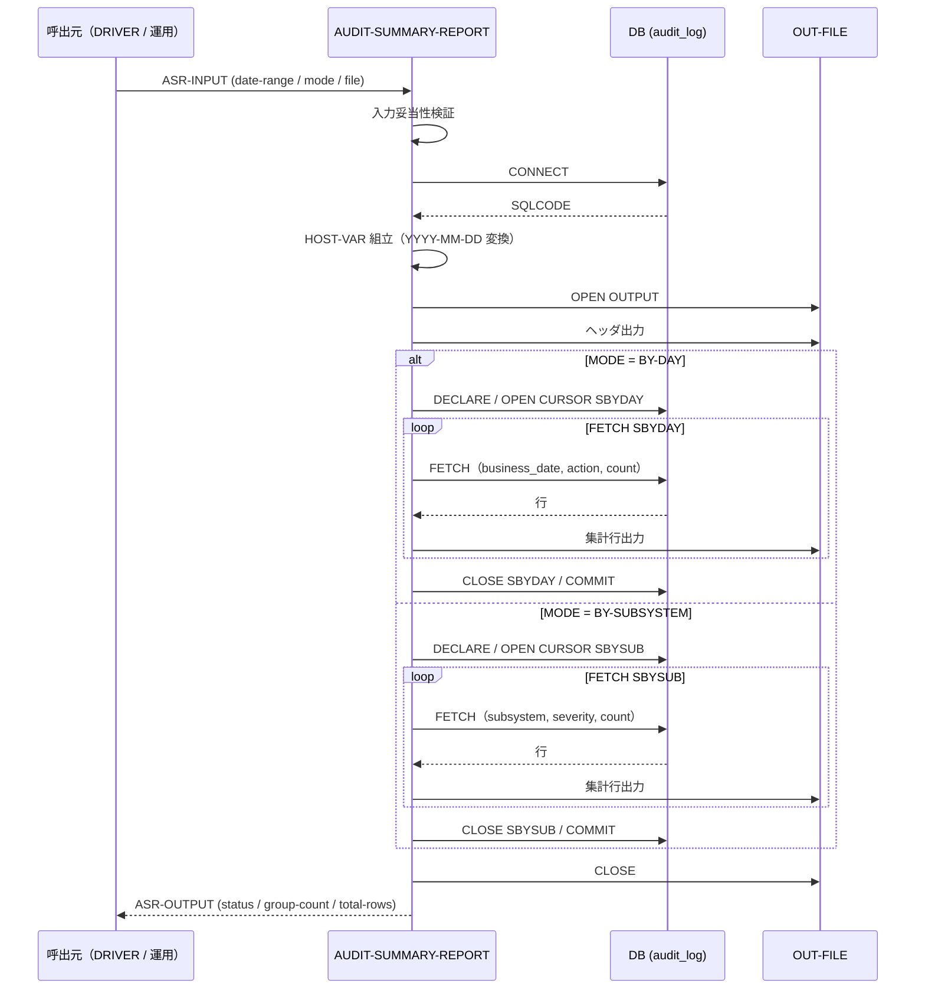
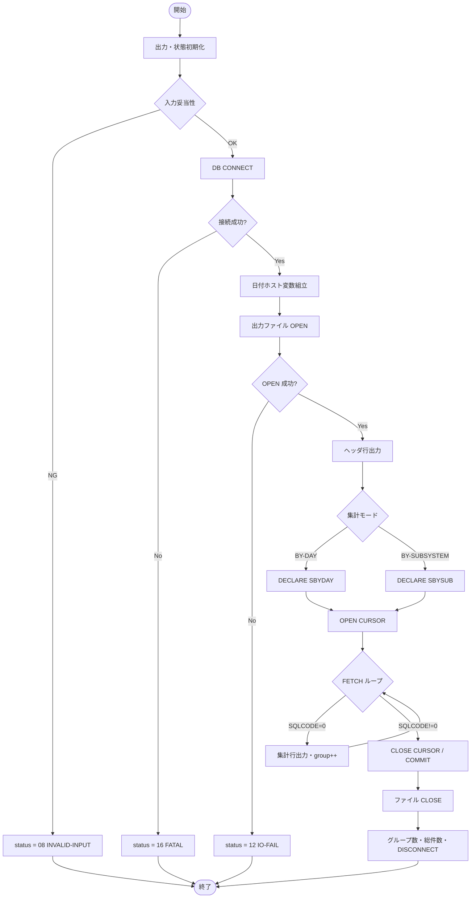

# 基本設計書 — AUDIT-SUMMARY-REPORT

> **サブシステム:** 21-audit
> **プログラム ID:** `AUDIT-SUMMARY-REPORT`
> **種別:** バッチ
> **更新日:** 2026-07-06

---

## 1. プログラム概要

| 項目 | 値 |
|------|-----|
| プログラム ID | `AUDIT-SUMMARY-REPORT` |
| ソースファイル | `src/audit-summary-report.sqb` |
| 所属サブシステム | 21-audit |
| 種別 | バッチ |
| 概要 | 監査証跡テーブル（audit_log）を日付範囲で集計し、「日付＋アクション別」または「サブシステム＋重大度別」の集計レポートをファイルへ出力する。 |

---

## 2. 機能概要

### 2.1 このプログラムが「すること」
指定された日付範囲に対して GROUP BY 集計クエリ（BY-DAY / BY-SUBSYSTEM）を実行し、CSV ラインレポートをファイルに書き出す。
結果として総グループ数および総件数を呼び出し元へ返す。

### 2.2 呼出元と呼出し先
- **呼出元:** テストドライバ `AUDIT-DRIVER`（`AUDIT_MODE=S`）。運用端末／期末バッチ等から呼出しを想定。
- **呼出先:** 共有ユーティリティなし（このプログラムは下位モジュールを呼出さない）。

### 2.3 シーケンス図

---

## 3. 処理フロー

### 3.1 全体フロー（flowchart）

---

## 4. 入出力仕様

### 4.1 入力

| 項目 | 型 | 必須 | 説明 |
|------|-----|:----:|------|
| ASR-DATE-START | PIC 9(8) | ✅ | 検索開始日（YYYYMMDD） |
| ASR-DATE-END | PIC 9(8) | ✅ | 検索終了日（YYYYMMDD） |
| ASR-MODE | PIC X(1) | ✅ | "D"=BY-DAY 集計、"S"=BY-SUBSYSTEM 集計。未指定はデフォルト "D" |
| ASR-OUTPUT-FILENAME | PIC X(120) | ✅ | 出力ファイルパス |

### 4.2 出力

| 項目 | 型 | 説明 |
|------|-----|------|
| ASR-STATUS | PIC X(2) | 処理結果コード（下記返却コード参照） |
| ASR-OUT-GROUP-COUNT | PIC 9(7) | 出力した集計行（グループ）数 |
| ASR-OUT-TOTAL-ROWS | PIC 9(10) | 集計対象の総レコード件数（SUM(count)） |

### 4.3 返却コード（概要）

| コード | 意味 |
|--------|------|
| 00 | 正常（出力ファイル生成完了） |
| 08 | INVALID-INPUT（日付 0、またはファイル名空） |
| 12 | IO-FAIL（出力ファイル OPEN 失敗） |
| 16 | FATAL（DB 接続不能） |

---

## 5. 正常系テストケース

| # | テスト名 | 入力 | 期待出力 | 確認ポイント |
|---|---------|------|---------|------------|
| 1 | BY-DAY 集計基本 | START=20260601, END=20260730, MODE=D | status=00, groups >= 1 | ヘッダ "Audit Summary Report" が出力されること |
| 2 | BY-DAY が日付順＋カウント降順 | 同一日複数アクション | ACTION 降序で並ぶ | ORDER BY business_date, count DESC であること |
| 3 | BY-SUBSYSTEM 集計 | MODE=S | groups >= 1 | サブシステム名が出力されること |
| 4 | 空の日付範囲 | 未来日指定 | groups = 0, total = 0 | グループ 0 件でも正常終了すること |
| 5 | モード未指定 | MODE=空白 | デフォルト D で動作 | "D" を設定したのと同等であること |

---

## 6. 異常系テストケース

| # | テスト名 | 入力 | 期待される異常 | 確認ポイント |
|---|---------|------|--------------|------------|
| 1 | 開始日 0 | START=0, END=20260730 | status = 08 | VALIDATE-INPUT で検知されること |
| 2 | 出力ファイル空欄 | FILENAME=空 | status = 08 | ファイル OPEN 前に検知されること |
| 3 | 出力ファイル OPEN 失敗 | 権限なしパス | status = 12 | FILE STATUS で判定し後続発行しないこと |
| 4 | DB 接続不能 | DB 停止 | status = 16 | DISCONNECT まで達しないこと |

---

## 参考
- ソース: [audit-summary-report.sqb](../src/audit-summary-report.sqb)
- 公開 IF: [audit-api.cpy](../copy/api/audit-api.cpy)
- その他: [Makefile](../Makefile)
