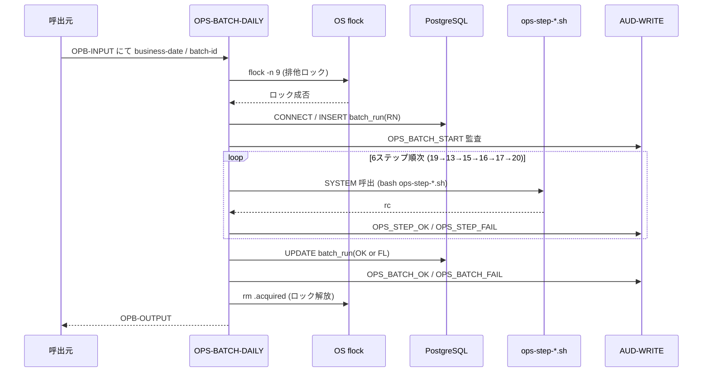
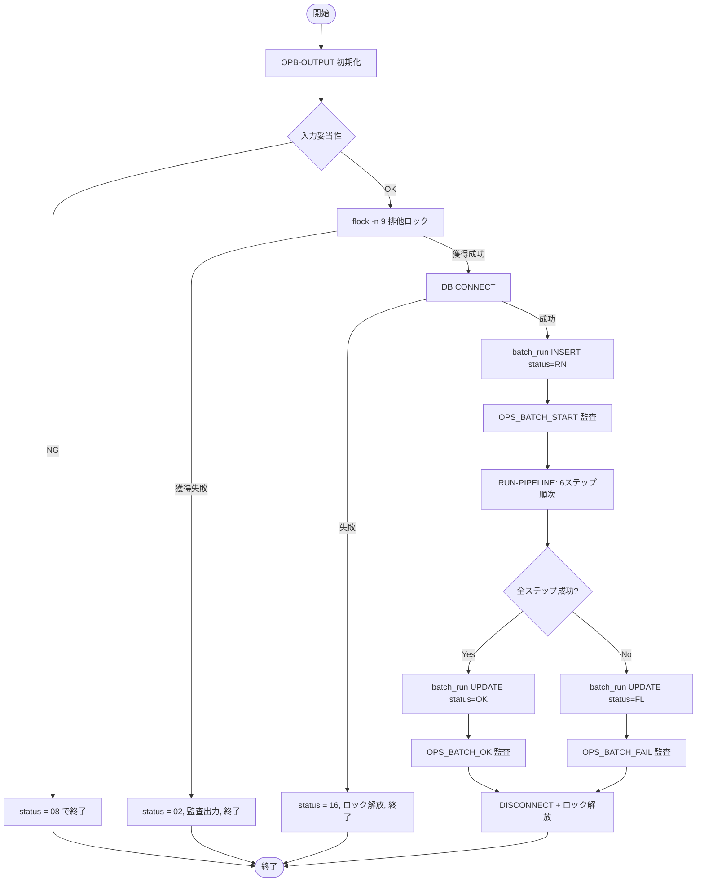

# 基本設計書 — OPS-BATCH-DAILY

> **サブシステム:** 22-operations
> **プログラム ID:** `OPS-BATCH-DAILY`
> **種別:** バッチ
> **更新日:** 2026-07-06

---

## 1. プログラム概要

| 項目 | 値 |
|------|-----|
| プログラム ID | `OPS-BATCH-DAILY` |
| ソースファイル | `src/ops-batch-daily.sqb` |
| 所属サブシステム | 22-operations |
| 種別 | バッチ |
| 概要 | 日次バッチパイプラインのオーケストレータ。ファイル LOCK 獲得 → DB 接続 → batch_run レコード作成 → 6 ステップ順次実行 → 結果を batch_run に反映 → LOCK 解放を行う。各ステップ失敗時は即時中断する。 |

---

## 2. 機能概要

### 2.1 このプログラムが「すること」
日次バッチのエントリポイントとして、直列ステップパイプライン（19-INTI → 13-IACR → 15-AD → 16-FEE → 17-STMT → 20-DRAIN）を順次実行し、各ステップの成否を DB `batch_run` テーブルへ記録する。
ステップ失敗時は `OPB-HALTED` を返し、上位へ中断理由（`OPB-OUT-LAST-STEP`）を通知する。

### 2.2 呼出元と呼出し先
- **呼出元:** テストドライバ `OPS-DRIVER`（`OPS_MODE=D`）。cron / ジョブスケジューラからの `CALL "OPS-BATCH-DAILY"` を想定。
- **呼出先:**
  - `AUD-WRITE`（共有監査モジュール）— ステップ・バッチイベントの監査出力
  - 外部シェルスクリプト `ops-step-19-inti.sh` / `ops-step-13-iacr.sh` / `ops-step-15-ad.sh` / `ops-step-16-fee.sh` / `ops-step-17-stmt.sh` / `ops-step-20-drain.sh` — 各ステップ実行
  - DB（PostgreSQL）— `batch_run` テーブルへの INSERT/UPDATE

### 2.3 シーケンス図

---

## 3. 処理フロー

### 3.1 全体フロー（flowchart）

---

## 4. 入出力仕様

### 4.1 入力

| 項目 | 型 | 必須 | 説明 |
|------|-----|:----:|------|
| OPB-BATCH-ID | PIC X(14) | ✅ | バッチ一意識別子。DB `batch_run.PK` |
| OPB-BUSINESS-DATE | PIC 9(8) | ✅ | 営業日（YYYYMMDD）。内部で ISO 文字列化 |
| OPB-DRY-RUN | PIC X(1) | ✅ | Y=ドライラン（各ステップ smoke のみ）、N=本番実行 |

### 4.2 出力

| 項目 | 型 | 説明 |
|------|-----|------|
| OPB-STATUS | PIC X(2) | 処理結果コード（下記返却コード参照） |
| OPB-OUT-LAST-STEP | PIC X(20) | 最後に実行したステップ ID |
| OPB-OUT-STEPS-RUN | PIC 9(2) | 実行されたステップ数 |
| OPB-OUT-FINALIZED-COUNT | PIC 9(7) | 未使用（将来拡張） |
| OPB-OUT-DURATION-SEC | PIC 9(5) | 未使用（将来拡張） |

### 4.3 返却コード（概要）

| コード | 意味 |
|--------|------|
| 00 | 正常（全ステップ成功） |
| 02 | FLOCK-CONFLICT（他バッチ実行中） |
| 04 | HALTED（ステップ中断） |
| 08 | INVALID-INPUT（batch-id / business-date 未指定） |
| 16 | FATAL（DB接続不能等） |

---

## 5. 正常系テストケース

| # | テスト名 | 入力 | 期待出力 | 確認ポイント |
|---|---------|------|---------|------------|
| 1 | ドライラン全ステップ成功 | batch=B001, date=20260706, dry=Y | status=00, steps-run=6 | 全ステップ smoke 実行、batch_run に OK 記録 |
| 2 | 本番実行全ステップ成功 | batch=B001, date=20260706, dry=N | status=00, steps-run=6 | 各ステップ real-mode 実行、監査 6 件出力 |
| 3 | recon-defer ファイル存在時リネーム | batch=B001, date=20260706, dry=N | status=00 | recon-defer ファイルが txn-recon-prev.dat にリネームされること |

---

## 6. 異常系テストケース

| # | テスト名 | 入力 | 期待される異常 | 確認ポイント |
|---|---------|------|--------------|------------|
| 1 | 他バッチによる LOCK 獲得中 | batch=B001 で事前に flock を保持 | status=02 | OPS_FLOCK_CONFLICT 監査出力、即時終了 |
| 2 | DB 接続不能 | PGHOST 等を不正に上書き | status=16 | LOCK 解放後に終了 |
| 3 | 入力未指定 | batch="" or date=0 | status=08 | 入力即座に検知、後続処理未実行 |
| 4 | ステップ 13 失敗（IACR-RUN-DAILY rc=1） | OPS_STEP_INJECT_FAIL=13-iacr | status=04, last-step=13-IACR | 14 番以降のステップは実行しないこと |

---

## 参考
- ソース: [ops-batch-daily.sqb](../src/ops-batch-daily.sqb)
- 生成ソース: [ops-batch-daily.cob.gen](../src/ops-batch-daily.cob.gen)
- 公開 IF: [ops-api.cpy](../copy/api/ops-api.cpy)
- ステップ定義: [ops-step-19-inti.sh](../src/ops-step-19-inti.sh) [ops-step-13-iacr.sh](../src/ops-step-13-iacr.sh) [ops-step-15-ad.sh](../src/ops-step-15-ad.sh) [ops-step-16-fee.sh](../src/ops-step-16-fee.sh) [ops-step-17-stmt.sh](../src/ops-step-17-stmt.sh) [ops-step-20-drain.sh](../src/ops-step-20-drain.sh)
- その他: [Makefile](../Makefile)
