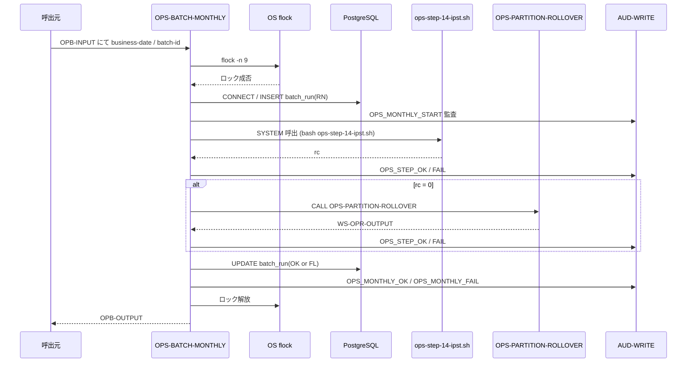

# 基本設計書 — OPS-BATCH-MONTHLY

> **サブシステム:** 22-operations
> **プログラム ID:** `OPS-BATCH-MONTHLY`
> **種別:** バッチ
> **更新日:** 2026-07-06

---

## 1. プログラム概要

| 項目 | 値 |
|------|-----|
| プログラム ID | `OPS-BATCH-MONTHLY` |
| ソースファイル | `src/ops-batch-monthly.sqb` |
| 所属サブシステム | 22-operations |
| 種別 | バッチ |
| 概要 | 月次バッチパイプラインのオーケストレータ。ファイル LOCK → DB 接続 → batch_run 作成 → 14-IPST（金利貼付）実行 → OPS-PARTITION-ROLLOVER（監査パーティション繰り越し）→ batch_run 完了記録 → LOCK 解放を行う。 |

---

## 2. 機能概要

### 2.1 このプログラムが「すること」
月次の締め処理として、金利貼付（14-IPST）と監査パーティション繰り越し（OPS-PARTITION-ROLLOVER）を順次実行し、成否を DB `batch_run` テーブルに記録する。
パーティション繰り越しは直接 COBOL CALL で呼び、結果ステータス `WS-OPR-STATUS` を評価してハンドリングする。

### 2.2 呼出元と呼出し先
- **呼出元:** テストドライバ `OPS-DRIVER`（`OPS_MODE=M`）。cron / 月次スケジューラからの `CALL "OPS-BATCH-MONTHLY"` を想定。
- **呼出先:**
  - `AUD-WRITE`（共有監査モジュール）
  - 外部シェルスクリプト `ops-step-14-ipst.sh` — 金利貼付
  - `OPS-PARTITION-ROLLOVER`（同一サブシステム .so）— 監査パーティション繰り越し
  - DB（PostgreSQL）— `batch_run` テーブル

### 2.3 シーケンス図



---

## 3. 処理フロー

### 3.1 全体フロー（flowchart）

```mermaid
flowchart TD
    START([開始]) --> INIT[OPB-OUTPUT 初期化]
    INIT --> VALIDATE{入力妥当性}
    VALIDATE -->|NG| ERR_INV[status = 08 で終了]
    VALIDATE -->|OK| FLOCK[flock -n 9 排他ロック]
    FLOCK -->|獲得失敗| ERR_FLOCK[status = 02, 終了]
    FLOCK -->|獲得成功| DBCONN[DB CONNECT]
    DBCONN -->|失敗| ERR_FATAL[status = 16, ロック解放, 終了]
    DBCONN -->|成功| INSERT[batch_run INSERT status=RN]
    INSERT --> AUD_START[OPS_MONTHLY_START 監査]
    AUD_START --> STEP14[EXEC-STEP-14-IPST (SYSTEM)]
    STEP14 --> CHK14{rc = 0 ?}
    CHK14 -->|No| UPD_FL[batch_run UPDATE status=FL]
    CHK14 -->|Yes| ROLL[CALL OPS-PARTITION-ROLLOVER]
    ROLL --> CHK_ROLL{OPR-STATUS = 00 ?}
    CHK_ROLL -->|Yes| UPD_OK[batch_run UPDATE status=OK]
    CHK_ROLL -->|No| UPD_FL
    UPD_OK --> AUD_OK[OPS_MONTHLY_OK 監査]
    UPD_FL --> AUD_FAIL[OPS_MONTHLY_FAIL 監査]
    AUD_OK --> CLEANUP[DISCONNECT + ロック解放]
    AUD_FAIL --> CLEANUP
    CLEANUP --> END([終了])
    ERR_INV --> END
    ERR_FLOCK --> END
    ERR_FATAL --> END
```

---

## 4. 入出力仕様

### 4.1 入力

| 項目 | 型 | 必須 | 説明 |
|------|-----|:----:|------|
| OPB-BATCH-ID | PIC X(14) | ✅ | バッチ一意識別子 |
| OPB-BUSINESS-DATE | PIC 9(8) | ✅ | 営業日（YYYYMMDD） |
| OPB-DRY-RUN | PIC X(1) | ✅ | Y=ドライラン、N=本番 |

### 4.2 出力

| 項目 | 型 | 説明 |
|------|-----|------|
| OPB-STATUS | PIC X(2) | 処理結果コード |
| OPB-OUT-LAST-STEP | PIC X(20) | 最後に実行したステップ |
| OPB-OUT-STEPS-RUN | PIC 9(2) | 実行ステップ数 |
| OPB-OUT-FINALIZED-COUNT | PIC 9(7) | 未使用 |
| OPB-OUT-DURATION-SEC | PIC 9(5) | 未使用 |

### 4.3 返却コード（概要）

| コード | 意味 |
|--------|------|
| 00 | 正常（14-IPST + PARTITION-ROLLOVER 成功） |
| 02 | FLOCK-CONFLICT |
| 04 | HALTED（ステップ中断） |
| 08 | INVALID-INPUT |
| 16 | FATAL |

---

## 5. 正常系テストケース

| # | テスト名 | 入力 | 期待出力 | 確認ポイント |
|---|---------|------|---------|------------|
| 1 | ドライラン月次実行 | batch=M001, date=20260731, dry=Y | status=00, steps-run=2 | 14-IPST smoke → PARTITION-ROLLOVER（デモ呼出）が成功 |
| 2 | 本番月次実行 | batch=M001, date=20260731, dry=N | status=00, steps-run=2 | IPST 実実行 + パーティション繰り越しが完結 |

---

## 6. 異常系テストケース

| # | テスト名 | 入力 | 期待される異常 | 確認ポイント |
|---|---------|------|--------------|------------|
| 1 | 他バッチ LOCK 中 | 事前 flock 保持 | status=02 | OPS_FLOCK_CONFLICT 監査、即時終了 |
| 2 | DB 接続不能 | PGHOST 不正 | status=16 | ロック解放後に終了 |
| 3 | 14-IPST 失敗 | so 不在 or inject-fail=14-ipst | status=04 | PARTITION-ROLLOVER は実行しないこと |
| 4 | PARTITION-ROLLOVER 未ロード | .so 不在 | status=04 | ON EXCEPTION で rc=16, HALTED 設定 |

---

## 参考
- ソース: [ops-batch-monthly.sqb](../src/ops-batch-monthly.sqb)
- 生成ソース: [ops-batch-monthly.cob.gen](../src/ops-batch-monthly.cob.gen)
- 公開 IF: [ops-api.cpy](../copy/api/ops-api.cpy)
- ステップ定義: [ops-step-14-ipst.sh](../src/ops-step-14-ipst.sh)
- 関連プログラム: [ops-partition-rollover.md](ops-partition-rollover.md)
- その他: [Makefile](../Makefile)
