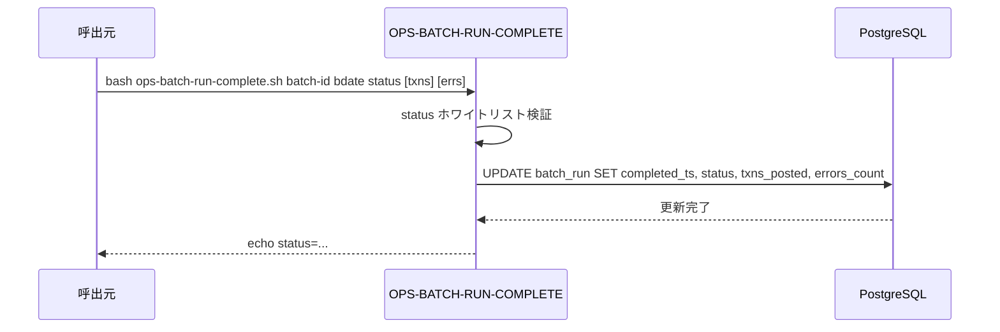
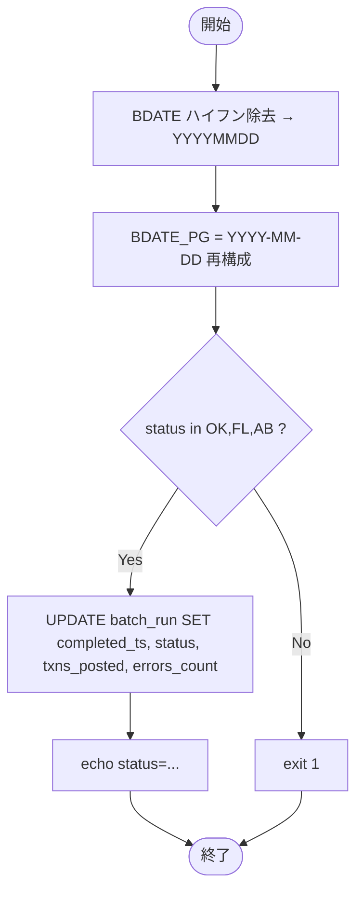

# 基本設計書 — OPS-BATCH-RUN-COMPLETE

> **サブシステム:** 22-operations
> **プログラム ID:** `OPS-BATCH-RUN-COMPLETE`
> **種別:** バッチ（シェルスクリプト）
> **更新日:** 2026-07-06

---

## 1. プログラム概要

| 項目 | 値 |
|------|-----|
| プログラム ID | `OPS-BATCH-RUN-COMPLETE` |
| ソースファイル | `src/ops-batch-run-complete.sh` |
| 所属サブシステム | 22-operations |
| 種別 | バッチ（シェル） |
| 概要 | バッチ終了時に DB `batch_run` テーブルへ完了ステータス（OK/FL/AB）・確定件数・エラー件数を UPDATE する。 |

---

## 2. 機能概要

### 2.1 このプログラムが「すること」
バッチ終了のマーカーを DB に書き込む。`completed_ts=NOW()` と `status` / `txns_posted` / `errors_count` を更新する。
ステータスはホワイトリスト（OK/FL/AB）で検証し、不正値は即座に拒否する。

### 2.2 呼出元と呼出し先
- **呼出元:** バッチスケジューラ / テストドライバ。
- **呼出先:**
  - DB（PostgreSQL）— `batch_run` テーブル UPDATE

### 2.3 シーケンス図

---

## 3. 処理フロー

### 3.1 全体フロー（flowchart）

---

## 4. 入出力仕様

### 4.1 入力

| 項目 | 型 | 必須 | 説明 |
|------|-----|:----:|------|
| $1 BATCH_ID | string | ✅ | バッチ一意識別子 |
| $2 BDATE | string | ✅ | 営業日（ハイフン許容） |
| $3 STATUS | string | ✅ | 完了ステータス（OK/FL/AB のみ許容） |
| $4 TXNS_POSTED | int | — | 確定件数（デフォルト 0） |
| $5 ERR_COUNT | int | — | エラー件数（デフォルト 0） |

### 4.2 出力

| 項目 | 型 | 説明 |
|------|-----|------|
| stdout | text | ログメッセージ |
| exit code | int | 0=成功、1=ステータス不正または DB エラー |

### 4.3 返却コード（概要）

| コード | 意味 |
|--------|------|
| 0 | 成功 |
| 1 | ステータスホワイトリスト不一致 / DB エラー |

---

## 5. 正常系テストケース

| # | テスト名 | 入力 | 期待出力 | 確認ポイント |
|---|---------|------|---------|------------|
| 1 | 正常完了 | B001 2026-07-06 OK 100 0 | status=OK | completed_ts 更新、txns_posted=100 |
| 2 | 失敗完了 | B001 2026-07-06 FL 50 3 | status=FL | errors_count=3 |
| 3 | 中断完了 | B001 2026-07-06 AB 0 0 | status=AB | AB ステータスが記録されること |

---

## 6. 異常系テストケース

| # | テスト名 | 入力 | 期待される異常 | 確認ポイント |
|---|---------|------|--------------|------------|
| 1 | 不正ステータス | B001 2026-07-06 XX | exit 1 | ホワイトリスト不一致で拒否 |
| 2 | DB 接続不能 | PGHOST 不正 | exit 1 | set -e で即座に終了 |

---

## 参考
- ソース: [ops-batch-run-complete.sh](../src/ops-batch-run-complete.sh)
- 関連: [ops-batch-run-start.md](ops-batch-run-start.md)
- その他: [Makefile](../Makefile)
