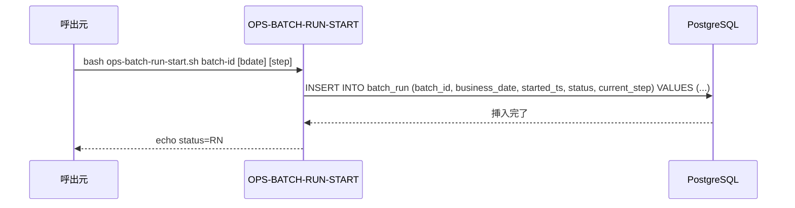
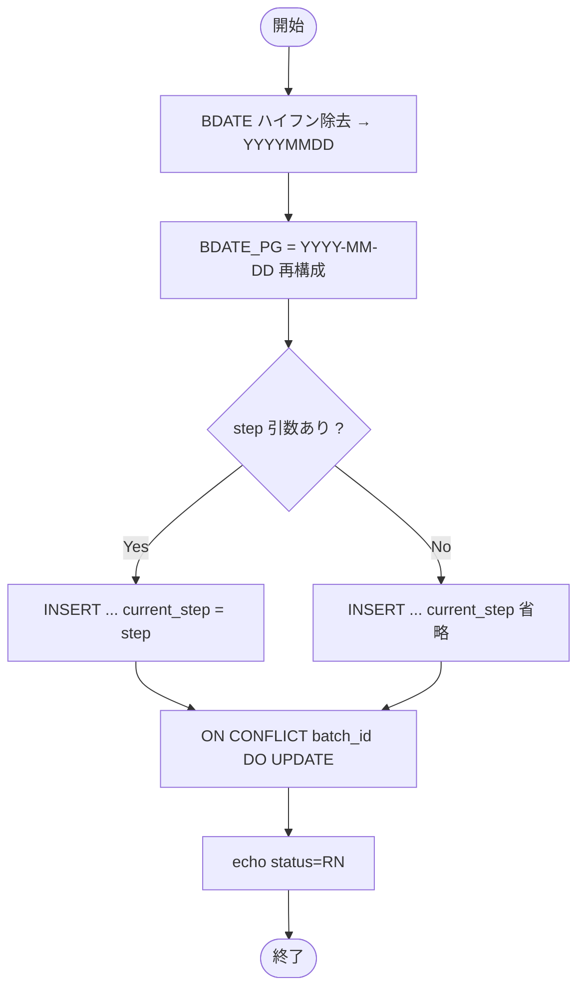

# 基本設計書 — OPS-BATCH-RUN-START

> **サブシステム:** 22-operations
> **プログラム ID:** `OPS-BATCH-RUN-START`
> **種別:** バッチ（シェルスクリプト）
> **更新日:** 2026-07-06

---

## 1. プログラム概要

| 項目 | 値 |
|------|-----|
| プログラム ID | `OPS-BATCH-RUN-START` |
| ソースファイル | `src/ops-batch-run-start.sh` |
| 所属サブシステム | 22-operations |
| 種別 | バッチ（シェル） |
| 概要 | バッチ開始時に DB `batch_run` テーブルへ実行中（RN）レコードを INSERT する。競合時は ON CONFLICT で UPSERT し、同一バッチの再実行に対応する。 |

---

## 2. 機能概要

### 2.1 このプログラムが「すること」
バッチ開始のマーカーを DB に書き込む。`batch_id` を主キーとし、`status='RN'` / `started_ts=NOW()` で初期化する。
ステップ指定があれば `current_step` も初期値として記録する。

### 2.2 呼出元と呼出し先
- **呼出元:** バッチスケジューラ / テストドライバ。
- **呼出先:**
  - DB（PostgreSQL）— `batch_run` テーブル INSERT/UPDATE

### 2.3 シーケンス図

---

## 3. 処理フロー

### 3.1 全体フロー（flowchart）

---

## 4. 入出力仕様

### 4.1 入力

| 項目 | 型 | 必須 | 説明 |
|------|-----|:----:|------|
| $1 BATCH_ID | string | ✅ | バッチ一意識別子 |
| $2 BDATE | string | — | 営業日（ハイフン許容、内部で正規化） |
| $3 STEP | string | — | 初期ステップ ID（省略可） |

### 4.2 出力

| 項目 | 型 | 説明 |
|------|-----|------|
| stdout | text | ログメッセージ |
| exit code | int | 0=成功（set -e のため失敗時は非ゼロで終了） |

### 4.3 返却コード（概要）

| コード | 意味 |
|--------|------|
| 0 | 成功 |
| 1 | psql エラー（接続失敗等） |

---

## 5. 正常系テストケース

| # | テスト名 | 入力 | 期待出力 | 確認ポイント |
|---|---------|------|---------|------------|
| 1 | 新規バッチ開始 | B001 2026-07-06 | status=RN | batch_run に行追加、status=RN |
| 2 | 既存バッチ再実行 | B001 2026-07-06 | status=RN | ON CONFLICT で UPSERT、started_ts 更新 |
| 3 | ステップ指定あり | B001 2026-07-06 19-INTI | status=RN | current_step=19-INTI で初期化 |

---

## 6. 異常系テストケース

| # | テスト名 | 入力 | 期待される異常 | 確認ポイント |
|---|---------|------|--------------|------------|
| 1 | DB 接続不能 | PGHOST 不正 | exit 1 | set -e で即座に終了 |
| 2 | 引数不足 | （なし） | psql エラー | 未検証のため psql 構文エラー |

---

## 参考
- ソース: [ops-batch-run-start.sh](../src/ops-batch-run-start.sh)
- 関連: [ops-batch-run-complete.md](ops-batch-run-complete.md)
- その他: [Makefile](../Makefile)
