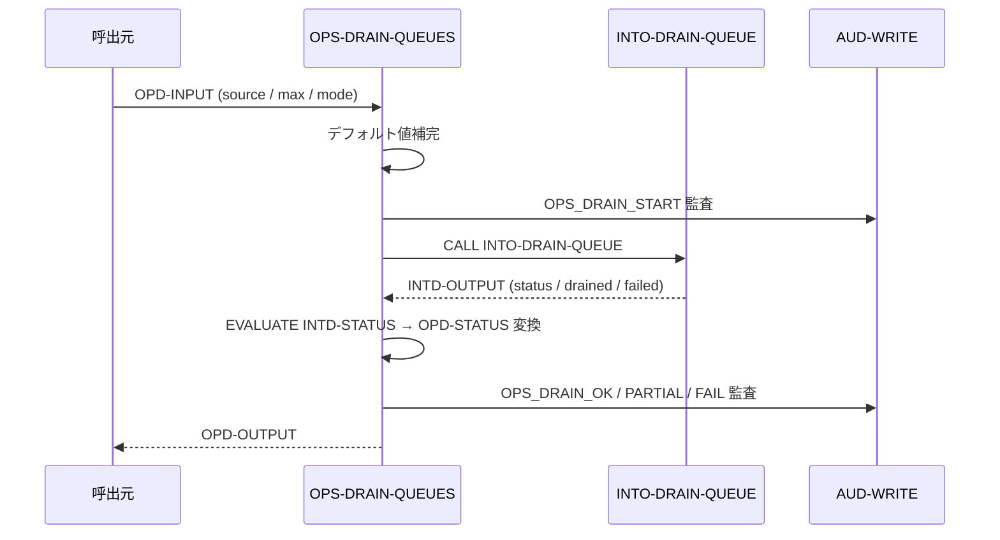

# 基本設計書 — OPS-DRAIN-QUEUES

> **サブシステム:** 22-operations
> **プログラム ID:** `OPS-DRAIN-QUEUES`
> **種別:** バッチ
> **更新日:** 2026-07-06

---

## 1. プログラム概要

| 項目 | 値 |
|------|-----|
| プログラム ID | `OPS-DRAIN-QUEUES` |
| ソースファイル | `src/ops-drain-queues.cob` |
| 所属サブシステム | 22-operations |
| 種別 | バッチ |
| 概要 | 失敗キュー（autodebit-failed）を排出するオーケストレータ。INTO-DRAIN-QUEUE を CALL し、drain 結果を監査ログに記録する。モード（MOCK/REAL）を切替可能。 |

---

## 2. 機能概要

### 2.1 このプログラムが「すること」
自動引き落とし失敗キューファイルを読み込み、`INTO-DRAIN-QUEUE` を呼出して該当レコードを処理する。
入力でソースファイル・最大レコード数・モード（MOCK or REAL）を指定でき、未指定時はデフォルト値（`/data/queues/autodebit-failed.dat`, 10000 件, MOCK）が適用される。

### 2.2 呼出元と呼出し先
- **呼出元:** テストドライバ `OPS-DRIVER`（`OPS_MODE=Q`）。日次バッチステップ 20-DRAIN からも呼出される。
- **呼出先:**
  - `INTO-DRAIN-QUEUE`（[20-integrationout](../../20-integrationout/design/into-drain-queue-bd.md) の .so）— キュー排出処理
  - `AUD-WRITE`（共有監査モジュール）— OPS_DRAIN_START / OK / PARTIAL / FAIL

### 2.3 シーケンス図



---

## 3. 処理フロー

### 3.1 全体フロー（flowchart）

```mermaid
flowchart TD
    START([開始]) --> INIT[OPD-OUTPUT 初期化]
    INIT --> DEFAULT[入力デフォルト補完 (file/max/mode)]
    DEFAULT --> AUD_START[OPS_DRAIN_START 監査]
    AUD_START --> CALL[CALL INTO-DRAIN-QUEUE]
    CALL -->|ON EXCEPTION| FATAL[status = 16, 監査出力, 終了]
    CALL -->|正常戻| EVAL{EVALUATE INTD-STATUS}
    EVAL -->|00| OK[status = 00]
    EVAL -->|04| PARTIAL[status = 04]
    EVAL -->|OTHER| FAIL[status = 16]
    OK --> AUD_END[OPS_DRAIN_OK 監査]
    PARTIAL --> AUD_PART[OPS_DRAIN_PART 監査]
    FAIL --> AUD_FAIL[OPS_DRAIN_FAIL 監査]
    AUD_END --> OUT[OPD-OUT に drained/failed 設定]
    AUD_PART --> OUT
    AUD_FAIL --> OUT
    OUT --> END([終了])
    FATAL --> END
```

---

## 4. 入出力仕様

### 4.1 入力

| 項目 | 型 | 必須 | 説明 |
|------|-----|:----:|------|
| OPD-SOURCE-FILENAME | PIC X(120) | — | キューファイルパス（未指定時 `autodebit-failed.dat`） |
| OPD-MAX-RECORDS | PIC 9(7) | — | 最大処理レコード数（未指定時 10000） |
| OPD-MODE | PIC X(1) | — | M=MOCK（読込のみ）、R=REAL（書込実行） |

### 4.2 出力

| 項目 | 型 | 説明 |
|------|-----|------|
| OPD-STATUS | PIC X(2) | 処理結果コード |
| OPD-OUT-DRAINED-COUNT | PIC 9(7) | 正常排出件数 |
| OPD-OUT-FAILED-COUNT | PIC 9(7) | 排出失敗件数 |

### 4.3 返却コード（概要）

| コード | 意味 |
|--------|------|
| 00 | 正常（全レコード排出） |
| 04 | PARTIAL（一部失敗あり） |
| 16 | FATAL（呼出先未ロード等） |

---

## 5. 正常系テストケース

| # | テスト名 | 入力 | 期待出力 | 確認ポイント |
|---|---------|------|---------|------------|
| 1 | MOCK モード・デフォルトファイル | mode=M, 他未指定 | status=00 | デフォルトファイル / 10000 件で呼出 |
| 2 | REAL モード・明示指定 | mode=R, file=/data/x.dat, max=500 | status=00 | 指定パラメータがそのまま渡されること |

---

## 6. 異常系テストケース

| # | テスト名 | 入力 | 期待される異常 | 確認ポイント |
|---|---------|------|--------------|------------|
| 1 | INTO-DRAIN-QUEUE 未ロード | .so 不在 | status=16 | ON EXCEPTION で FATAL、監査 FAIL |
| 2 | INTD が 04 を返す | 一部失敗データ | status=04 | PARTIAL として扱い、drained/failed は伝播 |
| 3 | INTD が 08 を返す | 予期せぬエラー | status=16 | OTHER → FATAL |

---

## 参考
- ソース: [ops-drain-queues.cob](../src/ops-drain-queues.cob)
- 公開 IF: [ops-api.cpy](../copy/api/ops-api.cpy)
- 呼出先: [into-drain-queue-bd.md](../../20-integrationout/design/into-drain-queue-bd.md)
- その他: [Makefile](../Makefile)
