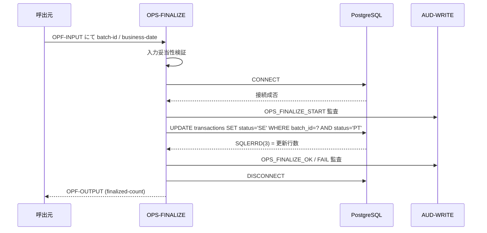

# 基本設計書 — OPS-FINALIZE

> **サブシステム:** 22-operations
> **プログラム ID:** `OPS-FINALIZE`
> **種別:** バッチ
> **更新日:** 2026-07-06

---

## 1. プログラム概要

| 項目 | 値 |
|------|-----|
| プログラム ID | `OPS-FINALIZE` |
| ソースファイル | `src/ops-finalize.sqb` |
| 所属サブシステム | 22-operations |
| 種別 | バッチ |
| 概要 | トランザクションを「確定済み（SE: Settled）」に一括更新する後処理プログラム。条件（batch_id + business_date + status='PT'）に合致するトランザクションを一括 UPDATE し、更新件数を出力・監査ログに記録する。 |

---

## 2. 機能概要

### 2.1 このプログラムが「すること」
バッチ完了後のトランザクション確定処理として、該当バッチに属する「仮/posted（PT）」ステータスのトランザクションを一括で「確定（SE）」に変更し、出力パラメータに確定件数を返す。
OPF-CHUNK-SIZE は保持されるが、現時点では単一 UPDATE で処理し、チャンク分割は将来拡張。

### 2.2 呼出元と呼出し先
- **呼出元:** テストドライバ `OPS-DRIVER`（`OPS_MODE=F`）。日次バッチ完了後の後処理として呼出される。
- **呼出先:**
  - `AUD-WRITE`（共有監査モジュール）— OPS_FINALIZE_START / OPS_FINALIZE_OK / FAIL
  - DB（PostgreSQL）— `transactions` テーブル UPDATE

### 2.3 シーケンス図



---

## 3. 処理フロー

### 3.1 全体フロー（flowchart）

```mermaid
flowchart TD
    START([開始]) --> INIT[OPF-OUTPUT 初期化 / CHUNK-SIZE デフォルト]
    INIT --> VALIDATE{入力妥当性}
    VALIDATE -->|NG| ERR_INV[status = 08 で終了]
    VALIDATE -->|OK| DBCONN[DB CONNECT]
    DBCONN -->|失敗| ERR_IO[status = 12 で終了]
    DBCONN -->|成功| AUD_START[OPS_FINALIZE_START 監査]
    AUD_START --> UPDATE[UPDATE transactions SET status=SE WHERE batch_id AND status=PT]
    UPDATE --> CHK_SQL{SQLCODE}
    CHK_SQL -->|0| COMMIT[COMMIT / rows = SQLERRD(3)]
    CHK_SQL -->|OTHER| ROLLBACK[ROLLBACK / status = 12]
    COMMIT --> OUT[OPF-OUT-FINALIZED-COUNT = rows]
    OUT --> AUD_END[OPS_FINALIZE_OK 監査]
    AUD_END --> CLEANUP[DISCONNECT]
    CLEANUP --> END([終了])
    ROLLBACK --> AUD_FAIL[OPS_FINALIZE_FAIL 監査]
    AUD_FAIL --> CLEANUP
    ERR_INV --> END
    ERR_IO --> END
```

---

## 4. 入出力仕様

### 4.1 入力

| 項目 | 型 | 必須 | 説明 |
|------|-----|:----:|------|
| OPF-BATCH-ID | PIC X(14) | ✅ | 確定対象バッチ |
| OPF-BUSINESS-DATE | PIC 9(8) | ✅ | 営業日（YYYYMMDD） |
| OPF-CHUNK-SIZE | PIC 9(7) | — | チャンクサイズ（未指定時 10000）。将来拡張用 |

### 4.2 出力

| 項目 | 型 | 説明 |
|------|-----|------|
| OPF-STATUS | PIC X(2) | 処理結果コード |
| OPF-OUT-FINALIZED-COUNT | PIC 9(7) | 確定済みに更新した行数 |
| OPF-OUT-CHUNKS-RUN | PIC 9(4) | 実行チャンク数（現版は常に 1） |

### 4.3 返却コード（概要）

| コード | 意味 |
|--------|------|
| 00 | 正常（UPDATE 成功） |
| 08 | INVALID-INPUT |
| 12 | IO-FAIL（DB エラー） |
| 16 | FATAL |

---

## 5. 正常系テストケース

| # | テスト名 | 入力 | 期待出力 | 確認ポイント |
|---|---------|------|---------|------------|
| 1 | 複数 PT トランザクション一括確定 | batch=B001, date=20260706 | status=00, finalized-count=N | N 行が SE に変わること、chunks-run=1 |
| 2 | 確定対象ゼロ | batch=B002（PT なし）, date=20260706 | status=00, finalized-count=0 | エラーなく 0 件で終了すること |

---

## 6. 異常系テストケース

| # | テスト名 | 入力 | 期待される異常 | 確認ポイント |
|---|---------|------|--------------|------------|
| 1 | 入力未指定 | batch="" or date=0 | status=08 | 即座に検知 |
| 2 | DB 接続不能 | PGHOST 不正 | status=12 | 接続エラーで IO-FAIL |
| 3 | UPDATE 中に DB エラー | テーブル不在等 | status=12 | ROLLBACK 後、OPS_FINALIZE_FAIL 監査 |

---

## 参考
- ソース: [ops-finalize.sqb](../src/ops-finalize.sqb)
- 生成ソース: [ops-finalize.cob.gen](../src/ops-finalize.cob.gen)
- 公開 IF: [ops-api.cpy](../copy/api/ops-api.cpy)
- その他: [Makefile](../Makefile)
