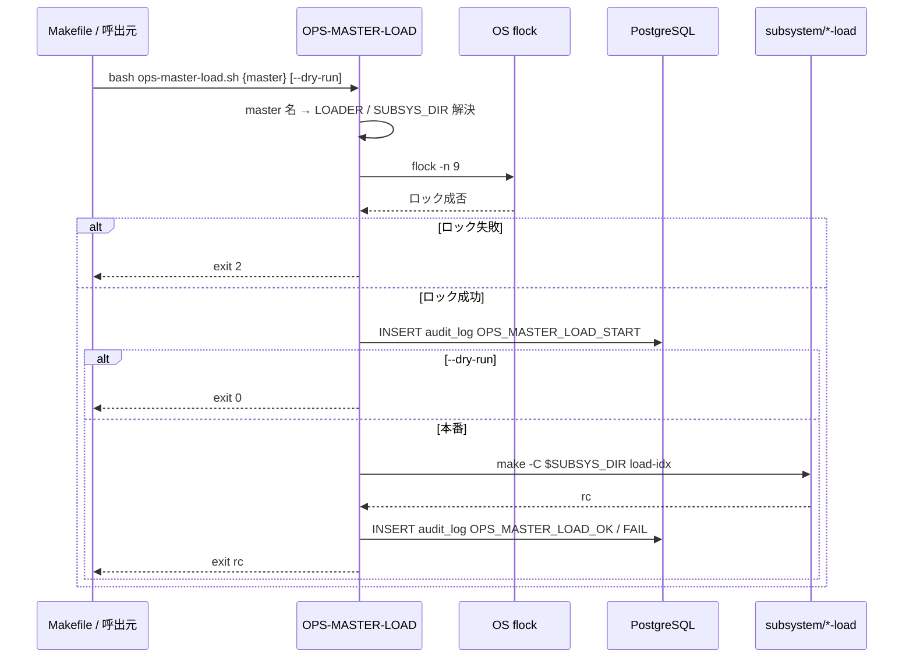
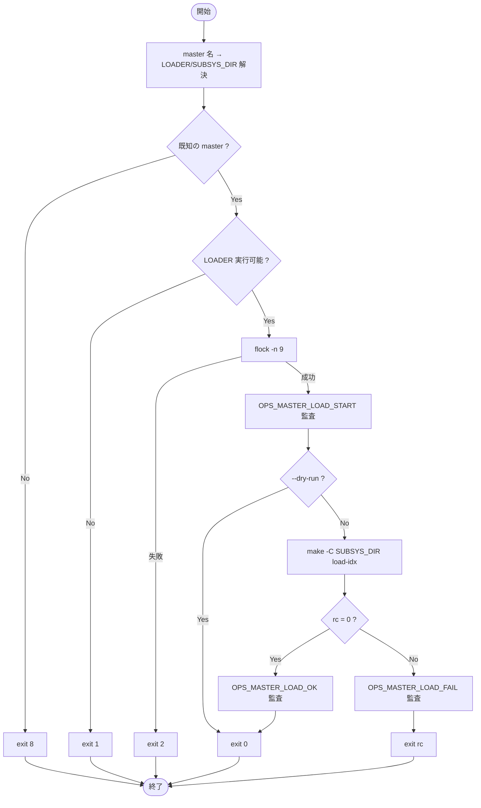

# 基本設計書 — OPS-MASTER-LOAD

> **サブシステム:** 22-operations
> **プログラム ID:** `OPS-MASTER-LOAD`
> **種別:** LOAD（シェルスクリプト）
> **更新日:** 2026-07-06

---

## 1. プログラム概要

| 項目 | 値 |
|------|-----|
| プログラム ID | `OPS-MASTER-LOAD` |
| ソースファイル | `src/ops-master-load.sh` |
| 所属サブシステム | 22-operations |
| 種別 | LOAD |
| 概要 | 7 個のマスタデータ（calendar / branches / customers / products / interestrates / feeschedules / accounts）をそれぞれのサブシステムのローダで投入する。排他ロック（flock）を獲得し、開始/終了の監査イベントを DB に書き込む。 |

---

## 2. 機能概要

### 2.1 このプログラムが「すること」
マスター名を引数に取り、対応するサブシステムの `bin/*-load` バイナリを `make -C <subsys> load-idx` で実行する。
実行前に flock を獲得し、他バッチ実行中はスキップ（rc=2）する。
開始時と終了時に `audit_log` へ OPS_MASTER_LOAD_START / OPS_MASTER_LOAD_OK / FAIL を書き込む。

### 2.2 呼出元と呼出し先
- **呼出元:** Makefile ターゲット `master-load-{calendar|branches|...|accounts}`。
- **呼出先:**
  - 各サブシステムの `bin/*-load` ローダ（01-calendar, 02-branch, 03-customer, 05-product, 06-interestrate, 07-feeschedule, 08-account）
  - DB（PostgreSQL）— `audit_log` テーブル INSERT

### 2.3 シーケンス図

---

## 3. 処理フロー

### 3.1 全体フロー（flowchart）

---

## 4. 入出力仕様

### 4.1 入力

| 項目 | 型 | 必須 | 説明 |
|------|-----|:----:|------|
| $1 MASTER | string | ✅ | マスター名（calendar/branches/customers/products/interestrates/feeschedules/accounts） |
| $2 DRY_RUN | string | — | `--dry-run` 指定時は smoke のみ |

### 4.2 出力

| 項目 | 型 | 説明 |
|------|-----|------|
| stdout/stderr | text | ログメッセージ |
| exit code | int | 0=成功/DRY、1=ローダ不在、2=flock 競合、8=不明 master |

### 4.3 返却コード（概要）

| コード | 意味 |
|--------|------|
| 0 | 成功 / ドライラン |
| 1 | ローダ不在 |
| 2 | 他バッチ実行中（flock 競合） |
| 8 | 不明なマスター名 |

---

## 5. 正常系テストケース

| # | テスト名 | 入力 | 期待出力 | 確認ポイント |
|---|---------|------|---------|------------|
| 1 | ドライラン | calendar --dry-run | rc=0 | make は呼ばず、smoke メッセージのみ |
| 2 | 本番実行 | calendar | rc=0 | make -C 01-calendar load-idx が実行される |
| 3 | 全マスター投入 | master-load-all | rc=0 | 7 マスターが順次ロードされる |

---

## 6. 異常系テストケース

| # | テスト名 | 入力 | 期待される異常 | 確認ポイント |
|---|---------|------|--------------|------------|
| 1 | 不明マスター名 | unknown | rc=8 | エラーメッセージ表示、即座に終了 |
| 2 | ローダ不在 | calendar (bin 未ビルド) | rc=1 | ファイル存在チェックで検知 |
| 3 | 他バッチ実行中 | 事前に flock 保持 | rc=2 | SKIP メッセージ、監査未出力 |

---

## 参考
- ソース: [ops-master-load.sh](../src/ops-master-load.sh)
- 関連サブシステム: [01-calendar](../../01-calendar/design/cal-load.md) [08-account](../../08-account/design/acct-load.md)
- その他: [Makefile](../Makefile)
