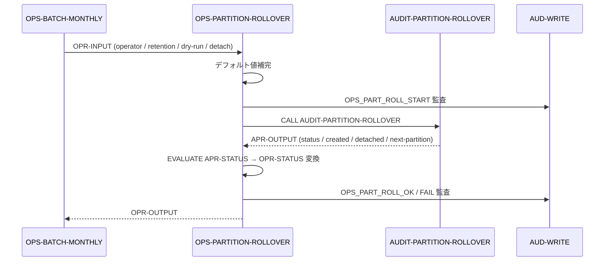

# 基本設計書 — OPS-PARTITION-ROLLOVER

> **サブシステム:** 22-operations
> **プログラム ID:** `OPS-PARTITION-ROLLOVER`
> **種別:** バッチ
> **更新日:** 2026-07-06

---

## 1. プログラム概要

| 項目 | 値 |
|------|-----|
| プログラム ID | `OPS-PARTITION-ROLLOVER` |
| ソースファイル | `src/ops-partition-rollover.cob` |
| 所属サブシステム | 22-operations |
| 種別 | バッチ |
| 概要 | 監査ログ（audit_log）のパーティション繰り越しを行うラッパ。AUDIT-PARTITION-ROLLOVER を CALL し、作成/切り離しパーティション数を出力・監査ログに記録する。 |

---

## 2. 機能概要

### 2.1 このプログラムが「すること」
月次バッチの最終工程として、監査テーブルのパーティション管理（新パーティション作成・古パーティション切り離し）を AUDIT-PARTITION-ROLLOVER に委譲し、結果を OPR-OUTPUT に設定する。
入力でオペレータ・保持日数・ドライラン・切り離し有効を指定でき、未指定時はデフォルト（ops / 30 日 / 本番 / 切り離し無効）が適用される。

### 2.2 呼出元と呼出し先
- **呼出元:** `OPS-BATCH-MONTHLY`（同一サブシステム .so 直接 CALL）。
- **呼出先:**
  - `AUDIT-PARTITION-ROLLOVER`（[21-audit](../../21-audit/design/) の .so）— パーティション繰り越し
  - `AUD-WRITE`（共有監査モジュール）— OPS_PART_ROLL_START / OK / FAIL

### 2.3 シーケンス図



---

## 3. 処理フロー

### 3.1 全体フロー（flowchart）

```mermaid
flowchart TD
    START([開始]) --> INIT[OPR-OUTPUT 初期化]
    INIT --> DEFAULT[入力デフォルト補完 (operator/retention/dry-run/detach)]
    DEFAULT --> AUD_START[OPS_PART_ROLL_START 監査]
    AUD_START --> CALL[CALL AUDIT-PARTITION-ROLLOVER]
    CALL -->|ON EXCEPTION| FATAL[status = 16, 監査出力, 終了]
    CALL -->|正常戻| EVAL{EVALUATE APR-STATUS}
    EVAL -->|00| OK[status = 00]
    EVAL -->|OTHER| FAIL[status = 16]
    OK --> AUD_END[OPS_PART_ROLL_OK 監査]
    FAIL --> AUD_FAIL[OPS_PART_ROLL_FAIL 監査]
    AUD_END --> OUT[OPR-OUT に created/detached/next 設定]
    AUD_FAIL --> OUT
    OUT --> END([終了])
    FATAL --> END
```

---

## 4. 入出力仕様

### 4.1 入力

| 項目 | 型 | 必須 | 説明 |
|------|-----|:----:|------|
| OPR-OPERATOR-USER | PIC X(30) | — | 実施オペレータ（未指定時 "ops"） |
| OPR-RETENTION-DAYS | PIC 9(5) | — | 保持日数（未指定時 30） |
| OPR-DRY-RUN | PIC X(1) | — | Y=ドライラン、N=本番（未指定時 N） |
| OPR-ENABLE-DETACH | PIC X(1) | — | Y=古パーティション切り離し有効（未指定時 N） |

### 4.2 出力

| 項目 | 型 | 説明 |
|------|-----|------|
| OPR-STATUS | PIC X(2) | 処理結果コード |
| OPR-OUT-CREATED-COUNT | PIC 9(3) | 新規作成パーティション数 |
| OPR-OUT-DETACHED-COUNT | PIC 9(3) | 切り離しパーティション数 |
| OPR-OUT-NEXT-PARTITION | PIC X(20) | 次回対象パーティション識別子 |

### 4.3 返却コード（概要）

| コード | 意味 |
|--------|------|
| 00 | 正常 |
| 16 | FATAL（呼出先未ロード or 異常終了） |

---

## 5. 正常系テストケース

| # | テスト名 | 入力 | 期待出力 | 確認ポイント |
|---|---------|------|---------|------------|
| 1 | デフォルト値で実行 | 全未指定 | status=00 | ops / 30 日 / 本番 / detach=N で呼出 |
| 2 | 切り離し有効 | detach=Y, dry=Y | status=00 | detach=Y が APR に伝達、ドライラン扱い |

---

## 6. 異常系テストケース

| # | テスト名 | 入力 | 期待される異常 | 確認ポイント |
|---|---------|------|--------------|------------|
| 1 | AUDIT-PARTITION-ROLLOVER 未ロード | .so 不在 | status=16 | ON EXCEPTION で FATAL、監査 FAIL |
| 2 | APR が 04 を返す | 予期外のステータス | status=16 | OTHER → FATAL |

---

## 参考
- ソース: [ops-partition-rollover.cob](../src/ops-partition-rollover.cob)
- 公開 IF: [ops-api.cpy](../copy/api/ops-api.cpy)
- 呼出先: AUDIT-PARTITION-ROLLOVER（21-audit サブシステム）
- 呼出元: [ops-batch-monthly.md](ops-batch-monthly.md)
- その他: [Makefile](../Makefile)
