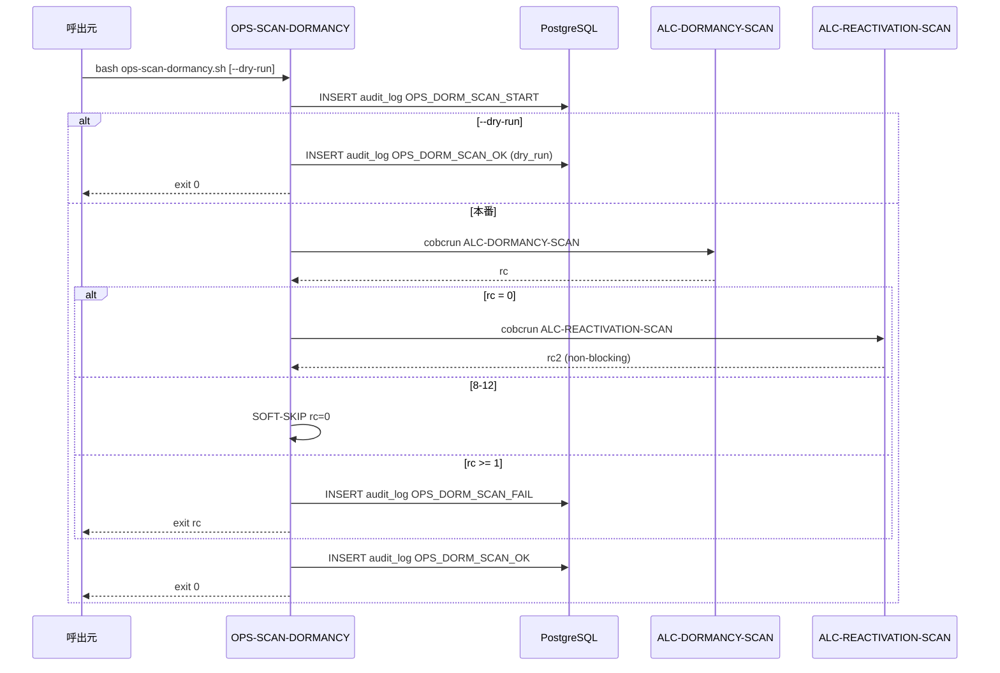

# 基本設計書 — OPS-SCAN-DORMANCY

> **サブシステム:** 22-operations
> **プログラム ID:** `OPS-SCAN-DORMANCY`
> **種別:** バッチ（シェルスクリプト）
> **更新日:** 2026-07-06

---

## 1. プログラム概要

| 項目 | 値 |
|------|-----|
| プログラム ID | `OPS-SCAN-DORMANCY` |
| ソースファイル | `src/ops-scan-dormancy.sh` |
| 所属サブシステム | 22-operations |
| 種別 | バッチ（シェル） |
| 概要 | 口座休眠スキャン（ALC-DORMANCY-SCAN）と再活性スキャン（ALC-REACTIVATION-SCAN）を順次実行する。09-accountlifecycle サブシステムの .so を cobcrun で呼び、各段階の開始/終了を DB 監査ログに記録する。 |

---

## 2. 機能概要

### 2.1 このプログラムが「すること」
週次等のバッチとして、休眠判定と再活性判定の 2 つの .so を順次実行する。
rc 評価は 0=成功、8-12=SOFT-SKIP（v1.1 backlog）、その他=失敗。
再活性スキャンは休眠スキャンが成功した場合のみ実行され、再活性の rc はブロッキングしない（WARN 扱い）。

### 2.2 呼出元と呼出し先
- **呼出元:** Makefile ターゲット `scan-dormancy`。cron / 週次スケジューラ。
- **呼出先:**
  - 09-accountlifecycle `ALC-DORMANCY-SCAN.so` — 休眠判定
  - 09-accountlifecycle `ALC-REACTIVATION-SCAN.so` — 再活性判定
  - DB（PostgreSQL）— `audit_log` テーブル INSERT

### 2.3 シーケンス図



---

## 3. 処理フロー

### 3.1 全体フロー（flowchart）

```mermaid
flowchart TD
    START([開始]) --> CHK_BIN{DORM_SO 存在 ?}
    CHK_BIN -->|No| FAIL1[OPS_DORM_SCAN_FAIL 監査, exit 1]
    CHK_BIN -->|Yes| AUD_START[OPS_DORM_SCAN_START 監査]
    AUD_START --> DRY{--dry-run ?}
    DRY -->|Yes| AUD_DRY[OPS_DORM_SCAN_OK 監査 dry_run, exit 0]
    DRY -->|No| DORM[cobcrun ALC-DORMANCY-SCAN]
    DORM --> EVAL_DORM{rc 評価}
    EVAL_DORM -->|0| REACT_BIN{REACT_SO 存在 ?}
    EVAL_DORM -->|8-12| SKIP1[SOFT-SKIP rc=0]
    EVAL_DORM -->|>=1| FAIL2[OPS_DORM_SCAN_FAIL 監査, exit rc]
    REACT_BIN -->|Yes| REACT[cobcrun ALC-REACTIVATION-SCAN]
    REACT_BIN -->|No| AUD_OK
    REACT --> EVAL_REACT{rc2 評価}
    EVAL_REACT -->|0| AUD_OK
    EVAL_REACT -->|8-12| AUD_OK
    EVAL_REACT -->|>=1| AUD_OK (WARN non-blocking)
    SKIP1 --> AUD_OK[OPS_DORM_SCAN_OK 監査]
    AUD_OK --> EXIT0[exit 0]
    FAIL1 --> END([終了])
    FAIL2 --> END
    AUD_DRY --> END
    EXIT0 --> END
```

---

## 4. 入出力仕様

### 4.1 入力

| 項目 | 型 | 必須 | 説明 |
|------|-----|:----:|------|
| $1 DRY_RUN | string | — | `--dry-run` 指定時は smoke のみ |

### 4.2 出力

| 項目 | 型 | 説明 |
|------|-----|------|
| stdout/stderr | text | ログメッセージ |
| exit code | int | 0=成功/SOFT-SKIP、1=バイナリ不在/実行失敗 |

### 4.3 返却コード（概要）

| コード | 意味 |
|--------|------|
| 0 | 成功 / ドライラン / SOFT-SKIP |
| 1 | バイナリ不在 / 実行失敗 |

---

## 5. 正常系テストケース

| # | テスト名 | 入力 | 期待出力 | 確認ポイント |
|---|---------|------|---------|------------|
| 1 | ドライラン | --dry-run | rc=0 | smoke のみ、.so は呼ばない |
| 2 | 休眠 + 再活性 本番 | （引数なし） | rc=0 | 両 .so が順次実行される |
| 3 | 休眠 SOFT-SKIP | cobcrun rc=8..12 | rc=0 | 再活性は呼ばれない、SOFT-SKIP ログ |

---

## 6. 異常系テストケース

| # | テスト名 | 入力 | 期待される異常 | 確認ポイント |
|---|---------|------|--------------|------------|
| 1 | DORM_SO 不在 | ファイル削除 | rc=1 | OPS_DORM_SCAN_FAIL 監査、即座に終了 |
| 2 | 休眠スキャン失敗 | cobcrun rc=13 | rc=13 | 再活性は呼ばれない |
| 3 | 再活性のみ失敗 | react rc=13 | rc=0 (WARN) | 上位には成功で返る、ログ WARN |

---

## 参考
- ソース: [ops-scan-dormancy.sh](../src/ops-scan-dormancy.sh)
- 呼出先: 09-accountlifecycle ALC-DORMANCY-SCAN / ALC-REACTIVATION-SCAN
- その他: [Makefile](../Makefile)
