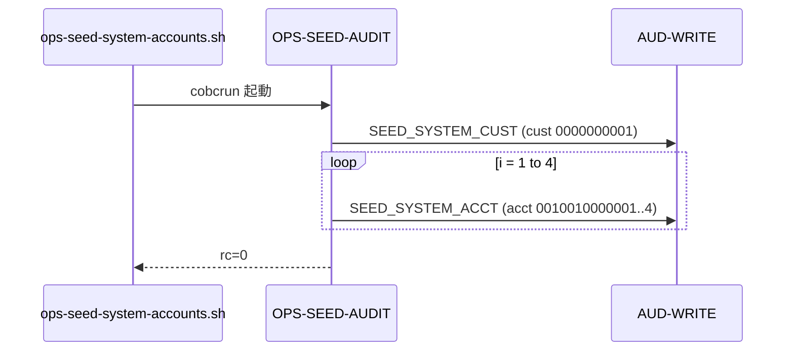

# 基本設計書 — OPS-SEED-AUDIT

> **サブシステム:** 22-operations
> **プログラム ID:** `OPS-SEED-AUDIT`
> **種別:** バッチ
> **更新日:** 2026-07-06

---

## 1. プログラム概要

| 項目 | 値 |
|------|-----|
| プログラム ID | `OPS-SEED-AUDIT` |
| ソースファイル | `src/ops-seed-audit.cob` |
| 所属サブシステム | 22-operations |
| 種別 | バッチ |
| 概要 | システム起動時のマスターデータとして、システム顧客（1 件）およびシステム口座（4 件）の監査レコードを AUD-WRITE に初期出力するシードプログラム。 |

---

## 2. 機能概要

### 2.1 このプログラムが「すること」
初期データ投入の一部として、システム利用の顧客・口座マスターに対応する監査ログレコードを生成する。
具体的には SEED_SYSTEM_CUST（1 件）および SEED_SYSTEM_ACCT（4 件）の合計 5 件の監査イベントを AUD-WRITE に書き込む。

### 2.2 呼出元と呼出し先
- **呼出元:** `ops-seed-system-accounts.sh`（`run-seed` ターゲットから呼出）。
- **呼出先:**
  - `AUD-WRITE`（共有監査モジュール）— 5 件の監査レコード出力

### 2.3 シーケンス図



---

## 3. 処理フロー

### 3.1 全体フロー（flowchart）

```mermaid
flowchart TD
    START([開始]) --> CUST[SEED_SYSTEM_CUST 監査出力 (cust 0000000001)]
    CUST --> LOOP{i = 1..4}
    LOOP --> ACCT[SEED_SYSTEM_ACCT 監査出力 (acct 001001000000i)]
    ACCT --> CHECK{i > 4 ?}
    CHECK -->|No| LOOP
    CHECK -->|Yes| DONE[完了メッセージ]
    DONE --> END([終了])
```

---

## 4. 入出力仕様

### 4.1 入力

| 項目 | 型 | 必須 | 説明 |
|------|-----|:----:|------|
| （なし） | — | — | リンクセクションなし。すべて定数で駆動 |

### 4.2 出力

| 項目 | 型 | 説明 |
|------|-----|------|
| （なし） | — | 戻り値は STOP RETURNING 0 のみ。監査は副作用 |

### 4.3 返却コード（概要）

| コード | 意味 |
|--------|------|
| 0 | 正常（5 件出力） |

---

## 5. 正常系テストケース

| # | テスト名 | 入力 | 期待出力 | 確認ポイント |
|---|---------|------|---------|------------|
| 1 | 初回起動時 | — | rc=0 | SEED_SYSTEM_CUST 1 件 + SEED_SYSTEM_ACCT 4 件が出力されること |

---

## 6. 異常系テストケース

| # | テスト名 | 入力 | 期待される異常 | 確認ポイント |
|---|---------|------|--------------|------------|
| 1 | AUD-WRITE 未ロード | .so 不在 | 実行時エラー | ON EXCEPTION 無しのため実行時エラーとなる |

---

## 参考
- ソース: [ops-seed-audit.cob](../src/ops-seed-audit.cob)
- 呼出元: [ops-seed-system-accounts.sh](../src/ops-seed-system-accounts.sh)
- その他: [Makefile](../Makefile)
