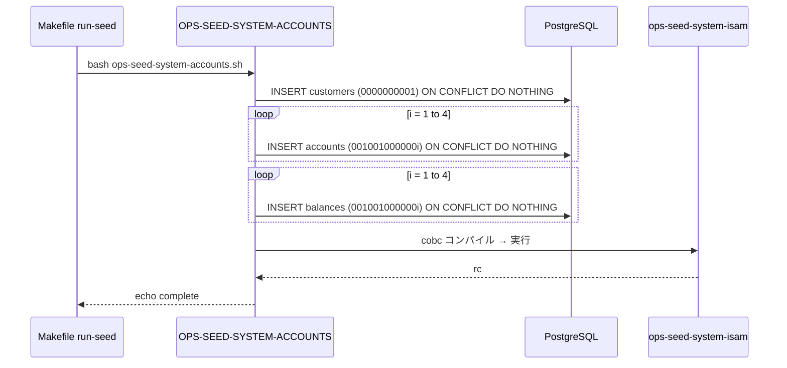

# 基本設計書 — OPS-SEED-SYSTEM-ACCOUNTS

> **サブシステム:** 22-operations
> **プログラム ID:** `OPS-SEED-SYSTEM-ACCOUNTS`
> **種別:** LOAD（シェルスクリプト）
> **更新日:** 2026-07-06

---

## 1. プログラム概要

| 項目 | 値 |
|------|-----|
| プログラム ID | `OPS-SEED-SYSTEM-ACCOUNTS` |
| ソースファイル | `src/ops-seed-system-accounts.sh` |
| 所属サブシステム | 22-operations |
| 種別 | LOAD |
| 概要 | システム起動時のマスターデータとして、システム顧客（1 件）・システム口座（4 件）・残高（4 件）を DB に UPSERT し、さらに OPS-SEED-SYSTEM-ISAM をコンパイル・実行して ISAM ファイルにも初期口座を投入する。 |

---

## 2. 機能概要

### 2.1 このプログラムが「すること」
初期データ投入のエントリポイントとして、以下の 3 段階を順次実行する:
1. DB `customers` テーブルにシステム顧客 1 件を UPSERT
2. DB `accounts` テーブルにシステム口座 4 件（CASH/CLEARING/INTEREST EXPENSE/FEE REVENUE）を UPSERT
3. DB `balances` テーブルに初期残高 4 件を UPSERT
4. `ops-seed-system-isam.cob` をコンパイル・実行し、ISAM ファイルに 4 件投入

### 2.2 呼出元と呼出し先
- **呼出元:** Makefile ターゲット `run-seed`。
- **呼出先:**
  - DB（PostgreSQL）— `customers` / `accounts` / `balances` テーブル UPSERT
  - `ops-seed-system-isam` — ISAM ファイル書込（内部で cobc コンパイル）

### 2.3 シーケンス図



---

## 3. 処理フロー

### 3.1 全体フロー（flowchart）

```mermaid
flowchart TD
    START([開始]) --> CUST[INSERT customers 0000000001 ON CONFLICT DO NOTHING]
    CUST --> ACCT_LOOP{i = 1..4}
    ACCT_LOOP --> ACCT[INSERT accounts 001001000000i ON CONFLICT DO NOTHING]
    ACCT --> BAL_LOOP{i = 1..4}
    BAL_LOOP --> BAL[INSERT balances 001001000000i ON CONFLICT DO NOTHING]
    BAL --> COMPILE[cobc -o /tmp/ops-seed-system-isam ops-seed-system-isam.cob]
    COMPILE --> CHK_COMPILE{コンパイル成功 ?}
    CHK_COMPILE -->|No| FAIL1[exit 1]
    CHK_COMPILE -->|Yes| RUN[/tmp/ops-seed-system-isam 実行]
    RUN --> CHK_RUN{実行 rc = 0 ?}
    CHK_RUN -->|No| FAIL2[exit 1]
    CHK_RUN -->|Yes| DONE[echo complete]
    DONE --> END([終了])
    FAIL1 --> END
    FAIL2 --> END
```

---

## 4. 入出力仕様

### 4.1 入力

| 項目 | 型 | 必須 | 説明 |
|------|-----|:----:|------|
| （なし） | — | — | すべて定数で駆動 |

### 4.2 出力

| 項目 | 型 | 説明 |
|------|-----|------|
| stdout | text | ログメッセージ |
| exit code | int | 0=成功、1=ISAM コンパイル/実行失敗 |

### 4.3 返却コード（概要）

| コード | 意味 |
|--------|------|
| 0 | 成功 |
| 1 | ISAM コンパイル失敗 or 実行時エラー |

---

## 5. 正常系テストケース

| # | テスト名 | 入力 | 期待出力 | 確認ポイント |
|---|---------|------|---------|------------|
| 1 | 初回起動 | — | rc=0 | customers 1 件 + accounts 4 件 + balances 4 件 + ISAM 4 件が投入される |
| 2 | 再実行（冪等） | 2 回目 | rc=0 | ON CONFLICT DO NOTHING により UPSERT スキップ、件数は変わらない |

---

## 6. 異常系テストケース

| # | テスト名 | 入力 | 期待される異常 | 確認ポイント |
|---|---------|------|--------------|------------|
| 1 | DB 接続不能 | PGHOST 不正 | psql エラー | set -e で即座に終了 |
| 2 | ISAM コンパイル失敗 | cobc 不在 | rc=1 | コンパイルエラーで終了 |
| 3 | ISAM 実行時エラー | account.idx 書込権限なし | rc=1 | 実行エラーで終了 |

---

## 参考
- ソース: [ops-seed-system-accounts.sh](../src/ops-seed-system-accounts.sh)
- 関連プログラム: [ops-seed-system-isam.md](ops-seed-system-isam.md) [ops-seed-audit.md](ops-seed-audit.md)
- その他: [Makefile](../Makefile)
