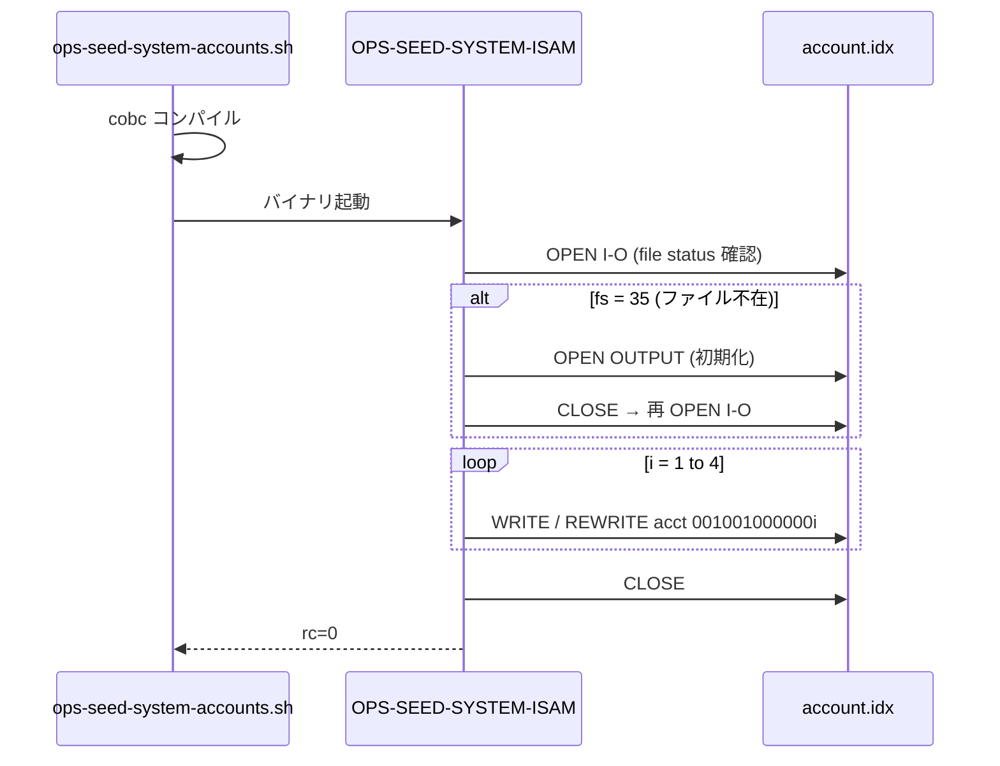
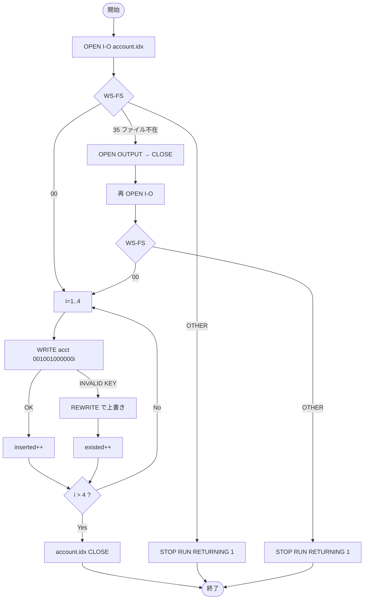

# 基本設計書 — OPS-SEED-SYSTEM-ISAM

> **サブシステム:** 22-operations
> **プログラム ID:** `OPS-SEED-SYSTEM-ISAM`
> **種別:** LOAD
> **更新日:** 2026-07-06

---

## 1. プログラム概要

| 項目 | 値 |
|------|-----|
| プログラム ID | `OPS-SEED-SYSTEM-ISAM` |
| ソースファイル | `src/ops-seed-system-isam.cob` |
| 所属サブシステム | 22-operations |
| 種別 | LOAD |
| 概要 | システム口座マスター（ISAM ファイル `account.idx`）に初期システム口座 4 件を投入するブートストラッププログラム。ファイル不在時は新規作成后再オープンする。 |

---

## 2. 機能概要

### 2.1 このプログラムが「すること」
08-account サブシステムの ISAM インデックスファイルに、システム利用の口座 4 件（0010010000001..4）をレコードとして書き込む。
ファイルが存在しない場合（ステータス 35）は空ファイルを作成して再オープンするブートストラップ動作を行う。
既存レコード（INVALID KEY）は REWRITE で上書きスキップする。

### 2.2 呼出元と呼出し先
- **呼出元:** `ops-seed-system-accounts.sh`（シェル内で cobc コンパイル→実行）。
- **呼出先:**
  - ISAM ファイル `/workspace/subsystems/08-account/data/account.idx` — 直接書込

### 2.3 シーケンス図

---

## 3. 処理フロー

### 3.1 全体フロー（flowchart）

---

## 4. 入出力仕様

### 4.1 入力

| 項目 | 型 | 必須 | 説明 |
|------|-----|:----:|------|
| （なし） | — | — | リンクセクションなし。レコード内容は定数 |

### 4.2 出力

| 項目 | 型 | 説明 |
|------|-----|------|
| （なし） | — | 標準出力のみ。ISAM ファイルへの副作用 |

### 4.3 返却コード（概要）

| コード | 意味 |
|--------|------|
| 0 | 正常（4 件投入または上書きスキップ） |
| 1 | FATAL（ファイル作成/オープン失敗） |

---

## 5. 正常系テストケース

| # | テスト名 | 入力 | 期待出力 | 確認ポイント |
|---|---------|------|---------|------------|
| 1 | 初回投入（ファイル不在） | — | rc=0, inserted=4 | account.idx が新規作成、4 件書き込まれる |
| 2 | 再実行（ファイル・レコード存在） | — | rc=0, existed=4 | REWRITE Branch を通ること |

---

## 6. 異常系テストケース

| # | テスト名 | 入力 | 期待される異常 | 確認ポイント |
|---|---------|------|--------------|------------|
| 1 | OPEN OUTPUT 失敗 | 書込権限なし | rc=1 | 即座に STOP RUN |
| 2 | 再 OPEN I-O 失敗 | fs が 35 以外で失敗 | rc=1 | ブートストラップ後再オープン失敗時の異常終了 |

---

## 参考
- ソース: [ops-seed-system-isam.cob](../src/ops-seed-system-isam.cob)
- 呼出元: [ops-seed-system-accounts.sh](../src/ops-seed-system-accounts.sh)
- 出力先: 08-account サブシステム `account.idx`
- その他: [Makefile](../Makefile)
