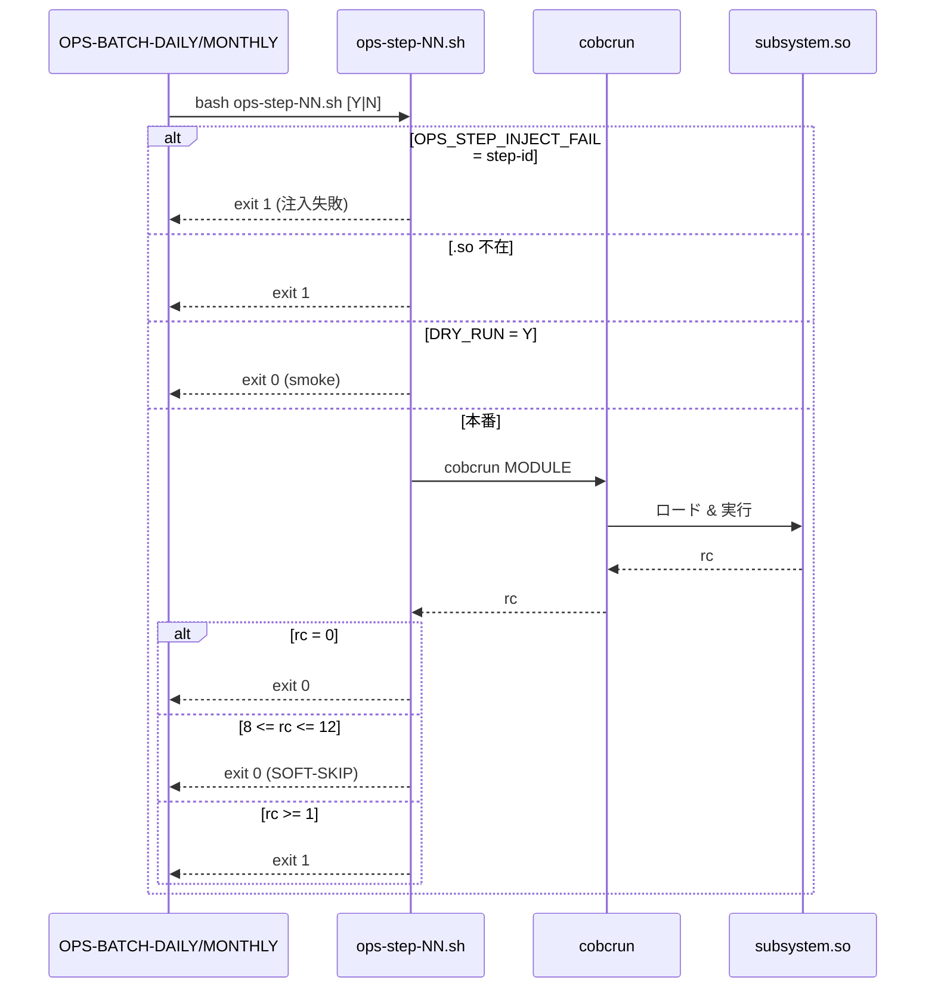

# 基本設計書 — OPS-STEP-WRAPPERS（ステップラッパー 7 本）

> **サブシステム:** 22-operations
> **プログラム ID:** `ops-step-13-iacr` / `ops-step-14-ipst` / `ops-step-15-ad` / `ops-step-16-fee` / `ops-step-17-stmt` / `ops-step-19-inti` / `ops-step-20-drain`
> **種別:** バッチ（シェルスクリプト）
> **更新日:** 2026-07-06

---

## 1. プログラム概要

| 項目 | 値 |
|------|-----|
| プログラム ID | `ops-step-{NN}-{name}` × 7 |
| ソースファイル | `src/ops-step-*.sh` |
| 所属サブシステム | 22-operations |
| 種別 | バッチ（シェル） |
| 概要 | 日次 / 月次バッチの各ステップを個別に実行するシェルラッパー。ドライラン対応、cobcrun 呼出、rc ベースの成否判定、OPS_STEP_INJECT_FAIL によるテスト用故障注入を共通実装する。 |

### ステップ一覧

| スクリプト | 呼出先 .so | 親バッチ |
|----------|----------|---------|
| `ops-step-13-iacr.sh` | 13-interestaccrual `IACR-RUN-DAILY` | DAILY |
| `ops-step-14-ipst.sh` | 14-interestpost `IPST-RUN-MONTHEND` | MONTHLY |
| `ops-step-15-ad.sh` | 15-autodebit `AD-RUN-DAILY` | DAILY |
| `ops-step-16-fee.sh` | 16-fee `FEE-CHARGE` | DAILY |
| `ops-step-17-stmt.sh` | 17-statement `STMT-GENERATE-BATCH` | DAILY |
| `ops-step-19-inti.sh` | 19-integrationin `INTI-DECODE-BATCH` | DAILY |
| `ops-step-20-drain.sh` | 20-integrationout `INTO-DRAIN-QUEUE` | DAILY |

---

## 2. 機能概要

### 2.1 このプログラムが「すること」
各ステップの COBOL .so モジュールを `cobcrun` で実行する。ドライラン時は smoke チェック（バイナリ存在確認）のみ行い即座に成功で返す。
実行結果 rc を評価し、0=成功、8-12=SOFT-SKIP（v1.1 backlog で未接続の前提モジュール）、その他=失敗として扱う。

### 2.2 呼出元と呼出し先
- **呼出元:** `OPS-BATCH-DAILY` / `OPS-BATCH-MONTHLY`（`CALL "SYSTEM"` 経由）。
- **呼出先:**
  - 各サブシステム .so（cobcrun 経由）
  - 環境変数 `OPS_STEP_INJECT_FAIL` によるテスト故障注入

### 2.3 シーケンス図



---

## 3. 処理フロー

### 3.1 全体フロー（flowchart）

```mermaid
flowchart TD
    START([開始]) --> INJ{OPS_STEP_INJECT_FAIL = step-id ?}
    INJ -->|Yes| FAIL1[exit 1 (注入失敗)]
    INJ -->|No| CHK_SO{.so 存在 ?}
    CHK_SO -->|No| FAIL2[exit 1]
    CHK_SO -->|Yes| CHK_COB{cobcrun 利用可 ?}
    CHK_COB -->|No| FAIL3[exit 1]
    CHK_COB -->|Yes| DRY{DRY_RUN = Y ?}
    DRY -->|Yes| SMOKE[exit 0 (smoke)]
    DRY -->|No| RUN[cobcrun MODULE]
    RUN --> EVAL{rc 評価}
    EVAL -->|0| OK[exit 0]
    EVAL -->|8-12| SKIP[exit 0 SOFT-SKIP]
    EVAL -->|>=1| FAIL4[exit 1]
    FAIL1 --> END([終了])
    FAIL2 --> END
    FAIL3 --> END
    SMOKE --> END
    OK --> END
    SKIP --> END
    FAIL4 --> END
```

---

## 4. 入出力仕様

### 4.1 入力

| 項目 | 型 | 必須 | 説明 |
|------|-----|:----:|------|
| $1 (DRY_RUN) | string | — | Y=ドライラン（デフォルト）、N=本番実行 |
| OPS_STEP_INJECT_FAIL | env | — | 注入対象ステップ ID（例 `13-iacr`）。一致時は exit 1 |

### 4.2 出力

| 項目 | 型 | 説明 |
|------|-----|------|
| exit code | int | 0=成功/SOFT-SKIP、1=失敗 |
| stdout/stderr | text | ログメッセージ（/tmp/ops-step-NN.out にもリダイレクト） |

### 4.3 返却コード（概要）

| コード | 意味 |
|--------|------|
| 0 | 成功 / ドライラン / SOFT-SKIP |
| 1 | 失敗（.so 不在、cobcrun 不在、実行エラー、注入失敗） |

---

## 5. 正常系テストケース

| # | テスト名 | 入力 | 期待出力 | 確認ポイント |
|---|---------|------|---------|------------|
| 1 | ドライラン | dry=Y | rc=0 | smoke メッセージのみ、cobcrun は呼ばない |
| 2 | 本番正常 | dry=N, .so 存在 | rc=0 | cobcrun 実行、rc=0 |
| 3 | SOFT-SKIP | dry=N, cobcrun rc=8..12 | rc=0 | ログに SOFT-SKIP と出力、上位には成功で返る |

---

## 6. 異常系テストケース

| # | テスト名 | 入力 | 期待される異常 | 確認ポイント |
|---|---------|------|--------------|------------|
| 1 | .so 不在 | 該当パスにファイル無し | rc=1 | 即座に終了 |
| 2 | cobcrun 不在 | PATH から cobcrun 除外 | rc=1 | 即座に終了 |
| 3 | 注入失敗 | OPS_STEP_INJECT_FAIL=13-iacr | rc=1 | 当該ステップのみ失敗 |
| 4 | 実行時エラー | cobcrun rc=13 等 | rc=1 | ログにエラー詳細 |

---

## 参考
- ソース: [ops-step-13-iacr.sh](../src/ops-step-13-iacr.sh) [ops-step-14-ipst.sh](../src/ops-step-14-ipst.sh) [ops-step-15-ad.sh](../src/ops-step-15-ad.sh) [ops-step-16-fee.sh](../src/ops-step-16-fee.sh) [ops-step-17-stmt.sh](../src/ops-step-17-stmt.sh) [ops-step-19-inti.sh](../src/ops-step-19-inti.sh) [ops-step-20-drain.sh](../src/ops-step-20-drain.sh)
- 呼出元: [ops-batch-daily.md](ops-batch-daily.md) [ops-batch-monthly.md](ops-batch-monthly.md)
- その他: [Makefile](../Makefile)
